# Dagsorden

- Litteraturgennemgang
    - Mellem narrative og systematiske reviews
    - Søgning efter litteratur
    - Behandling af studier
    - Konklusioner

- Læsning af studier
    - Hvad skal man være opmærksom på?

# Seminaropgave

- Deadlines, det korte perspektiv
    - 8. februar: $\approx$ ½-1 side. Brainstorm.
    - 29. februar: $\approx$ 5 sider. Idé og fokus.

- Alle, der har sendt mig noget, har fået skriftlig feedback

- Hvis du/I ikke allerede har sendt mig noget: gør det så hurtigt som muligt

- Spørgsmål? Spørg eller send en mail

# Hvad lærte vi sidste uge?

- Offentlig politik er fyldt med kausale spørgsmål

- Verden er kompleks
    - Vores opgave er at forsimple den
    - Hvordan?
      - Studere kausale relationer mellem klart definerede variable

- I dag: Litteraturreview

# Fordele ved at lave et litteraturreview (cf. Knopf [2006](http://journals.cambridge.org/action/displayAbstract?fromPage=online&aid=386229&fileId=S1049096506060264))

- Fem (relaterede) fordele
    1. Giver et bredt kendskab til en litteratur
    2. Giver en forståelse af, hvad vi allerede ved
    3. Giver ideer til, hvad man kan og bør gøre
    4. Giver en forståelse af, hvilke problemer og udfordringer der er
    5. Giver en kontekst hvori man kan placere sit eget spørgsmål

# Hvorfor flere studier? 

- Et studie siger ikke ret meget

- Enkelte studier har ofte ikke meget diversitet (land, mål osv.)

- Enkelte studier kan være ekstreme (_outliers_)
    - Pas på ekstreme studier (også selvom journalister elsker dem)
    
- Vi vil gerne generalisere på baggrund af flere studier

# Afgrænsning af litteratur

- Litteratur dumper ikke ned fra himlen (eller "læseplanen")

- Forskningsspørgsmål skal passe ind i en litteratur
    - Hvilken litteratur er vi interesseret i?

- I meget statskundskabslitteratur er litteraturgennemgangen arbitrær og ustruktureret
    - Narrativ gennemgang af vigtige/interessante studier
    - Vi skal efterstræbe mere systematiske reviews

- Narrativ og systematisk litteraturgennemgang
    - Tænk på et kontinium

# Narrative reviews

- Introduktion af overordnet problemstilling

- Narrativ gennemgang af udvalgte studier
    - Hovedfund
    - Metodiske tilgange
    - Resultater
    - Illustrative eksempler
    - Begrænsninger
    
- Illustrativt eksempel: de fleste videnskabelige artikler

# Styrker og svagheder ved narrative reviews

- Styrker:
    - Grundig beskrivelse af en litteratur
    - Formulering af hypoteser
    - Teoriudvikling med kvalitative kategorier

- Svagheder:
    - Ustruktureret
    - Arbitrær udvælgelse, målefejl
    - Mange forskellige relationer mellem variable
    - Dårligt framework til at diskutere åbenlyse udfordringer (publikationsbias osv.)

# Systematiske reviews

- Jo mindre dit review ligner en slavisk gennemgang af 'the usual suspects', desto bedre

- Overvej: Hvis der skal være en tabel eller figur i din litteraturgennemgang, hvordan skulle den så se ud?

- Vi vil især fokusere på metaanalyser
    - Hav altid metaanalyser i baghovedet
    - Tommelfingerregel: Jo tættere dit review ligger op ad en metaanalyse, desto bedre

# Metaanalyser

- Metaanalyse: Analyse af analyser

- Guldstandarden for litteraturreviews

- Udfordringer for metaanalyser (og andre litteraturreviews):
    - Manglende reliabitilitet i de inkluderede studier
    - Publikationsbias (og andre biases)
    - Manglende information (effektstørrelser, stikprøve etc.)
    - Bias i kodning, bias i udregning af effektstørrelser
    - Statistisk power

# Hvorfor metaanalyser? Kogebogseksempel

- Eksempel: Forårsager bestemte typer af mad og drikke kræft?

- Studie: Is everything we eat associated with cancer? A systematic cookbook review (Schoenfeld og Ioannidis [2012](http://ajcn.nutrition.org/content/early/2012/11/27/ajcn.112.047142.abstract))

- Metode: ``We selected 50 common ingredients from random recipes in a cookbook. PubMed queries identified recent studies that evaluated the relation of each ingredient to cancer risk. Information regarding author conclusions and relevant effect estimates were extracted.''

# Hvorfor metaanalyser? Kogebogseksempel (Schoenfeld og Ioannidis [2012](http://ajcn.nutrition.org/content/early/2012/11/27/ajcn.112.047142.abstract))

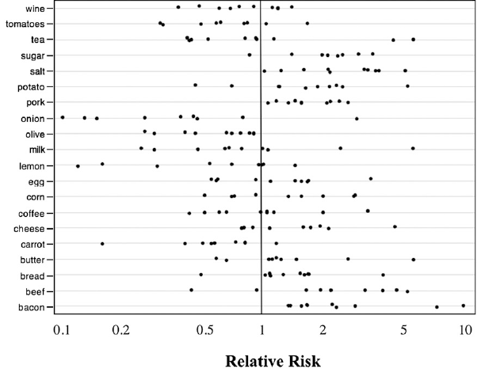

# Metaanalyser: Procedure

1. Problemformulering

2. Indsamling af studier
    - Publicerede _og_ ikke-publicerede (hvorfor?)
    
3. Vurder de enkelte studier
    - Passer det ind i rammen? Er der nok information?
    
4. Vælg et passende effektmål
    - Udregn effekterne for alle studierne

5. Lav et datasæt med så mange informationer som muligt
    - Effekter, stikprøvestørrelse, design, moderatorer, land osv.

6. (Meta)analyser litteraturen
    - Er der konsistente effekter i litteraturen? Hvad forklarer dem?

7. Lav robusthedstests
    - Sandsynlighed for Type I og Type II fejl

# Fem principper for metaanalyser og kausal inferens

1. Sammenlignelighed
    - Er det fair at sammenligne de respektive studier?

2. Udelukkelse af irrelevante faktorer
    - Kan uobserverede forhold forklare forskelle?

3. Diskrimination
    - Hvordan skal studierne vægtes? Alle studier er lige, men...

4. Interpolation og extrapolation
    - Hvor ville andre effekter være givet de data vi har?

5. Kausal forklaring
    - Hvilke _kausale_ effekter er der?

# Kodning af studier

- Informationer, der kan kodes:
    - Studie: publiceringsår, citationer
    - Metode: design, uafhængig og afhængig variabel, moderatorer
    - Resultater: effekter, standardfejl, observationer
    - Kontekst: land, tid

- Stort problem i mange studier: Manglende information!

# Effektstørrelser

- Det vi gerne vil sammenligne er effektstørrelser

- Hvad er en effektstørrelse?
    - Et standardiseret mål

- Kvantificerer forskellen mellem to grupper

- Gør det muligt at sammenligne forskellige studier

# Effektstørrelser

- Forskellige mål (Cohens _d_, Hedges _g_, odds ratio etc.)

- Standardiseseret gennemsnitsforskel (Cohen's _d_, _d_-index, _d_): $d_{i} = \frac{ \overline{X_{i}^{t}} - \overline{X_{i}^{c}} }{s_{i}}$
    - $\overline{X_{i}^{t}}$: gennemsnit for stimuligruppen i studie $i$
    - $\overline{X_{i}^{c}}$: gennemsnit for kontrolgruppen i studie $i$
    - $s_{i}$: standardafvigelsen for de to grupper

- For studier med flere grupper er udfordringen større
    - Standardisering af koefficienter m.v.

# Analyse og præsentation af metaanalysedata 

- Kan analyseres som andre typer af data

- Deskriptiv statistik, OLS, hierarkiske modeller (effekter indlejret i studier)

- Heterogenitet mellem studier
    - Kan studeres systematisk
    - Fixed og random effects

- Grafisk præsentation
    - Histogram med effekter
    - Funnel plot

# Opbygning af metaanalyse (Moser og Schmidt [2014](https://www.researchgate.net/publication/228562111_Meta-analysis_An_alternative_to_narrative_reviews_for_synthesising_social_science_research))

1. Baggrundsinformation
2. Hypoteser/forskningsspørgsmål
3. Metodesektion/fremgangsmåde
4. Detaljer om inkluderede studier
5. Detaljer om ekskluderede studier
6. Resultater fra metaanalyse
7. Resultater fra robusthedsanalyser 
8. Diskussion, implikationer

# Hvor finder vi studier?

- Søgning efter litteratur
    - Brug Google Scholar

- Søg efter:
    - Emneord
    - Bestemt artikel
    
- Se hvilke artikler, der citerer de pågældende artikler

- Angiv evt. periode (find de nyeste artikler)

# Hvornår siger vi, at der er evidens for noget?

- Det er svært at konkludere, at der er systematisk evidens for et fænomen
    - 'Absence of evidence is not evidence of absence'

- Hvad er forskellen på evidens og ikke-evidens? 
    - Hvor går grænsen?

# Hypotetisk scenarie: Hvornår viser to studier noget forskelligt?

- Et studie viser en effekt
- Et andet studie viser, at der ikke er en effekt

- Viser de to studier noget forskelligt? Ikke nødvendigvis
    - Forskellen mellem signifikant og ikke-signifikant er ikke altid signifikant

- Vi vil gerne have numeriske resultater (og standardfejl/konfidensintervaller)

# Hvor mange artikler har præcise numeriske resultater (i deres abstract)? (Sood og Guess [2015](http://www.gsood.com/research/papers/quant.pdf))

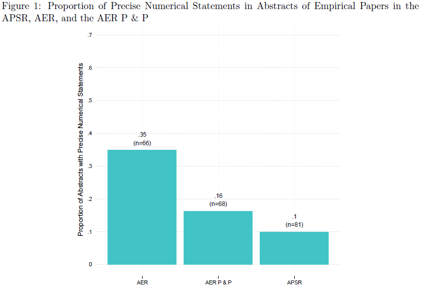

# Hvorfor er det svært at finde sammenlignelige studier?

- Der vil *altid* være forskelle
    - Kontekst, tid

- Nyhedsskævhed ("*novelty bias*")
    - Fokus på at lave noget nyt

- Forskellige rapporteringsstrategier 
    - Svært at identificere sammenlignelige mål

# Hvad skal man være opmærksom på?

- Når man finder et studie, skal man ikke gå direkte til resultaterne

- Ikke alle studier er lige gode
    - Alle studier skal læses med kritiske øjne

- Ingen udtømmende liste, men...

# 20 ting vi skal være opmærksomme på (Sutherland et al. [2013](http://www.nature.com/news/policy-twenty-tips-for-interpreting-scientific-claims-1.14183))

1. Der er mange kilder til variation
    - Opgaven er for os at isolere fænomener
    - Udelukke andre kilder til variation

2. Intet mål er eksakt
    - Vi skal forholde os til målefejl
    - Hvilke potentielle målefejl er der ved vores variable?
  
3. Der er systematiske skævheder
    - Mange forhold kan føre til *bias* i vores resultater
    - Ikke-tilfældige målefejl
    
# 20 ting vi skal være opmærksomme på (Sutherland et al. [2013](http://www.nature.com/news/policy-twenty-tips-for-interpreting-scientific-claims-1.14183))

4. Jo flere observationer, desto bedre
    - More is more
    - Mange studier har for lav statistisk styrke til at finde den effekt, de ønsker at finde
    
5. Korrelation er ikke lig kausalitet
    - En pointe der skal nævnes igen og igen

6. Regression mod gennemsnittet
    - Jo længere væk en observation ligger fra gennemsnittet ved første observation, desto større er sandsynligheden for at den vil falde tættere på gennemsnittet ved næste observation
    - Tendenser kan være en naturlig udvikling mod gennemsnittet

# 20 ting vi skal være opmærksomme på (Sutherland et al. [2013](http://www.nature.com/news/policy-twenty-tips-for-interpreting-scientific-claims-1.14183))

7. Pas på med at ekstrapolere
    - Vi har observationer der falder i et bestemt rum
    - Kræver stærk teori at sige noget om ikke-observationer

8. Husk sandsynligheder og stikprøvestørrelse ("base rate fallacy")
    - Ikke alle tests er perfekte (Type I og Type II-fejl)

9. Kontrolgrupper er vigtige
    - Vi skal have observationer, der ikke påvirkes af vores stimuli

# 20 ting vi skal være opmærksomme på (Sutherland et al. [2013](http://www.nature.com/news/policy-twenty-tips-for-interpreting-scientific-claims-1.14183))

10. Randomisering fjerner skævheder
    - Uden randomisering ved vi ikke, om vores stimuli har en effekt
    - Problem med effekten af offentlige politikker: Ingen randomisering

11. Søg replikationer
    - Uden replikationer giver det ingen mening at tale om videnskab
    - Jo flere selvstændige studier der tester et givent fænomen, desto bedre

12. Forskere er også mennesker(!)
    - Forskere har egne interesser; er ikke altid rationelle

# 20 ting vi skal være opmærksomme på (Sutherland et al. [2013](http://www.nature.com/news/policy-twenty-tips-for-interpreting-scientific-claims-1.14183))

13. Signifikant er signifikant
    - (_Se bort fra dette_)
    - Diskuter altid statistisk signifikans i forhold til substantiel signifikans

14. Insignifikant betyder ikke, at der ikke er en effekt

15. Effektstørrelsen er afgørende

16. Der kan være et trade-off mellem relevans og generaliserbarhed 

# 20 ting vi skal være opmærksomme på (Sutherland et al. [2013](http://www.nature.com/news/policy-twenty-tips-for-interpreting-scientific-claims-1.14183))

17. Vi er dårlige til at forholde os til risici/sandsynligheder

18. Når begivenheder er relateret, kan det påvirke sandsynlighederne drastisk for, at de finder sted

19. Data kan manipuleres
    - Selektiv præsentation af resultater
    
20. Ekstreme mål kan være misvisende

# Hvor mange observationer, skal vi have med?

- Ofte har vi ikke ret mange observationer

- Mange studier er *underpowered*. 

- Hvad er problemet?

# Hvor store effekter? (Simmons et al. [2013](http://papers.ssrn.com/sol3/papers.cfm?abstract_id=2205186))

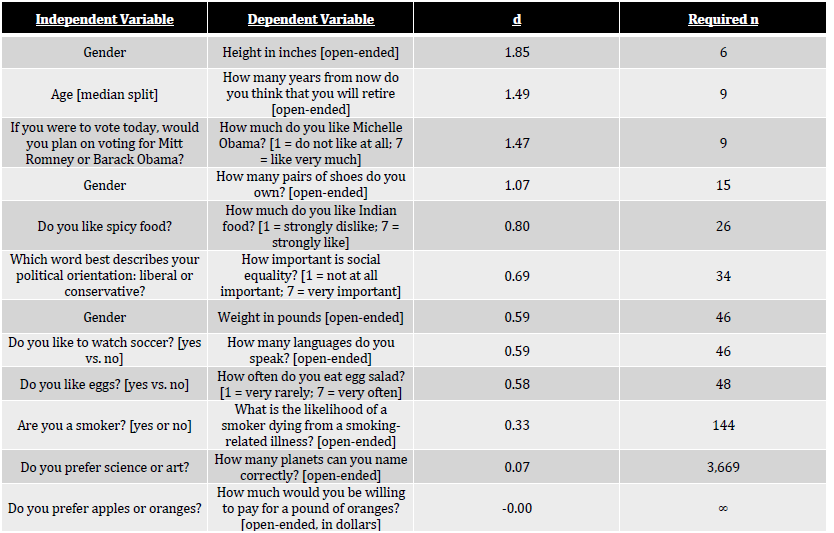

# ``Winner's curse''

- Forestil jer:
    - ingen effekt af stimuli (en effekt på 0)
    - publikationsbias (kun publikation af studier med effekter $\neq$ 0)

- Hvem bliver publiceret? Den 'heldige' forsker(gruppe)

- Forudgående forsøg finder vej til arkivet (bliver ikke publiceret)

- Kan forklare Proteus-fænomenet: Det første studie vil som regel have større effekter end efterfølgende forsøg

# ``Winner's curse'' (Button [2013](http://www.nature.com/nrn/journal/v14/n5/full/nrn3475.html))

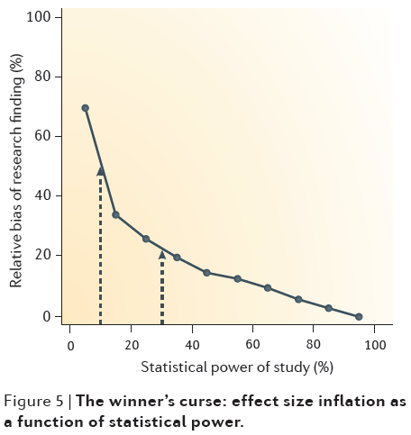

# Hvor store korrelationer? (Richard et al. [2003](http://neuron4.psych.ubc.ca/~schaller/Psyc591Readings/RichardBondStokes-Zoota2003.pdf))

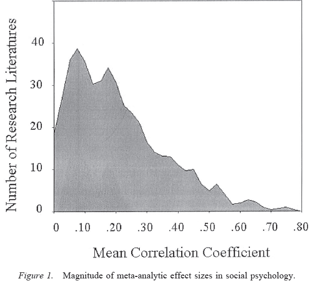

# Eksempel: Den offentlige opinion og offentlige politikker (Burstein [2003](http://prq.sagepub.com/content/56/1/29.short))

- Spørgsmål: Er der signifikante effekter af den offentlige opinion på offentlige politikker?

- Metode: Kig på koefficienter i forskellige studier

- Analyse: Antallet af signifikante koefficienter

# Eksempel: Den offentlige opinion og offentlige politikker (Burstein [2003](http://prq.sagepub.com/content/56/1/29.short))

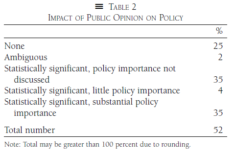

# Eksempel: Mediernes formidling af meningsmålinger (Larsen og Straubinger [2012](http://erikgahner.dk/pub/2012meningsmaalinger.pdf))

- Spørgsmål: Formidler medierne metodiske informationer fra meningsmålinger?

- Metode: Indsamling af numeriske resultater fra andre studier

- Analyse: Deskriptiv statistik med vægtede gennemsnit

# Eksempel: Mediernes formidling af meningsmålinger (Larsen og Straubinger [2012](http://erikgahner.dk/pub/2012meningsmaalinger.pdf))

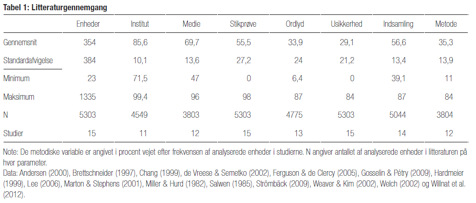

# Eksempel: Internetbrug og politisk engagement (Boulianne [2009](http://www.tandfonline.com/doi/abs/10.1080/10584600902854363))

- Spørgsmål: Påvirker brugen af internettet borgerens politiske engagement?

- Metode: Effektstørrelser

- Analyse: Distribution af effekter

# Eksempel: Internetbrug og politisk engagement (Boulianne [2009](http://www.tandfonline.com/doi/abs/10.1080/10584600902854363))

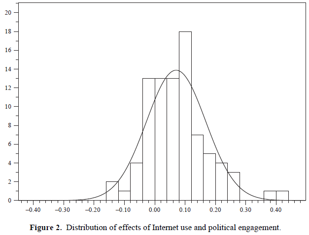

# Eksempel: Responsivitet til den offentlige opinion online (Dekker og Bekkers [2015](http://www.sciencedirect.com/science/article/pii/S0740624X15300125))

- Spørgsmål: Er der responsivitet til den offentlige opinion online?

- Fremgangsmåde
    - Teori: Analytisk framework 
    - Metode: Indsamling af litteratur
    - Resultater: Kategorisering af studier

# Eksempel: Responsivitet til den offentlige opinion online (Dekker og Bekkers [2015](http://www.sciencedirect.com/science/article/pii/S0740624X15300125))

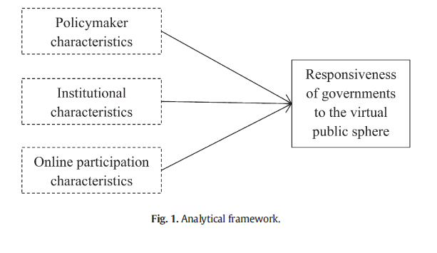

# Eksempel: Responsivitet til den offentlige opinion online (Dekker og Bekkers [2015](http://www.sciencedirect.com/science/article/pii/S0740624X15300125))

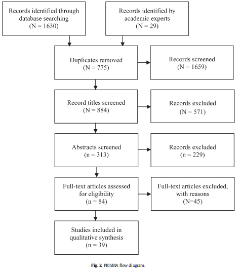

# Eksempel: Responsivitet til den offentlige opinion online (Dekker og Bekkers [2015](http://www.sciencedirect.com/science/article/pii/S0740624X15300125))

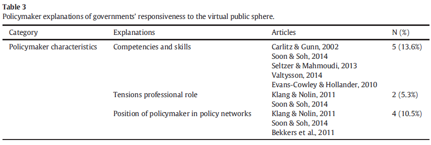

# Eksempel: Effekten af negative kampagner (Lau et al. [2007](http://onlinelibrary.wiley.com/doi/10.1111/j.1468-2508.2007.00618.x/abstract))

- Spørgsmål: Påvirker negative kampagner vælgerne?

- Metode: Kodning af effekter

- Analyse: En lang række af afhængige variable

# Eksempel: Effekten af negative kampagner (Lau et al. [2007](http://onlinelibrary.wiley.com/doi/10.1111/j.1468-2508.2007.00618.x/abstract))

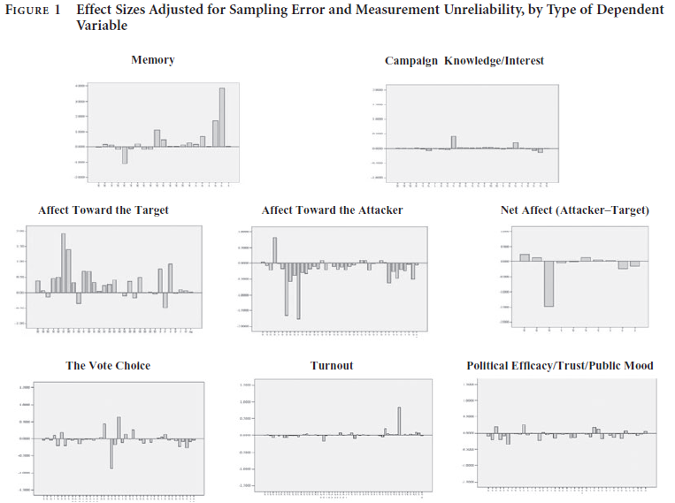

# Eksempel: Personlighedstræk og prosocial adfærd (Kline et al. [2015](http://static1.squarespace.com/static/55be646de4b0178bcb43d37a/t/55e1f5aee4b0cbd6165f7c75/1440871854270/KlineBankertLevitan2015.pdf))

- Spørgsmål: Påvirker personlighedstræk borgerens sociale adfærd?

- Metode: Indsamling af data med de relevante variable

- Analyse: Multilevel metaanalyse

# Eksempel: Personlighedstræk og prosocial adfærd (Kline et al. [2015](http://static1.squarespace.com/static/55be646de4b0178bcb43d37a/t/55e1f5aee4b0cbd6165f7c75/1440871854270/KlineBankertLevitan2015.pdf))

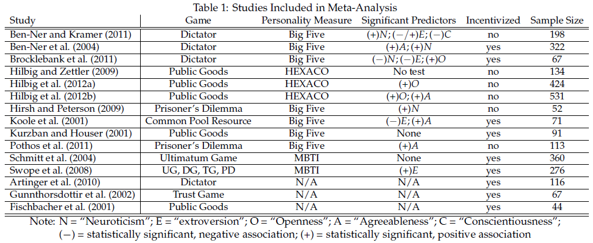

# Dit studie og andres litteraturreview

- I den bedste af alle verdener kan andre bruge dit studie

- Rapporter tilstrækkelige informationer
    - Andre skal kunne bruge det i metaanalyser
    - Nøgleordet er transparens

# Dagens øvelse

- Find en review artikel, der belyser den afhængige variabel eller det spørgsmål, du ønsker at beskæftige dig med

- Google Scholar
    - Konkrete emneord ('review', 'overview', 'agenda')
    - Bestemte tidsskrifter ('Annual Review of Political Science')

- Alene eller sammen med en anden

- 10 minutter

# Næste gang

- Udvikle teorier
    - *Definere kausaleffekt*
    - Opbygge kausalmodeller
    - Eksplicitere antagelser
    - Validitet

- Senere: Teste og evaluere teorier

- Bemærk: næste gang (mandag) er vi tilbage
    - (Se altid seneste version af læseplanen for tid og sted)