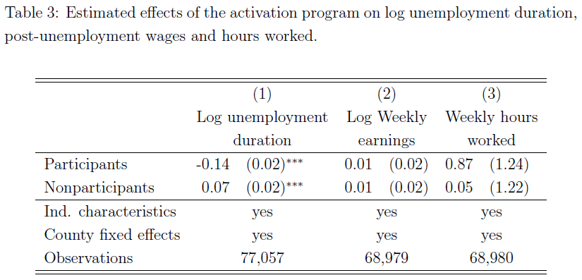
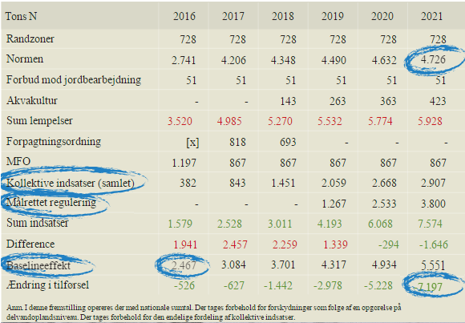

# Kontrafaktisk kausalitet


# Dagsorden

- Kausalitet og kontrafaktiske scenarier

- Teoretisk framework: Neyman-Rubin kausalmodel

- Antagelser, kriterier for kausalitet

- Eksempler og diskussion

# Kontrafaktiske scenarier og kausalitet

- Afgørende for kausalitet: Evnen til at manipulere fænomener
    - "no causation without manipulation" (Holland [1986](http://www.jstor.org/stable/2289064))
    
- Forskellige scenarier
    - Kontrafaktisk scenarie til det observerede

- Kontrafaktisk tænkning er afgørende for at definere en kausal effekt
    - Hvorfor?

# Kontrafaktisk kausalitet i historisk forskning

- Kontrafaktisk tænkning er afgørende: selv i historisk forskning!

    - Intellektuelt værktøj

    - "Counterfactual claims are legitimate, if ultimately uncertain, tools of thought" (Bulfoh [1999](http://onlinelibrary.wiley.com/doi/10.1111/0018-2656.00084/abstract), 168)
    
    - Vigtigt redskab til at diskutere kausalitet - selv i N=1 studier (Fearon [1991](http://www.jstor.org/stable/2010470))

- "The primary function of alternate history - the answer to the question ''why do we ask 'what if?'´´-is to express our changing views about the present." (Rosenfeld [2002](http://onlinelibrary.wiley.com/doi/10.1111/1468-2303.00222/abstract), 103)

# Definition af en kausal effekt

- Vi har ét mål for i dag: at definere en kausal effekt

- Hvordan kan vi definere en kausal effekt?
    - Potentielle udfald
    - I princippet uendeligt mange potentielle udfald

- Neyman-Rubin kausalmodel
    - Relevant for alle typer af forskningsdesigns
        - Eksperimenter, observationsstudier
    - Statistisk baggrund og applikation
        - Men relevant for både kvalitative og kvantitative tilgange

- Eksempel: Effekten af at modtage SU på tilfredsheden med uddannelsessystemet

# Neyman-Rubin kausalmodel

- Potentielle udfald muliggør en klar definition af en kausal effekt
    - Kausal effekt for en enhed
    - Gennemsnitlige kausale effekter
    - Eksplicitte antagelser

- For enhed _i_, har vi et potentielt udfald: $Y_{i}$
    - Enhed: person, gruppe, land, politisk parti etc.

- Stimuli: $W_{i}$

- Potentielt udfald givet stimuli: $Y_{i}(W_{i})$

- To potentielle udfald (i.e. binært stimuli): $Y_{i}(1), Y_{i}(0)$

- Kausaleffekt for enhed _i_: Forskellen mellem enhedens potentielle udfald givet stimuli og potentielle udfald givet kontrol.

    - $\tau_{i} = Y_{i}(1) - Y_{i}(0)$


# Eksempel: SU og uddannelsestilfredshed

- $W_{i}$: SU, stimuli

- $Y_{i}(W_{i})$: uddannelsestilfredshed givet stimuli (SU)

    - $Y_{i}(1)$: uddannelsestilfredshed hvis man modtager SU

    - $Y_{i}(0)$: uddannelsestilfredshed hvis man _ikke_ modtager SU

- $\tau_{i} = Y_{i}(1) - Y_{i}(0)$: kausaleffekt af at modtage SU

    - $\tau_{i} < 0$: negativ effekt af SU på uddannelsestilfredshed
    - $\tau_{i} = 0$: ingen effekt af SU på uddannelsestilfredshed
    - $\tau_{i} > 0$: positiv effekt af SU på uddannelsestilfredshed

# To vigtige aspekter

1. Definitionen af en kausal effekt afhænger ikke af hvilket potentielt udfald der er observeret/realiseret

2. Den kausale effekt er sammenlignignen af to potentielle udfald for den _samme_ enhed på det _samme_ tidspunkt

# Eksempel: SU og uddannelsestilfredshed

- 10 studerende

- 20 potentielle udfald
    - To potentielle udfald for hver studerende

- Tilfredshed mellem 0 og 100

- Vi begynder med en verden uden SU
    - 10 potentielle udfald

# Eksempel: SU og uddannelsestilfredshed

| Studerende _i_    | $Y_{i}(0)$ (ingen SU) |
|-------------|:---:|
| 1           | 60 | 
| 2           | 20 | 
| 3           | 80 | 
| 4           | 30 | 
| 5           | 40 | 
| 6           | 75 | 
| 7           | 40 | 
| 8           | 20 | 
| 9           | 60 | 
| 10          | 75 |
| **Gennemsnit**  | **50**  |

# Eksempel: SU og uddannelsestilfredshed

| Studerende _i_    | $Y_{i}(0)$ (ingen SU)  | $Y_{i}(1)$ (SU)  |
|-------------|:---:|:---:|
| 1           | 60 | 70 | 
| 2           | 20 | 50  |
| 3           | 80 | 80 |
| 4           | 30 | 45 |
| 5           | 40 | 50 |
| 6           | 75 | 60 |
| 7           | 40 | 45  |
| 8           | 20 | 30    |
| 9           | 60 | 85    |
| 10          | 75      | 85    |
| **Gennemsnit**  | **50**  | **60**  |

# Eksempel: SU og uddannelsestilfredshed

| Studerende _i_    | $Y_{i}(0)$ (ingen SU)  | $Y_{i}(1)$ (SU)  | $\tau_{i}$ |
|-------------|:---:|:---:|:---:|
| 1           | 60 | 70 | 10 |
| 2           | 20 | 50  | 30 |
| 3           | 80 | 80 | 0 |
| 4           | 30 | 45 | 15 |
| 5           | 40 | 50 | 10 |
| 6           | 75 | 60 | -15 |
| 7           | 40 | 45  | 5    |
| 8           | 20 | 30    | 10    |
| 9           | 60 | 85    | 25    |
| 10          | 75      | 85    | 10    |
| **Gennemsnit**  | **50**  | **60**  | **10**  |


# Det fundamentale kausalitetsproblem

- The Fundamental Problem of Causal Inference (FPCI)

- "It is impossible to _observe_ the value of $Y_{i}(1)$ and $Y_{i}(0)$ on the same unit and, therefore, it is impossible to _observe_ the effect of $W_{i}$ on $i$." (Holland [1986](http://www.jstor.org/stable/2289064), 947)

- Vi observerer _et_ udfald: det realiserede udfald
    - Det ikke-realiserede udfald er vores kontrafaktiske scenarie

- Tænk på en regression:
    - $R_{i} = W_{i}Y_{i}(1) + (1-W_{i})Y_{i}(0)$

# Eksempel: SU og uddannelsestilfredshed

| Studerende _i_  | $Y_{i}(0)$    | $Y_{i}(1)$  | $W_{i}$ |
|-------------|:---:|:---:|:---:|
| 1           | 60 | ? | 0 |
| 2           | ? | 50  | 1 |
| 3           | 80 | ? | 0 |
| 4           | ? | 45 | 1 |
| 5           | 40 | ? | 0 |
| 6           | ? | 60 | 1 |
| 7           | ? | 45  |  1   |
| 8           | 20 | ?    |  0   |
| 9           | ? | 85    |  1   |
| 10          | 75 | ?    | 0  |

# Eksempel: SU og uddannelsestilfredshed

| Studerende _i_  | $Y_{i}(0)$    | $Y_{i}(1)$  | $W_{i}$  | $R_{i}$ (observeret udfald)
|-------------|:---:|:---:|:---:|:---:|
| 1           | 60 | ? | 0 | 60 |
| 2           | ? | 50  | 1 | 50 |
| 3           | 80 | ? | 0 | 80 |
| 4           | ? | 45 | 1 | 45 |
| 5           | 40 | ? | 0 | 40  |
| 6           | ? | 60 | 1 | 60  |
| 7           | ? | 45  |  1   | 45  |
| 8           | 20 | ?    |  0   | 20 |
| 9           | ? | 85    |  1   | 85  |
| 10          | 75 | ?    | 0  | 75  |

# Den gennemsnitlige stimulieffekt 

- _Average treatment effect_ (ATE)

- Givet ved: 
    - $\tau_{ATE} = E[Y(1) - Y(0)] = E[Y(1)] - E[Y(0)]$

- Eksempel: Den gennemsnitlige effekt af at være SU-modtager
    - SU kan have store effekter men en ATE på 0
        - Hvorfor?

# Eksempel: SU og uddannelsestilfredshed

- Problem: Ikke tilfældigt hvem der modtager SU

- I den bedste af alle verdener:
    - Randomisering af stimuli (eksperiment, lektion 8)

- I andre tilfælde:
    - 'as-if' randomisering (naturlige eksperimenter, lektion 9)
    - manglende randomisering (observationsdata, lektion 10 og 11)

- To minutters tænkepause: Hvilken **realistisk** måde kunne vi studere dette på?

# Antagelse I: Stimuli er tilfældigt fordelt

- _Ignorability of Treatment Assignment_

- Med andre ord: Stimuli er ikke relateret til andre forhold, der er målt før stimuli er givet (prestimuli kovariat)

- Kovariate: $X$ (kontrolvariable)

- Eksogenitet: $(Y(1),Y(0),X) \perp W$

- I nogle tilfælde: $(Y(1),Y(0)) \perp W|X$
    - Vi vil diskutere dette senere i faget

# Antagelse II: Stable Unit Treatment Value Assumption (SUTVA)

- En samling af antagelser omkring stimulieffekter

- "The potential outcomes for any unit do not vary with the treatments assigned to other units, and, for each unit, there are no different forms or versions of each treatment level, which lead to different potential outcomes." (Imbens and Rubin [2015](http://www.cambridge.org/it/academic/subjects/statistics-probability/statistical-theory-and-methods/causal-inference-statistics-social-and-biomedical-sciences-introduction), 10)

# Antagelse II: Stable Unit Treatment Value Assumption (SUTVA)

1. Ingen interferens: Potentielle udfald for enhed _i_ afhænger udelukkende af tildeling af stimuli for enhed _i_ (ingen spillover effekter):
  
$(Y(1),Y(0)) \perp W_{j}, \forall i \neq j$

2. Stimulihomogenitet: Der er kun én version af et stimuli for hver enhed

# Assumption II: Stable Unit Treatment Value Assumption (SUTVA)

To implikationer (fra Heckman [2005](http://onlinelibrary.wiley.com/doi/10.1111/j.0081-1750.2006.00164.x/abstract), 11):

- Ingen sociale interaktioner og ligevægtseffekter.

- Ingen effekt af tildeling af stimuli på værdien af de potentielle udfald

# Antagelse II: Stable Unit Treatment Value Assumption (SUTVA)

- Eksempel: Fire personer (A, B, C, D), to får stimuli

- Vi antager to ting:

1. De to stimuli er ens
    - Der findes ikke forskellige version af vores stimuli
        - Hvis der gør dette, kan vi ikke isolere effekten af vores stimuli
    
2. Effekten af stimuli på person A er den samme uafhængigt af om person B, C, og/eller D modtager stimuli

# Eksempel: Aktiveringstiltag for arbejdsløse (Gautier et al. [2016](https://sites.google.com/site/pietgautier/DanishExp.pdf))

- Stimuli: aktiveringstiltag

- Afhængig variabel: arbejdsløshed

- Forventning: aktiveringstiltag $\rightarrow$ hurtigere i arbejde

- Hvad er det kontrafaktiske scenarie?
    - Hvad kan det potentielle problem være i forhold til SUTVA?


# Eksempel: Aktiveringstiltag for arbejdsløse (Gautier et al. [2016](https://sites.google.com/site/pietgautier/DanishExp.pdf))



# Eksempel: Aktiveringstiltag for arbejdsløse (Gautier et al. [2016](https://sites.google.com/site/pietgautier/DanishExp.pdf))

- Udfordring: når man gør noget for at få nogen i arbejde, kan det have effekter på andres mulighed for at finde arbejde
    - Effekt på kontrolgruppen, brud på SUTVA

- Hvordan påvirker det vores effekt? 
    - Vi overestimerer effekten af aktiveringstiltag
    - Hvorfor?
        - Kortere arbejdsløshed for stimuligruppen
        - Længere arbejdsløshed for kontrolgruppen
        
- Hvordan undersøges det? Difference-in-difference
    - Data fra områder, der ikke er en del af eksperimentet
    - Giver mulighed for at sammenligne med en 'bedre' kontrol
        - Med andre ord: et bedre kontrafaktisk scenarie

# Antagelse III: Overholdelse af tildeling til stimuli

- Udfordring: Det at tildele nogen et stimuli er ikke det samme som at de overholder tildelingen af stimuli
    - Forskellige grunde
        - Nogen har allerede fået stimuli
        - Nogen vil aldrig tage imod stimuli
    - Fire grupper

- $W_{i}$ er _tildeling_ af stimuli

- Eksempel: Vi tilbyder en gruppe at få SU, men ikke sikkert, at de tager imod

- $D_{i}$: stimulistatus (1 hvis man har stimuli, 0 hvis ikke)

# Always-takers, dem der altid tager stimuli

- Disse vil altid tage stimuli

- Uafhængigt af om man bliver tildelt stimuli, vil man tage det
    - $W_{i}$ = 1, $D_{i}$ = 1
    - $W_{i}$ = 0, $D_{i}$ = 1
    
- Eksempel?

# Never-takers, dem der aldrig tager imod stimuli

- Disse vil aldrig tage stimuli

- Uafhængigt af om man er tildelt stimuli, vil man ikke tage imod det

    - $W_{i}$ = 1, $D_{i}$ = 0

    - $W_{i}$ = 0, $D_{i}$ = 0

- Eksempel?

# Cooperators, dem der overholder tildeling af stimuli

- Disse vil tage stimuli hvis de bliver tildelt det - ellers ikke

    - $W_{i}$ = 1, $D_{i}$ = 1

    - $W_{i}$ = 0, $D_{i}$ = 0

- Eksempel?

# Defiers, de værste af slagsen

- Disse vil kun tage stimuli hvis de ikke bliver det tildelt - og omvendt
    - Hvis man bliver tildelt stimuli, vil man ikke tage det. 
    - Hvis man ikke bliver tildelt stimuli, vil man tage det.

- Får det modsattet af hvad de er tildelt
    - $W_{i}$ = 1, $D_{i}$ = 0

    - $W_{i}$ = 0, $D_{i}$ = 1

- Eksempel?

# Hvilke enheder vil kunne lære os noget om kausaleffekten?

- Husk: manipulation

- De tilfælde hvor vi kan manipulere stimuli på den ønskede måde
    - Med andre ord: dem der samarbejder med stimuli
    - _cooperators_

# Kausalitetsudfordring

- Hvordan ved vi at $W_{i}$ = 1, $D_{i}$ = 1 samarbejder med stimuli og ikke altid tager det?

- Hvordan ved vi at $W_{i}$ = 0, $D_{i}$ = 0 samarbejder og ikke altid vil fraskrive sig tildelingen af stimuli?

- Vi har kun ét realiseret udfald (vi mangler et kontrafaktisk scenarie)

- Svært at sige, hvordan en enhed ville have ageret

- Det bedste råd: Prøv at måle om folk overholder tildeling af stimuli

# Intention-to-treat

- De effekter vi får er ofte intention-to-treat (ITT) estimater.

- Gennemsnitsforskelle mellem enheder tildelt stimuli og enheder ikke tildelt stimuli.

# Eksempel: Opfordring $W_{i}$ til motion $D_{i}$

- Fra Tabel 5.5 in Rosenbaum ([2002](http://www.springer.com/us/book/9780387989679), 182).

- Y = lungekapacitet, målt udåndingsvolumen 

- Vil mennesker motionere når de bliver opfordret? ($d_{i}(1)$)
- Vil mennesker motionere uden at blive opfordret? ($d_{i}(0)$)

# Eksempel: Opfordring $W_{i}$ til motion $D_{i}$

| Person _i_ | $d_{i}(1)$ | $d_{i}(0)$  |
|-------------|:---:|:---:|
| 1 | 1 | 1 | 
| 2 | 1 | 1 | 
| 3 | 1 | 0 | 
| 4 | 1 | 0 | 
| 5 | 1 | 0 | 
| 6 | 1 | 0 | 
| 7 | 1 | 0 | 
| 8 | 1 | 0 | 
| 9 | 0 | 0 | 
| 10 | 0 | 0 |

# Eksempel: Opfordring $W_{i}$ til motion $D_{i}$

| _i_ | $d_{i}(1)$ | $d_{i}(0)$ | $Y_{i}(1)$ | $Y_{i}(0)$ |
|-------------|:---:|:---:|:---:|:---:|:---:|
| 1 | 1 | 1 | 71  | 71 |
| 2 | 1 | 1 | 68  | 68 |
| 3 | 1 | 0 | 64  | 59 |
| 4 | 1 | 0 | 62  | 57 |
| 5 | 1 | 0 | 59  | 54 |
| 6 | 1 | 0 | 58  | 53 |
| 7 | 1 | 0 | 56  | 51 |
| 8 | 1 | 0 | 56  | 51 |
| 9 | 0 | 0 | 42  | 42 |
| 10 | 0 | 0 | 39 | 39 |


# Eksempel: Opfordring $W_{i}$ til motion $D_{i}$

| _i_ | $d_{i}(1)$ | $d_{i}(0)$ | $Y_{i}(1)$ | $Y_{i}(0)$ | $W_{i}$ | $D_{i}$ |  $R_{i}$ |
|-------------|:---:|:---:|:---:|:---:|:---:|:---:|:---:|
| 1 | 1 | 1 | 71  | 71 | 1 | 1 | 71 |
| 2 | 1 | 1 | 68  | 68 | 0 | 1 | 68 |
| 3 | 1 | 0 | 64  | 59 | 1 | 1 | 64 |
| 4 | 1 | 0 | 62  | 57 | 0 | 0 | 57 |
| 5 | 1 | 0 | 59  | 54 | 0 | 0 | 54 |
| 6 | 1 | 0 | 57  | 52 | 1 | 1 | 57 |
| 7 | 1 | 0 | 56  | 51 | 1 | 1 | 56 |
| 8 | 1 | 0 | 56  | 51 | 0| 0 | 51 |
| 9 | 0 | 0 | 42  | 42 | 0 | 0 | 42 |
| 10 | 0 | 0 | 39 | 39 | 1 | 0 | 39 |

# Eksempel: Opfordring $W_{i}$ til motion $D_{i}$

```{r}
di1 <- c(1, 1, 1, 1, 1, 1, 1, 1, 0, 0)
di0 <- c(1, 1, 0, 0, 0, 0 ,0, 0, 0, 0)
Yi1 <- c(71, 68, 64, 62, 59, 57, 56, 56, 42, 39)
Yi0 <- c(71, 68, 59, 57, 54, 52, 51, 51, 42, 39)
Wi <- c(1, 0, 1, 0, 0, 1, 1, 0, 0, 1)
Di <- c(1, 1, 1, 0, 0, 1, 1, 0, 0, 0)
Ri <- c(71, 68, 64, 57, 54, 57, 56, 51, 42, 39)
lung <- data.frame(di1, di0, Yi1, Yi0, Wi, Di, Ri)
```

# Hvad er den gennemsnitlige stimulieffekt?

```{r}
mean(
  lung[lung$Wi == 1 & lung$di1 - lung$di0 == 1,]$Ri - 
  lung[lung$Wi == 0 & lung$di1 - lung$di0 == 1,]$Ri
  )
```

# Hvad er den **naive** gennemsnitlige stimulieffekt?

- Hvis vi ikke tager højde for tildeling af stimuli, men bare sammenligner folk der motionerer med folk der ikke gør

```{r}
mean(lung[lung$Di == 1,]$Ri - lung[lung$Di == 0,]$Ri)

```

- Næsten tre gange større end den gennemsnitlige stimulieffekt

# I en simpel OLS regression

```{r}
summary(lm(Ri~Di, data=lung))$coef

```

- Problem:
    - Vores gennemsnitlige stimulieffekt påvirkes af selvselektion ind i stimuli (manglende overholdelse af antagelse I)

# Hvad er ITT?

```{r}
mean(lung[lung$Wi == 1,]$Ri - lung[lung$Wi == 0,]$Ri)

summary(lm(Ri~Wi, data=lung))$coef

```

# Hvad med fænomener vi ikke kan manipulere?

- Hvordan undersøger vi den kausale effekt af køn?

- Vi kan ikke manipulere køn (endnu, desværre)
    - Men vi kan manipulere *opfattelser* af køn

- Eksempel: Identiske jobansøgninger med forskellige køn
    - Mulighed for at estimere den kausale effekt af at have et bestemt køn

- Husk: ingen kausalitet uden manipulation

# Hvor meget er i et stimuli?

- Vi skal være **meget** eksplicitte omkring, hvad vores stimuli er

- Ved vi ikke hvad stimuli er, har vi intet studie

- Jo mere diffust et stimuli er, desto mindre ved vi, hvad der påvirker en enhed

- Eksempel: effekten af at bruge internettet på livstilfredshed
    - Hvad driver en eventuel effekt? 

# Eksempel: Landbrugspakken

- Potentielle udfald: Mængden af kvælstof i havmiljøet

- Stimuli: Landbrugspakken

- Læs: [http://www.politiko.dk/infografik/her-er-regeringens-regnestykke](http://www.politiko.dk/infografik/her-er-regeringens-regnestykke)

- Hvad er problemet? 

# Eksempel: Landbrugspakken



# Eksempel: Terror og terrorfrygt


# Eksempel: Terror og terrorfrygt

- Fra [DR.dk](http://www.dr.dk/nyheder/indland/frygten-terror-er-steget-det-seneste-aar#!/): "Eksemplerne på terrorangreb begået det sidste år er flere end de, der er nævnt herover, men fælles for dem alle er, at de har været med til at skabe frygt i befolkningen."

- 56 procent svarer, at frygten er blevet større

- Kausalargument: terror $\rightarrow$ terrorfrygt

- Udfordring: vi har ingen idé om hvad den gennemsnitlige stimulieffekt er

- Hvorfor? Vi mangler et kontrafaktisk scenarie

- Løsning?

# Dagens øvelse

- Vælg et binært stimuli

- Vælg en afhængig variabel
    - Formuler to potentielle udfald

- Diskuter antagelser og potentielle brud på disse antagelser
    - Vil alle tage imod stimuli?
    - Hvornår vil der være brud på SUTVA?

# Add on

- Forslag?

- AGORA 16

# Afsluttende bemærkninger

- Tænk altid i kontrafaktiske scenarier
    - Har en politik den ønskede virkning? 
        - Hvordan ville verden se ud, hvis den pågældende politik *ikke* var gennemført?
        - Hvad var det kontrafaktiske scenarie?
        
- Definer kausale effekter med udgangspunkt i potentielle udfald

- Forhold dig altid til de antagelser en kausal effekt beror på
    - Intet andet end stimuli skal kunne forklare effekten
    - SUTVA
    - Enheder overholder stimulitildeling

# Næste gang

- Validitet

- Næste gang: Mandag, samme tid og sted