```{r include=FALSE}
options(digits=3)
```

# Hvad skal/kan vi kontrollere for? (White [2016](http://www.johnmyleswhite.com/notebook/2016/02/25/a-variant-on-statistically-controlling-for-confounding-constructs-is-harder-than-you-think/))

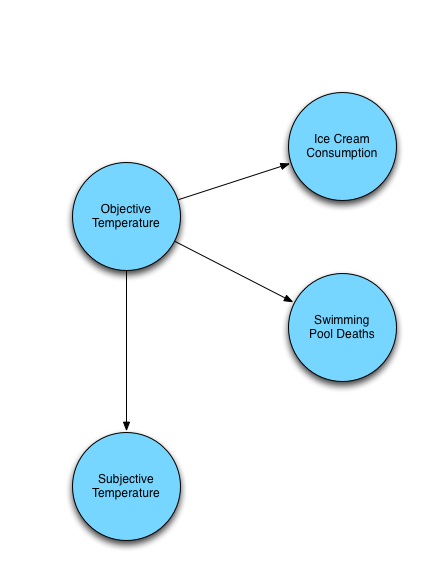

# Hvad skal/kan vi kontrollere for? (White [2016](http://www.johnmyleswhite.com/notebook/2016/02/25/a-variant-on-statistically-controlling-for-confounding-constructs-is-harder-than-you-think/))

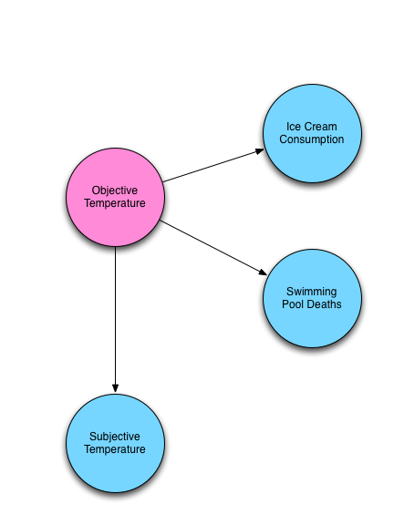

# Hvad skal/kan vi kontrollere for? (White [2016](http://www.johnmyleswhite.com/notebook/2016/02/25/a-variant-on-statistically-controlling-for-confounding-constructs-is-harder-than-you-think/))

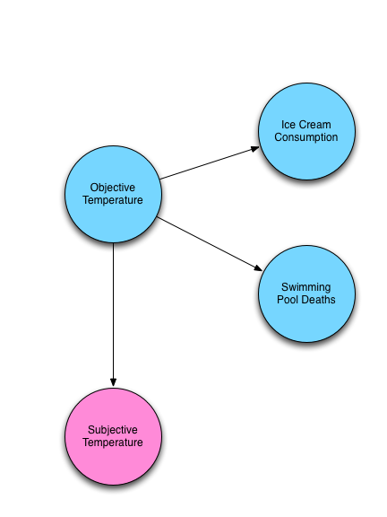

# Hvad skal/kan vi kontrollere for? (White [2016](http://www.johnmyleswhite.com/notebook/2016/02/25/a-variant-on-statistically-controlling-for-confounding-constructs-is-harder-than-you-think/))

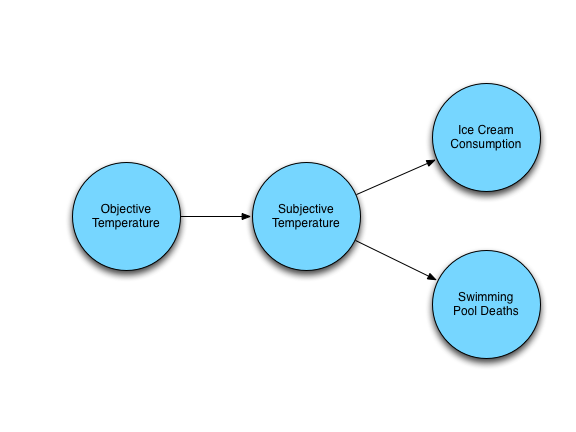

# Hvad skal/kan vi kontrollere for? (White [2016](http://www.johnmyleswhite.com/notebook/2016/02/25/a-variant-on-statistically-controlling-for-confounding-constructs-is-harder-than-you-think/))

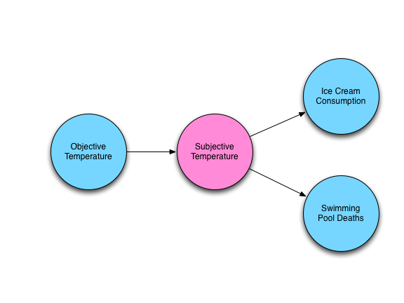

# Hvad skal/kan vi kontrollere for? (White [2016](http://www.johnmyleswhite.com/notebook/2016/02/25/a-variant-on-statistically-controlling-for-confounding-constructs-is-harder-than-you-think/))

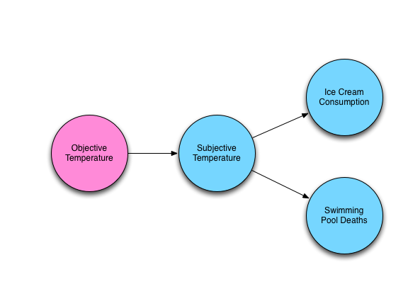

# Hvad skal/kan vi kontrollere for? (White [2016](http://www.johnmyleswhite.com/notebook/2016/02/25/a-variant-on-statistically-controlling-for-confounding-constructs-is-harder-than-you-think/))

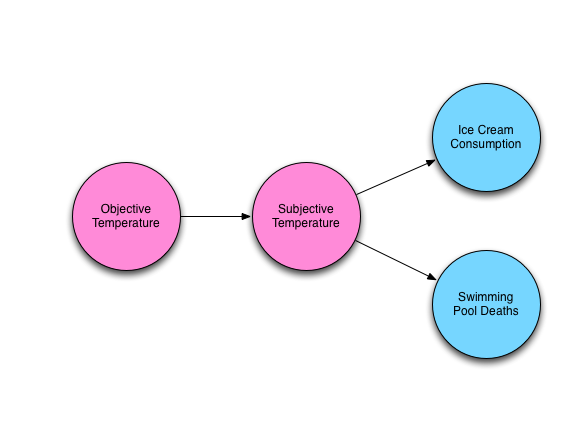

# Dagsorden

- Kausalitet og orienterede acykliske grafer

- Terminologi

- Applikationer

- Potentielle udfald, validitet og orienterede acykliske grafer

# Seminaropgaven

- Næste deadline: **I dag**

- Omkring 5 sider 

- Indhold: 
    - Kort beskrivelse af emne
    - Gerne én eller to konkrete ideer
    - En reference eller to til relevant litteratur
    
- Send til: [egl@sam.sdu.dk](egl@sam.sdu.dk)

# Kausalmodeller

- Lektion 3: Rubins kausalmodel
      - Fokus på potentielle udfald
      - Definition af en kausaleffekt
      - Antagelser (SITA, SUTVA)

- Lektion 4: Campbells kausalmodel
      - Validitetstypologi
      - Forskellige validitetsbegreber
      - Validitetstrusler

- I dag: Pearls kausalmodel
      - Grafteori
      - Ikke-parametrisk stianalyse
      - Kompatibelt med Rubins kausalmodel

# Kausaleffekter: Mange veje til Rom

- Vi er interesseret i kausale mekanismer
    - Mange måder hvorpå de kan studeres
    - Orienterede acycliske grafer
        - En god måde at formulere kausale ideer og evaluere deres konsekvenser

- Simple regler som alle relevante kontrolvariable siger os ikke meget

- Hovedpointe: Der er mange måder hvorpå man identificere en kausal effekt
    - Vi skal kigge på tre identifikationsstrategier vha. DAG

# Fire relationer mellem to variable

- X og Y kan være forbundne til hinanden på fire måder
    - Direct causation: X $\rightarrow$ Y
    - Reverse causation: X $\leftarrow$ Y
    - Confounding: X $\leftarrow$ C $\rightarrow$ Y
    - Collider: X $\rightarrow$ C $\leftarrow$ Y

- (Beklager, _mange_ engelske begreber)

# Directed acyclic graphs (DAGs)

- DAG
    - Directed acyclic graphs/orienterede acycliske grafer
    - Kausalmodel, graf uden kredse
    - Kausale grafer der forbinder variable gennem pile
    - Framework til at forstå konditionelle korrelationer

- Ekspliciterer kausale antagelser omkring relationen mellem variable (_nodes_)
    - En kvalitativ kausalmodel omkring verden

- Kan bruges til at udlede (partielle) korrelationer mellem variable i modellen
    - Belyse hvilke korrelationer der er af kausal karakter
    - Belyse hvilke korrelationer der _ikke_ er af kausal karakter

# DAGs: Tre overordnede elementer

1. Variable (_nodes_)

2. Pile (_edges_, _arcs_)

3. _Manglende_ pile (stærke antagelser)

# DAG, eksempel

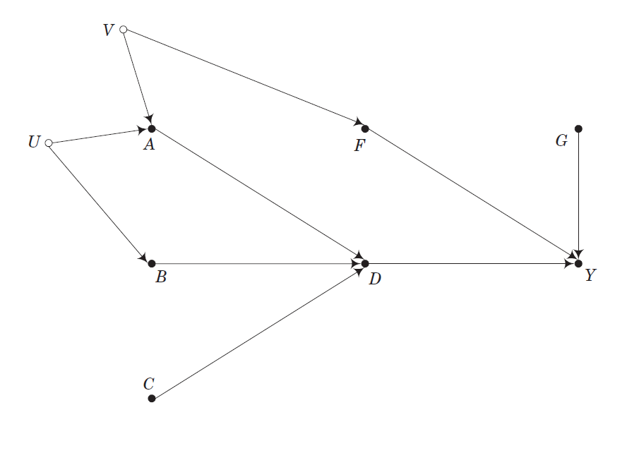

# Node

- Node: Variabel

- Illustreret med et bogstav (A, B, C etc.)

- Observeret stokastisk variabel
      - Representeret med fyldte cirkler ($\bullet$)

- Uobserveret stokastisk variabel
      - Representeret med hule cirkler ($\circ$)

# Pile (directed edges/arcs)

- En pil i én retning der går fra en node til en anden
    - Forbinder to nodes
    - Mulige kausale effekter
    - Indikerer retningen på en kaual relation

- Manglende pile er afgørende antagelser

- Der er også pile der fører til to nodes (_bidirected edges_)
    - Kurvet sti der viser en uobserveret node der påvirker to nodes

# Sti (path)

- En sti er en sekvens af pile, der forbinder to nodes
    - En sti krydser ikke en node mere end en gang

- Stier kan være åbne eller lukkede (eksempler følger!)
    - Alle stier driver en forbindelse med mindre de er blokeret
          - Blokerede stier kan få fjernet deres blokering
    - En sti med _colliding_ pile er lukket 
    - Betinger ("_condtions_") man på en collider (evt. kontrollerer i en regression), åbner stien (fjerner blokeringen)
        - Også for nodes der er direkte eller indirekte påvirket af den pågældende node
        - (kontrollerer man på en node der påvirkes af en _collider_, åbner stien)
    - Betinger man på en ikke-collider, lukker stien
    - Betinger man ikke på en collider, forbliver den lukket
    
- Forskellige stier
    - Back-door paths, front-door paths

# Hvorfor DAGs?

- Formelt _og_ generelt framework
- Eksplicit valg og fravalg af variable i empiriske analyser
    - Fokus på kausale antagelser
- Kan bruges til at udlede implikationer
- Perfekt til at illustrere mange udfordringer ift. kausal inferens
    - Især mere komplekse kausalmodeller
- En masse figurer (kan forstås uden algebra)
- Kan bruges til at visualisere og sammenligne forskellige identifikationsstrategier (Steiner et al. [2015](http://smr.sagepub.com/content/early/2015/05/13/0049124115582272.abstract))
- Kan bruges til at repræsentere nødvendige og tilstrækkelige kausale relationer (kendt fra QCA, process tracing m.v.)

# Cyklisk graf (_ikke_ en DAG)

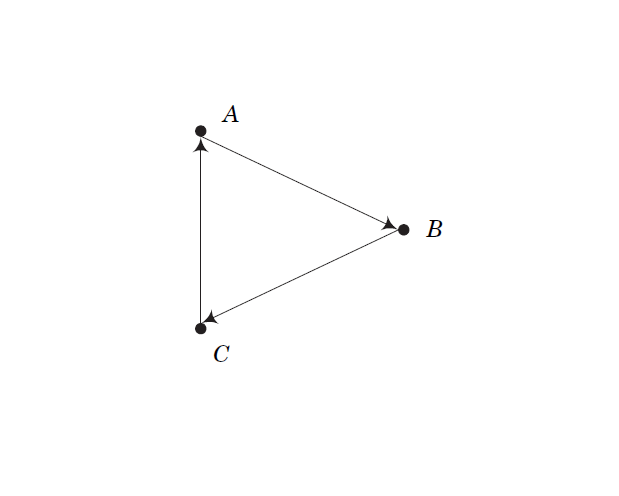

# Orienteret acyclisk graf

- DAG er orienteret så det ikke er muligt at følge pilene og ramme den samme _node_ igen

- Ingen simultanitet
    - Vi tillader ikke at to variable simultant påvirker hinanden direkte eller indirekte
- Tænk tid: Fremtiden kan ikke forårsage fortiden
- Hvis man er interesseret i feedbacks: komplekst!

# Hvordan ikke-parametrisk?

- Ikke-parametrisk fordi der ikke er nogle antagelser omkring parametrene i modellen

- Mere specifikt ingen antagelser omkring:

    1. Distributionen af variablene i DAG

    2. Den funktionelle form

# DAGs, tre elementer

- Alle DAGs kan konstrueres af tre elementer:
    - Chains
        - X $\rightarrow$ Y
    - Forks
        - X $\leftarrow$ C $\rightarrow$ Y
    - Inverted forks
        - X $\rightarrow$ C $\leftarrow$ Y

- De elementer skaber korrelationer via:
    - Kausalitet
    - Confounders
    - Colliders

# DAGs, tre elementer

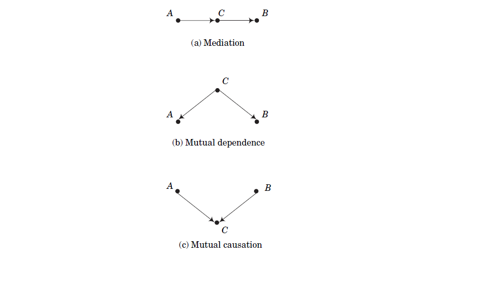

# Mere terminologi: familiestrukturen

- Descendent, child, ancestor, parent, grandparent
    - Eksempel: A $\rightarrow$ B $\rightarrow$ C

- _Parents_ af en node: alle nodes der direkte påvirker en node
    - pa(C) = {B}

- _Grandparents_ af en node: alle nodes der påvirker _parents_
    - gp(C) = {A}

- _Children_ af en node: alle nodes direkte påvirket af en node
    - child(A) = {B}

- _Descendants_ af en node: alle nodes direkte eller indirekte påvirket af en node
    - desc(A) = {B, C}

- _Ancestors_ af en node: alle nodes der direkte eller indirekte påvirker en node
    - an(C) = {A, B}

# Conditioning

- Kan finde sted i analysestadiet eller i dataindsamlingsprocessen

- Betinge en node, _conditioning_
    - Overordnet: introducere information omkring en variabel i analysen

- Kan finde sted på mange måder i praksis
    - Kontrol (regression)
    - Stratificering (krydstabulering)
    - Subgroup analyse (split sample)
    - Stikprøveudvælgelse
    - Frafald etc.

# Collider

- _Collider_: En node hvor to eller flere pile mødes
    - Colliders er i relation til en _path_, ikke én _edge_

- Enhver endogen variabel der har to eller flere årsager er en _collider_ i en sti
    - Endogene variable er ofte _colliders_
        - Desværre ikke noget politologer fokuserer meget på

- Et af de vigtigste koncepter med væsentlige implikationer!
    - En brugbar indsigt fra Pearl's framework
    - Relateret til selektion på den afhængige variabel og betingning på en endogen variabel
        - Altså hvad der finder sted i _mange_ studier

# d-seperation og d-connection

- d-seperation: grafisk test for om to sets af nodes er uafhængige efter kontrol for et tredje set
    - d = directional
    - udleder testbare implikationer af en model
    
- To nodes er d-connected hvis der er en åben sti mellem dem
    - Blokeret, d-seperated, ingen forbindelse
    - Ikke blokeret, d-connected, forbindelse

- Hvis to variable er d-seperated: statistisk uafhængige efter kontrol for en eller flere variable (ingen partiel korrelation)
    - Hvis to variable ikke er d-seperated: afhængige, åbne, d-connected

# d-seperation og d-connection

- Eksempel: A $\rightarrow$ B $\rightarrow$ C $\rightarrow$ D $\leftarrow$ E $\leftarrow$ F $\rightarrow$ G
    - Collider: D
    - A-B-C-D er ikke blokeret, så A og D er d-connected
    - D-E-F-G er ikke blokeret, så D og G er d-connected
    - A og G er d-seperated
    - Ved at betinge på D, åbnes stien og A og G er d-connected

# Betinge på en collider

- "_Conditioning on a collider_" 
    - Berksons Paradoks

- _Conditioning_ på en _collider_ kan **skabe** en spuriøs korrelation mellem de to nodes i en _inverted fork_

- I praksis: Vi kan ikke bare inkludere et hav af kontrolvariable i en regressionsmodel og undgå spuriøse korrelationer
    - Vi kan tværtimod skabe spuriøse korrelationer

# Eksempel: Regression, confounder og collider

- Hvilke variable er det OK at kontrollere for?
    - Confounders, generelt OK
    - Colliders, farligt!
        - Og hvis collideren er en del af dataudvælgelsen, kan det ikke klares i analysen

# Conditioning på en confounder (generelt OK)

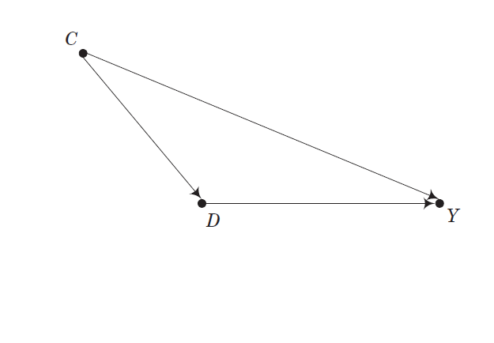

# Eksempel: Regression, confounder og collider (Ogorek [2016](http://anythingbutrbitrary.blogspot.dk/2016/01/how-to-create-confounders-with.html))

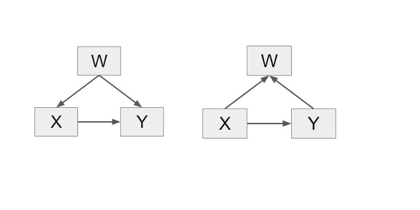

# Eksempel: Regression (Ogorek [2016](http://anythingbutrbitrary.blogspot.dk/2016/01/how-to-create-confounders-with.html))

- Confounding

```{r}
N <- 100000

w <- rnorm(N)

x <- .5 * w + rnorm(N)

y <- .3 * w + .4 * x + rnorm(N)
```

# Eksempel: Regression (Ogorek [2016](http://anythingbutrbitrary.blogspot.dk/2016/01/how-to-create-confounders-with.html))

- Confounding

```{r}
summary(lm(y ~ x))$coef
```

# Eksempel: Regression (Ogorek [2016](http://anythingbutrbitrary.blogspot.dk/2016/01/how-to-create-confounders-with.html))

- Confounding

```{r}
summary(lm(y ~ x + w))$coef
```

# Eksempel: Regression (Ogorek [2016](http://anythingbutrbitrary.blogspot.dk/2016/01/how-to-create-confounders-with.html))

- Collider

```{r}

x <- rnorm(N)

y <- .7 * x + rnorm(N)

w <- 1.2 * x + .6 * y + rnorm(N)

```

# Eksempel: Regression (Ogorek [2016](http://anythingbutrbitrary.blogspot.dk/2016/01/how-to-create-confounders-with.html))

- Collider

```{r}
summary(lm(y ~ x))$coef
```

# Eksempel: Regression (Ogorek [2016](http://anythingbutrbitrary.blogspot.dk/2016/01/how-to-create-confounders-with.html))

- Collider

```{r}
summary(lm(y ~ x + w))$coef
```


# Eksempel: College

- SAT score (A, test score)

- Motivation (B, interview rating)

- College (C = 1 for dem der er optaget på college, C = 0 for dem der er afvist)

- College er en collider
    - A $\rightarrow$ C $\leftarrow$ B

- Ingen relation mellem A og B ($\rho$ = .035)

- A og B påvirker C hver ($\rho$ (A,C) = .641, $\rho$ (B,C) = .232)

- Betinger vi på C, får vi en **negativ** korrelation mellem A og B

# Eksempel: College


# Tre typer af bias

- Overcontrol
    - Betinge på confounders i en sti

- Confounding bias
    - Ikke at betinge på bagvedliggende nodes

- Collider bias
    - Betinge på colliders

# Hvordan kan vi identificere en kausal effekt?

- Tre ikke-udtømmende måder
    - Strategi I: Conditioning
        - Conditioning på variable der blokerer alle back-door stier 
    - Strategi II: Instrumentelle variable
        - Eksogen variation i en IV
    - Strategi III: Front-door kriterier (mediatorer)
        - Find en isoleret og udtømmende node (eller flere nodes) der medierer effekten

# Back-door path

- En back-door sti fra X til Y er en sti der har en direkte edge til X der er en _ancestor_ til X 

- En kausal effekt af X på Y kan identificeres ved at betinge effekten på en observeret variabel der blokerer back-door stier

- Forskellige strategier
    - Kontrol
    - Instrumentel variabel
    - Mediatorer

# Back-door kriterier

- Hvis en eller flere back-door stier forbinder to nodes (T og Y), kan det at betinge på en tredje variabel kun virke hvis _alle_ back-door stier mellem de to nodes blokeres

- Applicerbar algoritme
    1. Find alle back-door stier, der forbinder T og Y
    2. Undersøg om disse blokeres naturligt
        - Hvis ja, identifikation
    3. Undersøg om de ikke-blokerede stier kan blokeres ved at betinge nodes der ikke er descendants af T
        - Hvis ja, fortsæt; hvis nej, ingen identifikation
    4. Undersøg om blokeringen i Step 3 åbnede ikke-kausale stier og undersøg om disse kan blokeres
        - Hvis ja, fortsæt; hvis nej, ingen identifikation
    5. Undersøg om nogle variable der skal betinges på for at blokere en back-door sti er på stien mellem T og Y eller er _descendants_ af en variabel på stien mellem T og Y
        - Hvis ja, ingen idenfitikation; hvis nej; identifikation

# Eksempel: Lagged variable, back-door 

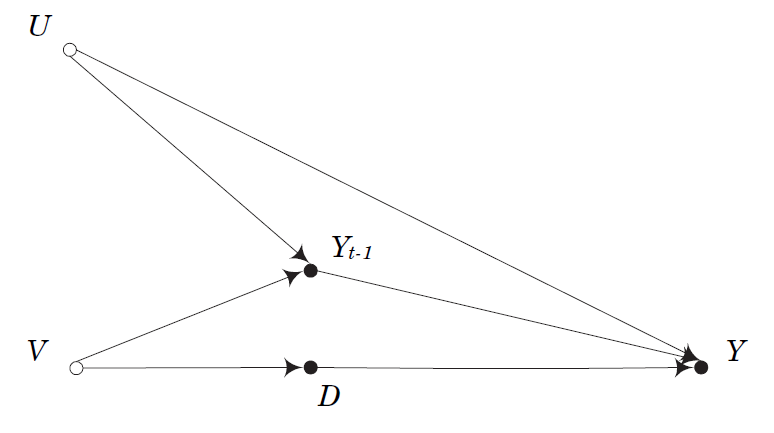

# Eksempel: Lagged variable, back-door

- Ofte bruger vi en lagged afhængig variabel
    - $Y_{t-1}$

- To back-door stier fra $D$ til $Y$
    - $D \leftarrow V \rightarrow Y_{t-1} \rightarrow Y$
    - $D \leftarrow V \rightarrow Y_{t-1} \leftarrow U \rightarrow Y$
    
- $Y_{t-1}$ opfylder ikke back-door kriteriet
    - Blokerer $D \leftarrow V \rightarrow Y_{t-1} \rightarrow Y$, men ikke $D \leftarrow V \rightarrow Y_{t-1} \leftarrow U \rightarrow Y$

- Hvad sker der ved at kontrollere for $Y_{t-1}$? 
    - COLLIDER!!! 
    - Hvilke nodes?
    
# Front-door

- Identifikation ved hjælp af en mekanisme

- Z opfylder front-door kriteriet når:
    - Z blokerer alle _direkte_ stier fra X til Y
    - Der ikke er nogle åbne back-door stier fra X til Z
    - X blokerer alle back-door stier fra Z til Y

# Simpelt eksempel på front-door

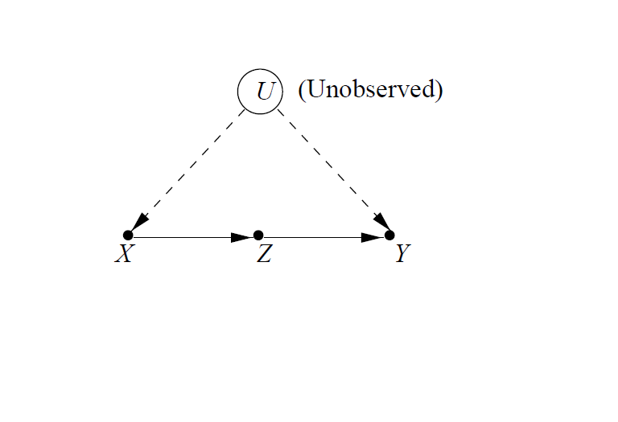

# Øvelse: Hvad er hvad?

- U er en [child/parent] til X og Y

- X og Y er [descendants/ancestors] af Z

- Der er en [direkte/ingen] sti fra Z til Y

- Der er [to/ingen] stier fra Z til U

- X er en [collider/ikke-collider] i stien Z $\rightarrow$ X $\leftarrow$ U

- X er en [collider/ikke-collider] i stien Z $\rightarrow$ X $\rightarrow$ Y

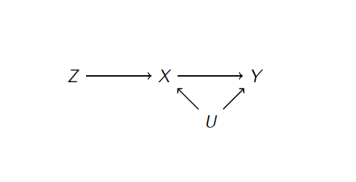

# Øvelse: Hvad er hvad?

- U er en [child/**parent**] til X og Y

- X og Y er [**descendants**/ancestors] af Z

- Der er en [**direkte**/ingen] sti fra Z til Y

- Der er [**to**/ingen] stier fra Z til U

- X er en [**collider**/ikke-collider] i stien Z $\rightarrow$ X $\leftarrow$ U

- X er en [collider/**ikke-collider**] i stien Z $\rightarrow$ X $\rightarrow$ Y


# do(x) operator

- Kontrafaktisk kausalitet i DAGs

- Operatoren erstatter en stokastisk variabel X med en konstant x
    - Tænk eksperiment, x = 1 (stimuli) og x = 0 (kontrol)
    - Fjerner alle edges der pejer til X 

- Bemærk: Kræver _ikke_ at X er manipulerbar! 
    - Kan eksempelvis være køn

# Kausaleffekt af X på Y (Pearl [2007](http://ftp.cs.ucla.edu/pub/stat_ser/r337-jsm07.pdf))

- Vi kan bruge do-operatoren til at beskrive back-door og front-door kriterierne

- $Pr(Y|do(X = x))$

- Kontrolvariable: S

- Back-door kriteriet: $Pr(Y|do(X = x)) = \sum\limits_{s} Pr(Y|X = x,S = s) Pr(S = s)$

- Front-door kriteriet: 

$Pr(Y|do(X = x)) = \sum\limits_{s} Pr(Y|S = s,X = x) \sum\limits_{x'} Pr(Y|X = x',S = s) Pr(X = x')$


# Hvad skal vi betinge på for at identificere effekten af D på Y?


# Hvad skal vi betinge på for at identificere effekten af D på Y?

- To back-door stier mellem D og Y
    - D $\leftarrow$ A $\leftarrow$ V $\rightarrow$ F $\rightarrow$ Y
    - D $\leftarrow$ B $\leftarrow$ U $\rightarrow$ A $\leftarrow$ V $\rightarrow$ F $\rightarrow$ Y

- A er collider i den anden back-door sti. 

1. F. F overholder back-door kriteriet, så vi kan identificere effekten af D på Y

2. A og B. A er en midtervariabel i D $\leftarrow$ A $\leftarrow$ V (og kan dermed blokere V). B er midtervariabel i D $\leftarrow$ B $\leftarrow$ U. A er dog også en collider variabel (U $\rightarrow$ A $\leftarrow$ V), så ved at betinge kun på A, vil vi åbne den anden back-door.
    - Altså: A _og_ B

# Hvilken node vil være et godt instrument?


# Hvilken node vil være et godt instrument?

- C. Eksogen variation i D der overholder front-door kriterie

- Den eneste effekt C kan have på Y er gennem D

# Opsummering

- DAG faciliterer diskussioner omkring antagelser ifm. kausal inferens

- DAG gør os bevidst omkring, at vi ikke skal inddrage alle variable i en analyse, for at identificere en kausal effekt
    - Vi skal fokusere på en bestemt sti

- Igen: Mange veje til Rom
    - Forskellige identifikationsstrategier tilgængelig i den samme DAG

- Mere forklarende model for kausalitet: Eksplicit beskrivelse af under hvilke betingelser X forårsager Y

# Er der nogle ulemper?

- Ingen DAG er bedre end de antagelser, der gøres
- Kausale antagelser er ofte svage og kan ikke ekspliciteres med den præcision, der kræves
- I "virkeligheden"" skal vi ofte gøre os parametriske antagelser for at estimere kausale effekter
- Det antages at der er effektheterogenitet (igen: ingen antagelser omkring parametre)

# Tre kausalmodeller: ligheder og forskelle

_Se tabel_

# Øvelse: Hvorfor kan vi identificere X $\rightarrow$ Y? (Pearl [1995](http://biomet.oxfordjournals.org/content/82/4/669.short))

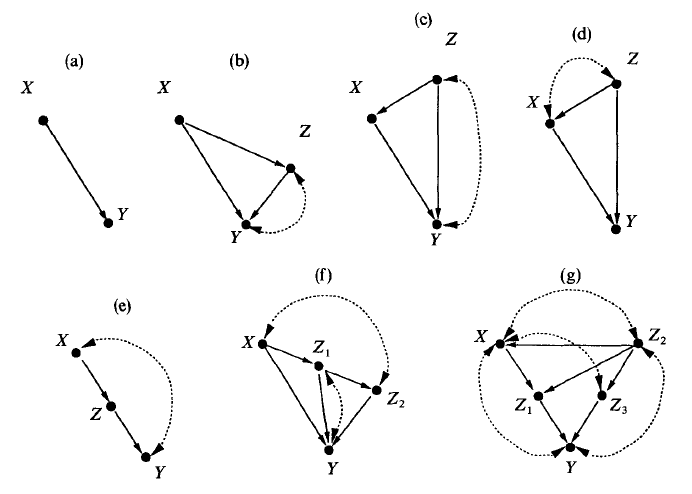

# Øvelse: Hvorfor kan vi _ikke_ identificere X $\rightarrow$ Y? (Pearl [1995](http://biomet.oxfordjournals.org/content/82/4/669.short))

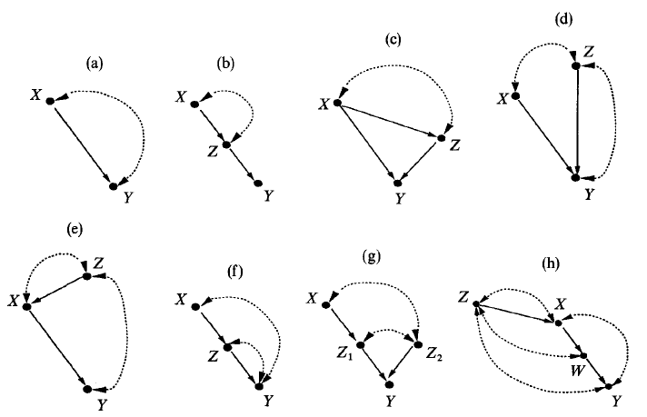

# Næste gang

- I dag var sidste gang om kausale modeller
    - Potentielle udfald
    - Validitetstypologi
    - _Directed acyclic graphs_ (DAGs)

- Næste gang: Præsentation af seminaropgave

- Mandag, samme tid og sted

# Næste gang: præsentation af idé

- Jeg holder en miniforelæsning

- Efterfulgt af præsentationer:
    - 10 minutter (max)

    - Slides
        - Kontekst (emne)
        - Teori (hypotese)
        - Metode (design)
        - Videre overvejelser
