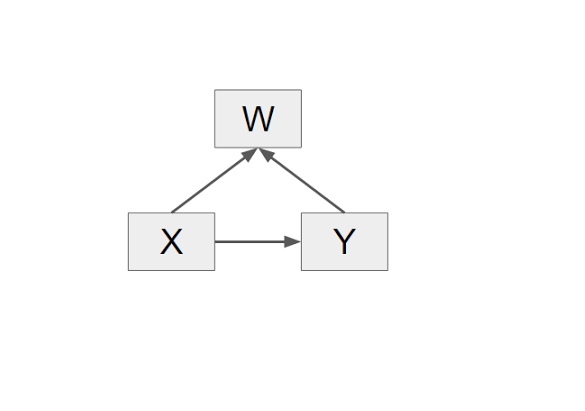

```{r include=FALSE}
options(digits=3)
library("ggplot2")
```

# Dagsorden

- Opsamling på kausalmodeller

- Seminaropgaven: Praktisk info

- Præsentation

- Seminaropgaven: Ideer og råd

# Kausalmodeller

- _Se tabel fra forrige lektion_

# Spørgsmål fra sidst: Er en collider altid et problem?



# Spørgsmål fra sidst: Er en collider altid et problem?

- Hvis X har en positiv effekt på W og Y har en negativ effekt på W, og de er af samme størrelse, er problemet med collideren så mindre?

- How to create confounders with regression (Ogorek [2016](http://anythingbutrbitrary.blogspot.dk/2016/01/how-to-create-confounders-with.html))

- To regressioner

    - $Y = \alpha + \beta X + \epsilon$

    - $W = \alpha + \beta_{1} X + \beta_{2} Y + \epsilon$

- Hvad sker der, hvis summen af effekten af X og Y på W er 0? ($\beta_{1} + \beta_{2} = 0$)

- Vi kigger på to forskellige scenarier
    1. Effekten af X på Y er positiv (1,5)
    2. Effekten af X på Y er negativ (-1,5)

# Spørgsmål fra sidst: Er en collider altid et problem?

- X er eksogen

```{r}
N <- 10000
x <- rnorm(N)
```

- Y er endogen (påvirkes af X)

```{r}
y.positiv <- 1.5 * x + rnorm(N)
y.negativ <- -1.5 * x + rnorm(N)
```

# Spørgsmål fra sidst: Er en collider altid et problem?

```{r}
df <- data.frame(id = 0:10, coef.positiv = c(NA), 
                 coef.negativ = c(NA))
for (i in 0:10) {
  w <- i * x - i * y.positiv + rnorm(N)
  df$coef.positiv[df$id == i] <- 
    coef(summary(lm(y.positiv ~ x + w)))["x","Estimate"]
  w <- i * x - i * y.negativ + rnorm(N)
  df$coef.negativ[df$id == i] <- 
    coef(summary(lm(y.negativ ~ x + w)))["x","Estimate"]
}
```

# Spørgsmål fra sidst: Er en collider altid et problem?

```{r echo=FALSE}
ggplot(df, aes(x=id, y=coef.positiv)) + 
  geom_line(size=1, colour="blue", alpha=.8) + 
  geom_line(aes(x=id, y=coef.negativ), colour="red", alpha=.8, size=1) + 
  theme_classic() +
  ylab("Effekten af X på Y") +
  scale_x_continuous("Effekten af X såvel som Y på W (størrelse på collider)", breaks=0:10)
```

# Spørgsmål fra sidst: Er en collider altid et problem?

- Hvorfor går effekten af X på Y mod 1 uafhængigt af effekten af X på Y?

- Jo større collider, desto tættere vil effekten af X på Y være på ratioen mellem effekten af X og Y på W

- Ratioen mellem effekten af X på W og Y på W $\left(\frac{\beta_{1}}{\beta_{2}}\right)$

- Eksempel: Effekten af X på W er 10, effekten af Y på W er 1
    - $\frac{\beta_{1}}{\beta_{2}} = \frac{10}{1} = 10$

# Spørgsmål fra sidst: Er en collider altid et problem?

```{r}
df <- data.frame(id = 0:10, coef.positiv = c(NA), 
                 coef.negativ = c(NA))
for (i in 0:10) {
  w <- i * 10 * x - i * y.positiv + rnorm(N)
  df$coef.positiv[df$id == i] <- 
    coef(summary(lm(y.positiv ~ x + w)))["x","Estimate"]
  w <- i * 10 * x - i * y.negativ + rnorm(N)
  df$coef.negativ[df$id == i] <- 
    coef(summary(lm(y.negativ ~ x + w)))["x","Estimate"]
}
```

# Spørgsmål fra sidst: Er en collider altid et problem?

```{r echo=FALSE}
ggplot(df, aes(x=id, y=coef.positiv)) + 
  geom_line(size=1, colour="blue", alpha=.8) + 
  geom_line(aes(x=id, y=coef.negativ), colour="red", alpha=.8, size=1) + 
  theme_classic() +
  ylab("Effekten af X på Y") +
  scale_x_continuous("Effekten af X såvel som Y på W (størrelse på collider)", breaks=0:10)
```

# Seminaropgaven: praktisk

- Præsentation af seminaropgave, part 1 (i dag)

- Litteraturgennemgang (31. marts)

- Tentativ udgave (30. april)

- Præsentation af seminaropgave, part 2 (2. maj)

# Seminaropgaven

- Skriv dig ind i en litteratur

- Find et emne
    - Ekspliciter relationen til offentlig politik

- Du skal have én pointe (ikke to, tre eller fire)

- Du skal have en argumentation


# Præsentation af seminaropgave

*Præsentationer*

# 20 ideer og råd til en seminaropgave (Zigerell [2011](http://journals.cambridge.org/action/displayAbstract?fromPage=online&aid=8314115); [2013](http://journals.cambridge.org/action/displayAbstract?fromPage=online&aid=8802582&fileId=S104909651200131X))

- 20 ideer til, hvad man kan fokusere på i en seminaropgave

- 70 råd til seminaropgaven

# 20 ideer til en seminaropgave (Zigerell [2011](http://journals.cambridge.org/action/displayAbstract?fromPage=online&aid=8314115))

1. Tilføj en variabel

    - Tilføj en ny, overset variabel, der forklarer variation i den afhængige varibel
    - Kræver selvfølgelig teori

2. (og 3. og 4.) Lav en interaktion

    - Talrige studier viser $X \rightarrow Y$
    - Varierer relationen mellem X og Y? Undersøg om forskellige forhold modererer effekten

# 20 ideer til en seminaropgave (Zigerell [2011](http://journals.cambridge.org/action/displayAbstract?fromPage=online&aid=8314115))

5. Indirekte effekter

    - Talrige studier viser $X \rightarrow Y$
    - Mediationsanalyse
        - $X \rightarrow Z \rightarrow Y$

6. Skift perspektiv

    - Se på relationen mellem to variable med et andet perspekiv
        - Eksempelvis at X har en relativ i stedet for en absolut effekt

# 20 ideer til en seminaropgave (Zigerell [2011](http://journals.cambridge.org/action/displayAbstract?fromPage=online&aid=8314115))

7. Gør et empirisk mål bedre
    - Kan vi måle det vi ønsker at måle bedre?

8. Analyser et eksisterende mål
    - Hvor godt fungerer et eksisterende mål?

9. Rejs til et andet sted
    - Mange studier finder sted i et andet land (læs: USA)
    - Holder teorien i andre lande?

# 20 ideer til en seminaropgave (Zigerell [2011](http://journals.cambridge.org/action/displayAbstract?fromPage=online&aid=8314115))

10. Rejs til en anden tid
    - Holder ældre studier stadig?
    - Mange studier tester en teori med data fra WVS/ESS/ISSP/GSS/ANES
        - Mulighed for at teste en teori med nye data

11. (og 12. og 13) Applicer teorier på andre fænomener
    - Teorier er ofte appliceret på ét fænomen
    - Holder teorier appliceret på parlamenter også på kommuner?
    - Kan være teorier fra andre traditioner (økonomi, sociologi, psykologi)

# 20 ideer til en seminaropgave (Zigerell [2011](http://journals.cambridge.org/action/displayAbstract?fromPage=online&aid=8314115))

14. Applicer nye metoder

    - Find og brug metoder fra andre fag 

15. Skift estimationsmetode

    - Diskuter den bedste måde at estimere en model

16. (og 17.) Diskuter en artikel 

    - Replicere resultater, undersøg robustheden

    - Analyser data eller diskuter empirisk strategi

# 20 ideer til en seminaropgave (Zigerell [2011](http://journals.cambridge.org/action/displayAbstract?fromPage=online&aid=8314115))

18. Rådgiv 
    - Diskuter hvordan man bedst gør noget (eksempelvis præsentation af resultater)

19. (og 20.) Litteraturreview
    - Litteraurreview 
    - Metaanalyse

# 70 råd til seminaropgaven (Zigerell [2013](http://journals.cambridge.org/action/displayAbstract?fromPage=online&aid=8802582&fileId=S104909651200131X))

Titel

1. Titlen skal være så bred som mulig

2. Undertitler kan være fine og mere specifikke, men hav aldrig mere end én

Abstract

3. Lav et abstract tidligt i processen
    - 200 ord, gerne mindre


# 70 råd til seminaropgaven (Zigerell [2013](http://journals.cambridge.org/action/displayAbstract?fromPage=online&aid=8802582&fileId=S104909651200131X))

Introduktion

4. Beskriv hvorfor emnet er vigtigt
    - Den eksisterende litteratur er mangelfuld

5. Ikke altid nødvendigt at have en overskrift på sin introduktion

6. Overvej om et afsnit med overblik er nødvendigt i introduktion
    - "Først X, så Y, så Z..."

# 70 råd til seminaropgaven (Zigerell [2013](http://journals.cambridge.org/action/displayAbstract?fromPage=online&aid=8802582&fileId=S104909651200131X))

Litteraturreview

7. Litteraturreviewet skal mere end bare gennemgå historien for forskningen i et felt
    - Hav et formål med litteraturreviewet 

Teori

8. Teori er mere end baggrundsviden, en lang hypotese eller implikationer af en hypotese
    - Teoriafsnittet leverer en teoretisk forklaring, en mekanisme

9. Lav teorien så generel som muligt

# 70 råd til seminaropgaven (Zigerell [2013](http://journals.cambridge.org/action/displayAbstract?fromPage=online&aid=8802582&fileId=S104909651200131X))

Hypoteser

10. Teoriafsnittet skal give en forklaring på, hvordan to variable præcist er relateret

11. Hypoteser skal formuleres, så de kan falsificeres helt - ikke kun delvist

12. Hypoteser skal aldrig indeholde ord som "måske"

13. Hypoteser skal ikke indeholde uklare ord som "substantielt"

14. Hypoteser skal være specifikke i forhold til, hvilken dimension man evaluerer

# 70 råd til seminaropgaven (Zigerell [2013](http://journals.cambridge.org/action/displayAbstract?fromPage=online&aid=8802582&fileId=S104909651200131X))

15. Lav ikke hypoteser for kontrolvariable

16. Vi antager at hypoteser er "alt andet lige"-udtalelser, så ingen grund til at skrive det

17. Hvis man numererer sine hypoteser, så kald dem $H_{1}$, $H_{2}$ og $H_{3}$ i stedet for $H_{1a}$, $H_{1b}$ og $H_{2}$.

18. En seminaropgave skal have én pointe
    - Pas på med for mange hypoteser

# 70 råd til seminaropgaven (Zigerell [2013](http://journals.cambridge.org/action/displayAbstract?fromPage=online&aid=8802582&fileId=S104909651200131X))

Forskningsdesign

19. (og 20.) Der skal leveres tilstrækkeligt med information til at andre kan replikere forskningsdesignet
    - Meget information kan gives i et appendiks

21. Konteksten skal beskrives
    - Hvornår blev data indsamlet? Skete der noget specifikt i perioden?
    
22. (og 24. og 25. og 26.) Empiriske valg skal begrundes med teori
    - Metode
    - Kodninger af variable
    - Periode

# 70 råd til seminaropgaven (Zigerell [2013](http://journals.cambridge.org/action/displayAbstract?fromPage=online&aid=8802582&fileId=S104909651200131X))

23. Lav skalaer så du undgår videnskabelige notationer

27. Beskriv den analytiske strategi så tilstrækkeligt, at du er fri for at rapportere en statistisk formel

28. Rapporter om det er en-sidede eller to-sidede tests, der foretages


# 70 råd til seminaropgaven (Zigerell [2013](http://journals.cambridge.org/action/displayAbstract?fromPage=online&aid=8802582&fileId=S104909651200131X))

Resultater

29. Overvej med hvor stor præcision resultater skal formidles
    - Undgå at rapportere **alle** decimaler R og/eller Stata giver som standard
    
30. Undgå at forkorte *statistisk signifikans* til *signifikans

31. Beskriv retningen i en effekt (forudsat der er en effekt)

32. Rapporter usikkerheden ved resultaterne

33. (og 34.) Rapporter robustheden af resultaterne
    - Og forudsætningstests m.v.

# 70 råd til seminaropgaven (Zigerell [2013](http://journals.cambridge.org/action/displayAbstract?fromPage=online&aid=8802582&fileId=S104909651200131X))

35. Rapporter hvor godt modellen klarer sig (goodness-of-fit)

36. Rapporter antallet af observationer
    - Hvis der er et betydeligt fald i observationerne, diskuter hvorfor

37. Visualiser resultaterne

38. Undgå at skrive højsignifikant
    - Statistisk signifikans er et binært koncept

# 70 råd til seminaropgaven (Zigerell [2013](http://journals.cambridge.org/action/displayAbstract?fromPage=online&aid=8802582&fileId=S104909651200131X))

39. Vær varsom med at tolke på retningen af en effekt, der ikke er statistisk signifikant

40. Hvis en kontrolvariabel viser noget overraskende: kommenter den

41. Undlad at skrive, at resultaterne stemmer overens med $H_{1}$
    - Opsumer i stedet hypotesen og diskuter resultaterne
    
# 70 råd til seminaropgaven (Zigerell [2013](http://journals.cambridge.org/action/displayAbstract?fromPage=online&aid=8802582&fileId=S104909651200131X))

Konklusion

42. Opsummer resultaterne, fortæl hvad bidraget er, diskuter eventuelle implikationer
    - Undgå at foreslå ideer 

Fodnoter

43. Hold fodnoter til et minimum
    - De afbryder læsningen, så de skal være det værd
   
Referencer

44. Husk referencer
    - *Alle* referencer, også dem citeret i tabeller, figurer m.v.

# 70 råd til seminaropgaven (Zigerell [2013](http://journals.cambridge.org/action/displayAbstract?fromPage=online&aid=8802582&fileId=S104909651200131X))

Appendiks

45. Appendiksmateriale er alt det, der ikke er nødvendigt for at læse artiklen
    - Information der kræves for at kunne replikere studiet
    - Robusthedstests

Tabeller og figurer

46. Opstil variable efter vigtighed

# 70 råd til seminaropgaven (Zigerell [2013](http://journals.cambridge.org/action/displayAbstract?fromPage=online&aid=8802582&fileId=S104909651200131X))

47. Variable skal indikere en retning ("kvinde" i stedet for "køn")
    - Ikke nødvendigt for uddannelse, indkomst og lignende

48. Figurer og tabeller skal kunne læses uden at læse anden tekst i artiklen
    - Med undtagelse af noter til figuren/tabellen

49. Hav kun de mest essentielle figurer og tabeller med
    - En figur/tabel skal have en pointe

# 70 råd til seminaropgaven (Zigerell [2013](http://journals.cambridge.org/action/displayAbstract?fromPage=online&aid=8802582&fileId=S104909651200131X))

50. Figurer der har et nulpunkt bør inkludere dette nulpunkt

Referencer i teksten

51. Skal inkluderes for udsagn der kræver dokumentation

52. Referencer i teksten afbryder læsningen, så hav dem til sidst i sætningen

53. Er der flere referencer i samme parentes, så sørg for at de er konsistent struktureret
    - Alfabetisk, kronologisk

# 70 råd til seminaropgaven (Zigerell [2013](http://journals.cambridge.org/action/displayAbstract?fromPage=online&aid=8802582&fileId=S104909651200131X))

54. Det er ofte tilstrækkeligt med én til tre referencer i samme parentes
    - Er der brug for en lang række af referencer, kan det begrunde en hypotese

55. Det skal fremstå tydeligt, hvad referencen refererer til

Manuskriptstil

56. Skriv til et samfundsvidenskabeligt publikum

57. Undgå stavefejl, skriv korrekt

# 70 råd til seminaropgaven (Zigerell [2013](http://journals.cambridge.org/action/displayAbstract?fromPage=online&aid=8802582&fileId=S104909651200131X))

58. Vær konsistent i sproglige valg

59. Vær konsistent med begreber
    - Undgå unødvendige synonymer

60. Undgå direkte citater
    - Med mindre den ordrette formulering er vigtig
    
61. Introducer kun forkortelser ved begreber der bruges flere gange

# 70 råd til seminaropgaven (Zigerell [2013](http://journals.cambridge.org/action/displayAbstract?fromPage=online&aid=8802582&fileId=S104909651200131X))

62. Skriv direkte og reducer omkostningerne for læseren

63. Undgå at lave evalueringer der ikke er vigtige for argumentationen
    - Såsom "en interessant artikel" 
    
64. Definer kun koncepter hvor der er flere forskellige definitioner

65. Undgå at beskrive, at noget vil blive taget op senere
    - Indikerer ofte, at der er en potentielt bedre logisk struktur


# 70 råd til seminaropgaven (Zigerell [2013](http://journals.cambridge.org/action/displayAbstract?fromPage=online&aid=8802582&fileId=S104909651200131X))

66. Undgå spørgsmålstegn

67. Formateringen skal være læsevenlig
    - Se hvordan tidsskriftsartikler er formateret

68. Begynd sætninger med det væsentlige, der giver læseren en idé om, hvad det handler om 

69. Vær konsistent med anførselstegn

70. Information der ikke taler for sig selv, skal placeres i en kontekst

# Næste gang

- Fra teoretiske koncepter til empiriske data

- Samme tid og sted