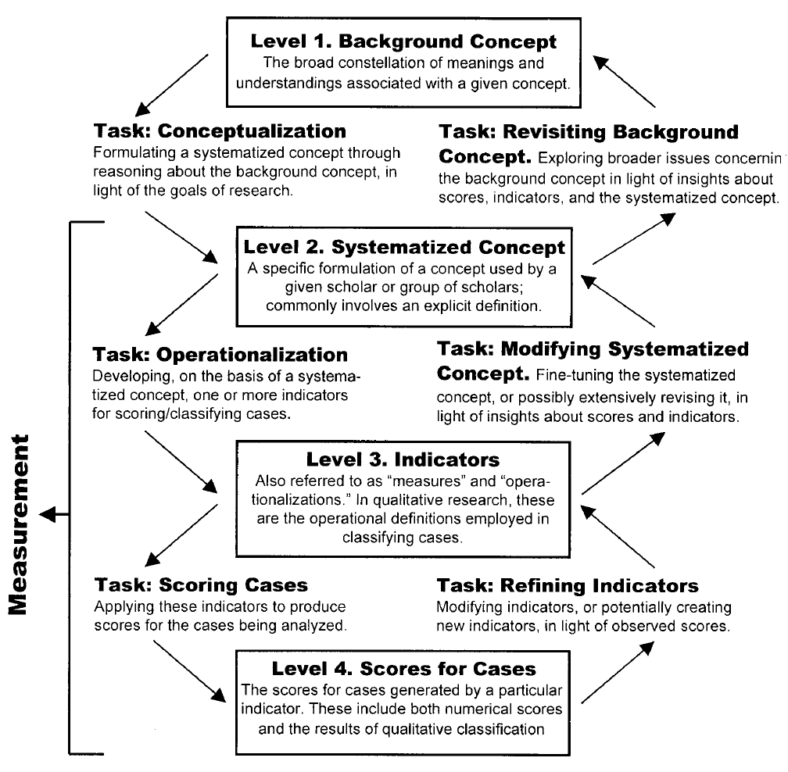
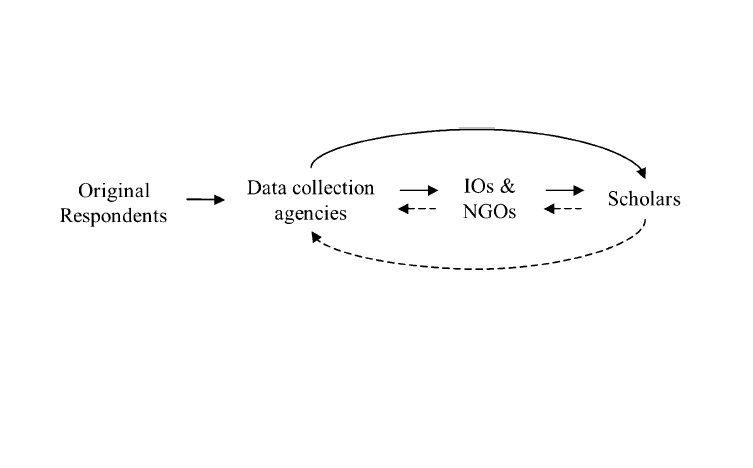
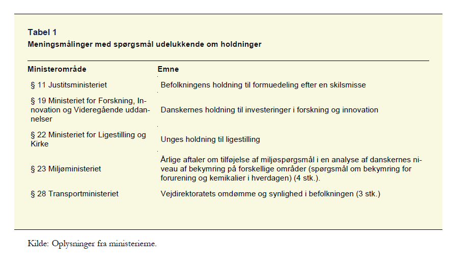
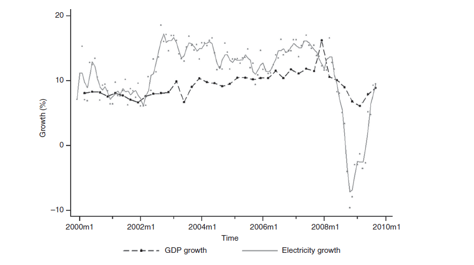
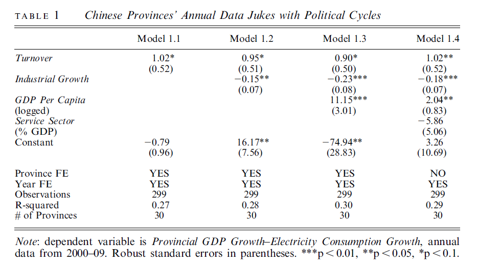
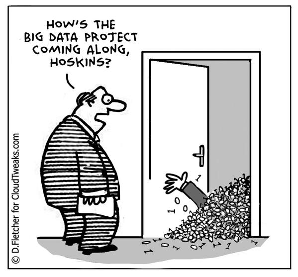

# Dagsorden

- Seminaropgaven: Udvalgte råd

- Fra teori til empiri
    - Validitet og reliabilitet
    - Målevaliditet
        - Indholdsvaliditet
        - Konvergensvaliditet
        - Konstruktionsvaliditet

- Datakvalitet

# Seminaropgaven

- Skriv dig ind i en litteratur

- Find et emne
    - Ekspliciter relationen til offentlig politik

- Du skal have én pointe (ikke to, tre eller fire)

- Du skal have en argumentation

# Udvalgte råd til seminaropgaven (Zigerell [2013](http://journals.cambridge.org/action/displayAbstract?fromPage=online&aid=8802582&fileId=S104909651200131X))

- Lav et abstract tidligt i processen
    - 200 ord, gerne mindre

- Beskriv hvorfor emnet er vigtigt
    - Den eksisterende litteratur er mangelfuld

- Litteraturreviewet skal mere end bare gennemgå historien for forskningen i et felt
    - Hav et formål med litteraturreviewet

# Udvalgte råd til seminaropgaven (Zigerell [2013](http://journals.cambridge.org/action/displayAbstract?fromPage=online&aid=8802582&fileId=S104909651200131X))

- En seminaropgave skal have én pointe
    - Pas på med for mange hypoteser

- Empiriske valg skal begrundes med teori
    - Metode
    - Kodning af variable
    - Periode
    - osv.

- Visualiser resultaterne

# Fra teori til data

- Til nu har vi fokuseret på teori
    - Kausalmodeller
    - Abstrakte koncepter (_variable_)
    - Intet fokus på konstruktion af data, ingen målefejl osv.

- De kommende gange: metode, empiriske tilgange
    - Fællesnævner: data
    - Forskellige metodiske tilgange

- To pointer i dag
    1. Fokuser på målevaliditet
    2. Vær kritisk i forhold til data

# Metode og data

- De kommende lektioner vil fokusere på forskellige metoder
    - Eksperimenter, naturlige eksperimenter, observationsstudier

- Ofte meget fokus på avancerede metoder
    - Brug for tilsvarende stærkt fokus på kvaliteten af data

- Ingen metode er bedre end de data, vi har til rådighed
    - Har vi dårlige data, kan ingen metodisk tilgang hjælpe os

# Data, data, data

- Uden data har vi ingenting
    - "In God we trust; all others must bring data."

- Men...
    - "Statistics make officials, and officials make statistics."
    
- Med andre ord: Data er fantastiske, men skal anvendes med omtanke

# Fra teori til data

- Udgangspunkt: Teoretisk koncept $\approx$ empirisk operationalisering

- Som altid: mange veje til Rom
    - Det er ofte ikke givet, hvordan vi skal operationalisere et koncept

- Når vi operationaliserer vores koncepter, laver vi - implicit eller eksplicit - en model for, hvordan vi måler ting
    - Teoretiske og metodiske implikationer

# Fra teori til data

- Vi skal ud og måle virkeligheden
    - Hayes og Embretson (2012, 163): "measurement is a system of rules for assigning numbers to the variable of interest such as developing a yardstick for assessing an object's (or respondent's) properties (variables)"

- Udfordring: Optimeringen af relationen teoretisk koncept og empirisk observation
    - Målevaliditet, _measurement validity_
    - "Valid measurement is achieved when scores (including the results of qualitative classification) meaningfully capture the ideas contained in the corresponding concept." (Adcock og Collier [2001](http://www.jstor.org/stable/3118231), 530)

# Virkeligheden: usikkerhed og målefejl

- Vi skal **altid** operere med usikkerhed
    - "As far as the laws of mathematics refer to reality, they are not certain; and as far as they are certain, they do not refer to reality."

- Sandhed = observation + målefejl

- Det bedste scenarie: tilfældige målefejl 

- I mange tilfælde: systematiske målefejl

# Validitet og reliabilitet

- Validitet $\neq$ reliabilitet
    - Hvad er forholdet mellem validitet og reliabilitet?

- Reliabilitet: "the reproducibility of measurements, and this is the degree to which a measure produces the same values when applied repeatedly to a person or process that has not changed." (Shrout og Lane 2012, 643)

- Vi har en latent variabel vi gerne vil replikere 

# Validitet og reliabilitet

# Reliabilitetstests

- Forskellige måder at vurdere reliabiliteten 

- Test-retest reliabilitet
    - Mål en variabel to gange på forskellige tidspunkter
    - Udfordring: isolere målefejl fra reelle forandringer

- Inter/intrakoderreliabilitet
    - Interkoder: flere kodere, samme materiale, en gang
    - Intrakoder: en koder, samme materiale, flere gange

# Målevaliditet (Adcock og Collier [2001](http://www.jstor.org/stable/3118231))

# Målevaliditet (Adcock og Collier [2001](http://www.jstor.org/stable/3118231))

- Tre opgaver: konceptualisering, operationalisering, klassificering
    - Konceptualisering $\rightarrow$ Operationalisering $\rightarrow$ Klassificering

- Tre typer af validitet
    - Indholdsvaliditet (_content_, _logical_)
    - Konvergensvaliditet (_convergent_, _discriminant_)
    - Konstruktionsvaliditet (_nomological_, _construct_)

# Målevaliditet: Indholdsvaliditet

- Repræsenterer vores empiriske mål vores teoretiske koncept? 
    - Indfanger vores indikatorer (_level 3_) vores koncept (_level 2_)?

- To spørgsmål:
    1) Er hovedelementer fraværende i indikatoren?
    2) Er irrelevante elementer inkluderet i indikatoren?

- Løsning: Undersøg værdierne givet i klassificeringen

# Målevaliditet: Konvergensvaliditet

- Er der konvergens mellem to mål, der skal måle det samme? Er der diskrepans mellem to mål, der _ikke_ skal måle det sammme?

- Er klassifikationerne (_level 4_) skabt af indikatorer (_level 3_) af et koncept (_level 2_) relateret?
    - Er klassifikationer skabt med udgangspunkt i forskellige koncepter ukorreleret?

- Når en indikator bruges som refernecepunkt til at evaluere andre indikatorer: kriterierelateret validitet

# Målevaliditet: Konstruktionsvaliditet

- Validiteten i den inferens vi drager mellem vores operationalisering og de teoretiske koncepter, de repræsenterer

- Er en hypotese bekræftet når enhederne er klassificeret (_level 4_) med de angivne indikatorer (_level 3_) for et koncept (_level 2_)?

- Jo bedre repræsentation, desto højere validitet

- Se slides fra lektion 4

# Øvelse: Byg en eksplicit målemodel

- Lav et diagram med processen fra teori til data
    - Gerne med udgangspunkt i seminaropgaven

- Beskriv koncept, dimension, indikatorer

- Hvilke udfordringer er der i forhold til validiteten?

# Datakvalitet (Herrera og Kapur [2007](http://pan.oxfordjournals.org/content/15/4/365.abstract))

- Data dumper ikke bare ned fra himlen

- Vi skal stillle vigtige spørgsmål ift. evalueringen af data
    - Hvem har indsamlet/konstrueret data?
    - Hvilke interesser har disse aktører?
    - Hvorfor er disse data indsamlet?

    
- "Like all organizations, those that produce data are prone to problems of agency, bureaucratic incentives, shirking, and multiple principals and goals, all of which are likely to shape their output, that is, data." (Herrera og Kapur [2007](http://pan.oxfordjournals.org/content/15/4/365.abstract), 366)

# Datakvalitet: validitet, dækning, præcision

- Hvordan vurderer vi kvaliteten af de data, vi har?

- Som med alting vi arbejder med: ikke blot én dimension

- Tre elementer ved datakvalitet
    - Validitet
    - Dækning
    - Præcision

# Datakvalitet: Validitet

- Relationen mellem teoretisk koncept og indsamlet data

- Udgangspunkt: Definition af koncept
    - Ofte underteoretiseret
    
- Målevaliditeten: Relationen mellem dimensioner og data
    - Udfordring: Konsistens, sammenlignelighed, reliabilitet
        - Er mål sammenlignelige på tværs af lande?

# Datakvalitet: Dækning

- Har vi komplette data?
    - Hvis vi ikke har de data, vi skal bruge, er der problemer med dækningen

- Tilstedeværelsen (eller fraværet) af data er sjældent tilfældigt (ikke MCAR!)

- Er det tilfældigt hvilke data vi har fra Kina?

# Datakvalitet: Præcision

- Præcision angiver fraværet af fejl i de data, vi har

- Fejl i dataindsamlingen eller datapræsentationen reducerer præcisionen

- Udfordringer
    - Metodiske ændringer
    - Forkerte indtastninger

# Datakvalitet: Forsyningskæden (Herrera og Kapur [2007](http://pan.oxfordjournals.org/content/15/4/365.abstract))

# Datakvalitet: Aktører

- Respondenter
    - Husholdning
    - Firma
    - Offentligt ansat

- Indsamlingsenheder
    - Ministerier
    - Analyseinstitutter

- Interesseorganisationer

- Akademia

# Datakvalitet: Respondenter

- Incitamenter
    - Penge
    - Politisk support
    - Frygt for straf
    - Alternativomkostninger

- Kapaciteter
    - Tid
    - Viden
    - Uddannelse
    - Surveyadgang

- Datakvalitetsproblemer
    - Manglende svar
    - Bevidst forkerte svar
    - Selvselektion i svar

# Datakvalitet: Indsamlingsenheder

- Incitamenter
    - Professionelle normer
    - Penge
    - Eksternt pres

- Kapaciteter
    - Ressourcer
        - Viden
        - Penge

- Datakvalitetsproblemer
    - Mangelfuld indsamling af data
    - Manipulation af data
    - Selvselektion i svar

# Datakvalitet: Interesseorganisationer/NGO

- Incitamenter
    - Professionelle normer
    - Support fra andre aktører
    - Samarbejde

- Kapaciteter
    - Ressourcer
        - Viden
        - Penge

- Datakvalitetsproblemer
    - Manglende indsamling af data
    - Selvselektion i svar

# Datakvalitet: Akademia

- Incitamenter
    - Publikationer
    - Profesionelle normer

- Kapaciteter
    - Tid
    - Forskningsmidler
    - Viden

- Datakvalitetsproblemer
    - Manglende data
    - Vedvarende brug af dårlige data
    - Problematisk brug af eksisterende data
        - Matcher ofte ikke teoretisk dimension eller koncept

# Hvad med kvalitative og kvantitative data? 

- Hvordan skal vi forholde os til kvalitative og kvantitative data?
    - Er der forskelle?

- Et spørgsmål om skalaniveauer
    - Et kontinuum af kvantificerbar

- De fleste kvalitative kategorier er blot nominelle kategorier

- Tænk tilbage på Metode II-undervisningen

# Skalaniveauer

| Skala    | Transformation | Egenskab            | Statistik                  |
|----------|----------------|---------------------|----------------------------|
| Nominel  | Isomorfi       | $a = b$, $a \neq b$ | Modus, fordelingstest      |
|          |                |                     |                            |
| Ordinal  | Monotonisk     | $a > b$, $a \leq b$ | Median, Spearman $\rho$    |
|          |                |                     |                            |
| Interval | Lineær         | $a + b$             | Gennemsnit, Pearson $\rho$ |
|          |                |                     |                            |
| Ratio    | Ratio          | $a/b$               | Gennemsnit, Pearson $\rho$ |

# Hvorfor får ministerier gennemført meningsmålinger?

# Hvorfor får ministerier gennemført meningsmålinger?

"Finansministeriet finder det derimod ikke hensigtsmæssigt, at ministeriernes bevilling anvendes til en direkte test af politiske budskabers opbakning blandt vælgerbefolkningen eller et bredt udsnit heraf. Finansministeriet mener derfor, at der bør udvises særlig omtanke og tilbageholdenhed i forbindelse med bestilling af meningsmålinger, som er rettet mod den brede befolkning, og som indeholder spørgsmål vedrørende politiske holdninger."

# Hvilke data vil være svære at få fat på?

- Overvej gerne hvilke data der *ikke* findes
    - Er der mulighed for at indsamle dem? 

- Hvilke grunde kan der være til, at specifikke data ikke findes? (eller ikke er offentligt tilgængelige)

- Politiske aktører har stærke interesser i forhold til indsamlingen og tolkningen af data

# Eksempel: Politisk sensitivitet og datamanipulation

- Wallace (2016) studerer BNP i Kina
    - BNP: salient
    - BNP korrelerer med mindre saliente mål
          - Elektricitetsproduktivitet
          - Forbrug

- Kan en svagere korrelation mellem BNP og relevante mål forklares?

- Hvad finder Wallace (2006)?
    - Data på vækst i provinserne viser, at der er mere vækst i alle provinser end den nationale vækstrate
    - Der er variation i relationen mellem BNP og andre mindre saliente mål
        - Større differens i år hvor ledere udskiftes

# Eksempel: Politisk sensitivitet og datamanipulation

# Eksempel: Politisk sensitivitet og datamanipulation

# Implikationer af målefejl

- Målefejl i afhængig variabel: Større usikkerhed i effektestimater

- Målefejl i uafhængig variabel: Større usikkerhed i effektestimater
    - Andre ukorrelerede variable påvirkes ikke

- Målefejl i uafhængige variable der korrelerer: Forkerte estimater
    - Målefejl i én uafhængig variabel kan påvirke effekten af de andre

- Målefejl i uafhængig variabel der korrelerer med målefejl i afhængig variabel: Manglende korrekt specifikation, forkerte estimater

# Bagsiden af datarevolutionen: nemt at drukne i data

# Øvelse: Dataindsamling

- Hvilke data vil du gerne bruge i seminaropgaven?

- Hvem har en interesse i at disse data (ikke) findes?

- Hvilke implikationer har det for de forbehold man skal tage sig, når man analyserer disse data?

# Næste gang

- Eksperimenter

- Samme tid og sted