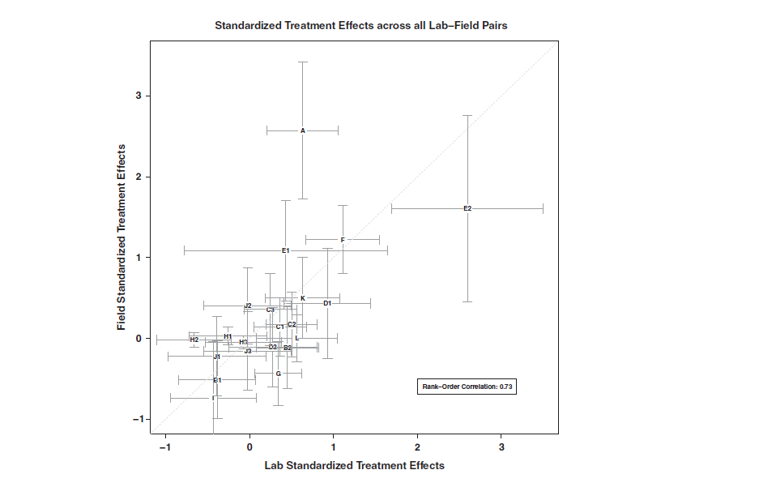

```{r include=FALSE}
options(digits=3)
library("ggplot2")
```

# Info: Talentprogram

- Talentprogram for kandidatstuderende i statskundskab og samfundsfag

- Giver bl.a. adgang til studiejobs, der udbydes i samarbejde med Odense Kommune, Socialstyrelsen og KMD

- Besøg [sdu.dk/poltalent](http://www.sdu.dk/poltalent)

- Deadline: 10. april

# Info: Afleveringsdato

- Ingen afleveringsdato endnu

- Vil blive offentliggjort i begyndelsen af april

# Info: Add ons

- Add on I: AGORA 16
    - Mere info på facebook: [https://www.facebook.com/events/1539248969708294/](https://www.facebook.com/events/1539248969708294/)

- Add on II: Introduktion til R
    - Format: Workshop
    - En eller to dage
    - Dato: TBA

# Dagsorden

- Hvorfor eksperimenter?

- Typer af eksperimentelle designs

- Eksperimentelle tilgange 
    - Laboratorieeksperimenter
    - Spørgeskemaeksperimenter
    - Felteksperimenter
    
- Styrker og svagheder

# Hvorfor eksperimenter? Kausal inferens og randomisering

- Randomisering
    - Randomisering er let at forstå (tænk lotteri)
    - Ingen selvselektion
    - Fair
    - Nemt at analysere

- Rubin: Realiseringen af potentielle udfald (eksperimenter er guldstandarden ift. potentielle udfald og kontrafaktisk kausalitet)
- Campbell: Reducerer trusselsniveauet fra en række validitetstrusler (alternative forklaringer)

# Hvorfor eksperimenter? Kausal inferens og randomisering

- Eksperimenter kan vi os en gennemsnitlig stimulieffekt, _average treatment effect_

    - $\tau_{ATE} = E[Y(1) - Y(0)] = E[Y(1)] - E[Y(0)]$
    
    - Gennemsnit på udfaldsvariablen for stimuligruppen ($E[Y(1)]$)
    
    - Gennemsnit på udfaldsvariablen for kontrolgruppen ($E[Y(0)]$)

- Der er dog mange andre begreber
    - Forskellige effekter (SATE, PATE, LATE, ITT, ATT, ATC)
    - Heterogene effekter (altså ikke gennemsnitseffekter)

# Hvorfor eksperimenter? Enkelthed

- Eksperimenter fordrer et eksplicit fokus på, hvad der er stimuli (_uafhængig variabel_) og hvad der er udfaldsvariabel (_afhængig variabel_)

- Tænk altid i eksperimenter

    - "If you can't devise an experiment that answers your question in a world where anything goes, then the odds of generating useful results with a modest budget and nonexperimental survey data seem pretty slim. The description of an ideal experiment also helps you formulate causal questions precisely." (Angrist og Pischke [2009](http://press.princeton.edu/titles/8769.html), 5)

# Hvorfor eksperimenter? Mere moderne end før

- Eksperimenter anvendes i hyppigere omfang til at besvare kausale spørgsmål

- Flere introduktionsartikler
    - Blom-Hansen og Serritzlew ([2014](http://politica.dk/fileadmin/politica/Dokumenter/politica_46_1/blom-hansen_og_serritzlew.pdf)): Endogenitet og eksperimenter - forskningsdesignet som løsning
    
    - Serritzlew ([2007](https://tidsskrift.dk/index.php/politica/article/view/71206/128536)): Det politologiske eksperiment: hvorfor, hvornår og hvordan?
    
    - McDermott ([2002](http://www.annualreviews.org/doi/abs/10.1146/annurev.polisci.5.091001.170657)): Experimental methods in political science
    
    - McDermott ([2002](http://pan.oxfordjournals.org/content/10/4/325.abstract)): Experimental methodology in political science

# Hvorfor eksperimenter? Mere moderne end før

```{r echo = FALSE, fig.width=9, fig.height=6}
library(ggplot2)

apsr.experiments <- data.frame(
  year = c(0:20),
  articles = c(rep(0,10),1,0,3,2,5,5,6,10,11,12,16)
)

ggplot(apsr.experiments, aes(x=year, y=articles)) + 
  geom_line() +
  geom_point() + 
  theme_minimal(base_size = 22) +
  scale_x_continuous("", breaks=apsr.experiments$year, labels=c("1906-09","1910-14","1915-19","1920-24","1925-29","1930-34","1935-39","1940-44","1945-49","1950-54","1955-59","1960-64","1964-69","1970-74","1975-79","1980-84","1985-89","1990-94","1995-99","2000-04","2005-09")) +
  ylab("Artikler publiceret i APSR") +
  theme(axis.text.x = element_text(angle = 90, hjust = 1), panel.grid.major = element_blank(), panel.grid.minor = element_blank()) +
  annotate("text", label = "Cambridge Handbook of Experimental\n Political Science (Druckman et al. 2011, 5)", x = 7.8, y = 13, colour = "gray60") 
```

# Hvorfor eksperimenter? Mere moderne end før (Nielsen [2014](http://www.palgrave-journals.com/cep/journal/vaop/ncurrent/abs/cep201437a.html))

```{r echo = FALSE, fig.width=9, fig.height=6}
eu.experiments <- data.frame(
  year = c(2000:2013),
  articles = c(0,0,0,1,1,0,0,2,1,2,4,7,6,3)
)

ggplot(eu.experiments, aes(x=year, y=articles)) + 
  geom_line() +
  geom_point() + 
  theme_minimal(base_size = 22) +
  scale_x_continuous("", breaks=eu.experiments$year, labels=eu.experiments$year) +
  ylab("Artikler publiceret i EU studier") +
  theme(axis.text.x = element_text(angle = 90, hjust = 1), panel.grid.major = element_blank(), panel.grid.minor = element_blank()) 
```

# Hvorfor eksperimenter? Mere moderne end før (Jackson og Cox [2013](http://www.annualreviews.org/doi/abs/10.1146/annurev-soc-071811-145443))


# 10 situationer hvor eksperimenter er anbefalelsesværdige

1. Når efterspørgsel overstiger udbud

    - Distribution af goder på en fair måde

2. Når et stimuli ikke kan gives til alle på samme tid

    - Økonomisk eller fysisk umuligt

3. Når enheder kan blive midlertidigt isoleret fra hinanden

    - Randomisering i tid

    - "Equiavelent Time Samples Design"

# 10 situationer hvor eksperimenter er anbefalelsesværdige

4. Når kontakten mellem enheder er lav

5. Når forandringer skal finde sted men løsningerne er ikke kendte

6. Når kriterier for tildeling af en service er tvetydig

7. Når enheder er indifferente i forhold til stimuli

8. Når du kan skabe din egen organisation

9. Når du har kontrol over enheder

10. Når lotterier forventes

# Hvad er vores kontrafaktiske scenarie?

- Kausaleffekten tager udgangspunkt i et kontrafaktisk scenarie

- Kontrolgruppe (uden stimuli) eller flere stimuli der sammenlignes?

- Tre grupper: Stimuli, kontrol og placebo (Gerber et al. [2010](http://pan.oxfordjournals.org/content/18/3/297.abstract))

- Forskellige stimuli
    - Kategorisk forskellige
    - Kvantitativt forskellige (parametrisk, doseringsrespons)

- Kontinuerlige stimuli er betydeligt mere komplicerede at analysere
    - Begynd i det små!

# Eksempel: GOTV, stimuli, placebo og kontrol

- Nickerson ([2008](http://journals.cambridge.org/action/displayAbstract?aid=1720676&fileId=S0003055408080039)): "During a face-to-face canvassing experiment targeting households with two registered voters, residents who answered the door were exposed to either a Get Out the Vote message (treatment) or a recycling pitch (placebo)."


# Forskellige designs: sammenligning af stimuli og kontrol

- $R$: Randomiseret gruppe
- $X$: Stimuli
- $O$: Udfald

|---|---|---|
| $R$ | $X$ | $O$ |
| $R$ |   | $O$ |

# Forskellige designs: sammenligning af to stimuli

- $R$: Randomiseret gruppe
- $X_{A}$: Stimuli A
- $X_{B}$: Stimuli B
- $O$: Udfald

|---|---|---|
| $R$ | $X_{A}$ | $O$ |
| $R$ | $X_{B}$ | $O$ |

# Forskellige designs: sammenligning af to stimuli og en kontrol

- $R$: Randomiseret gruppe
- $X_{A}$: Stimuli A
- $X_{B}$: Stimuli B
- $O$: Udfald

|---|---|---|
| $R$ | $X_{A}$ | $O$ |
| $R$ | $X_{B}$ | $O$ |
| $R$ |         | $O$ |

# Forskellige designs: Pretest-posttest kontrolgruppe design

- $R$: Randomiseret gruppe
- $X$: Stimuli 
- $O_{pre}$: Udfald _før_ stimuli
- $O_{post}$: Udfald _efter_ stimuli

|-----|-----------|---|------------|
| $R$ | $O_{pre}$ | X | $O_{post}$ |
| $R$ | $O_{pre}$ |   | $O_{post}$ |

# Forskellige designs: sammenligning af to stimuli med pretests

- $R$: Randomiseret gruppe
- $X_{A}$: Stimuli A
- $X_{B}$: Stimuli B
- $O_{pre}$: Udfald _før_ stimuli
- $O_{post}$: Udfald _efter_ stimuli

|-----|-----------|---|------------|
| $R$ | $O_{pre}$ | $X_{A}$ | $O_{post}$ |
| $R$ | $O_{pre}$ | $X_{B}$  | $O_{post}$ |

# Forskellige designs: sammenligning af to stimuli og en kontrol med pretests

- $R$: Randomiseret gruppe
- $X_{A}$: Stimuli A
- $X_{B}$: Stimuli B
- $O_{pre}$: Udfald _før_ stimuli
- $O_{post}$: Udfald _efter_ stimuli

|-----|-----------|---|------------|
| $R$ | $O_{pre}$ | $X_{A}$ | $O_{post}$ |
| $R$ | $O_{pre}$ | $X_{B}$  | $O_{post}$ |
| $R$ | $O_{pre}$ |   | $O_{post}$ |

# Forskellige designs: Faktorielt design

- Faktorforsøg
    - Flere stimuli der testes i _kombination_ med hinanden

- Fordele
    - Kan kræve færre enheder (da én person bliver udsat for flere stimuli)
    - Gør det nemt at teste kombinationerne af stimuli
    - Muliggør interaktionseffekter

- Eksempel med et $2 \times 2$ faktorielt design:

|     | $B1$ | $B2$ |
|-----|-----------|---
| $A1$ | $X_{A1B1}$ | $X_{A1B2}$ |
| $A2$ | $X_{A2B1}$ | $X_{A2B2}$ |

# Forskellige designs: Faktorielt design

- $R$: Randomiseret gruppe
- $X_{A1B1}$: Stimuli A1B1
- $X_{A1B2}$: Stimuli A1B2
- $X_{A2B1}$: Stimuli A2B1
- $X_{A2B2}$: Stimuli A2B2
- $O$: Udfald

|-----|-----------|---
| $R$ | $X_{A1B1}$ | $O$ |
| $R$ | $X_{A1B2}$ | $O$ |
| $R$ | $X_{A2B1}$ | $O$ |
| $R$ | $X_{A2B2}$ | $O$ |

# Forskellige designs: Tidsseriedesign

- $R$: Randomiseret gruppe
- $X$: Stimuli
- $O$: Udfald

|-----|-----------|---|---|---
| $R$ | $O ... O$ | $X$ | $O$ | $O ... O$ |
| $R$ | $O ... O$ |     | $O$ | $O ... O$ |

# Forskellige designs: Krydsdesign

- $R$: Randomiseret gruppe
- $X_{A}$: Stimuli A
- $X_{B}$: Stimuli B
- $O$: Udfald

|-----|-----------|---|---|---|---
| $R$ | $O$ | $X_{A}$ | $O$ | $X_{B}$ | $O$
| $R$ | $O$ | $X_{B}$ | $O$ | $X_{A}$ | $O$

# Forskellige empiriske tilgange

- Eksperimenter (i dag)
    - Laboratorieeksperimenter
    - Spørgeskemaeksperimenter
    - Felteksperimenter
- Naturlige og kvasieksperimentelle tilgange (lektion 9)
- Observationsstudier (lektion 10 og 11)

# Laboratorieeksperimenter

- Eksperiment der gennemføres i et kontrolleret miljø

- Ræsonnement: "Causal knowledge requires controlled variation." (Falk og Heckman [2009](http://science.sciencemag.org/content/326/5952/535), 537)

- Styrker
    - Kontrol med konteksten
    - Viden om konteksten

- Svaghed
    - Mindre realistisk kontekst

# Eksempel: Toneleje og opfattelse af lederkompetence (Klofstad et al. [2012](http://rspb.royalsocietypublishing.org/content/279/1738/2698))

- Stimuli: Stemmeleje (tonehøjde)
    - "[...] we recorded men and women saying 'I urge you to vote for me this November'. Each recording was manipulated digitally to yield a higher- and lower-pitched version of the original."

- Udfald: Opfattelse af kompetence, styrke og troværdighed

- Resultater: "Our results show that both men and women select male and female leaders with lower voices. These findings suggest that men and women with lower-pitched voices may be more successful in obtaining positions of leadership."

# Eksempel: Politiske kandidaters (over)vægt (Miller og Lundgren [2010](http://onlinelibrary.wiley.com/doi/10.1038/oby.2009.492/abstract))

- Stimuli: "One-half of the participants were randomly assigned
to read about female candidates and one-half were assigned to read
about male candidates. These groups were then further divided into
two groups, with one-half of participants reading about obese candidates
and one-half of participants reading about nonobese candidates."


# Eksempel: Suppe i laboratoriet (Wansink et al. [2015](http://onlinelibrary.wiley.com/doi/10.1038/oby.2005.12/full))

- Bruger personer visuelle cues, når de spiser? 

- "Fifty-four participants (BMI, 17.3 to 36.0 $kg/m^{2}$; 18 to 46 years of age) were recruited to participate in a study involving soup. The experiment was a between-subject design with two visibility levels: 1) an accurate visual cue of a food portion (normal bowl) vs. 2) a biased visual cue (self-refilling bowl). The soup apparatus was housed in a modified restaurant-style table in which two of four bowls slowly and imperceptibly refilled as their contents were consumed. Outcomes included intake volume, intake estimation, consumption monitoring, and satiety."

# Eksempel: Suppe i laboratoriet (Wansink et al. [2015](http://onlinelibrary.wiley.com/doi/10.1038/oby.2005.12/full))


# Spørgeskemaeksperimenter

- Forskellige versioner af et spørgeskema, tilfældigt hvilket spørgeskema respondenten får

- Styrker og svagheder: Som ved andre spørgeskemaer

- Vigtigt at forholde sig til den eksterne validitet (Barabas og Jerit [2010](http://journals.cambridge.org/action/displayAbstract?fromPage=online&aid=7793106); Hainmueller et al. [2015](http://www.pnas.org/content/112/8/2395.abstract))

- Overvej spillover effekter (Gaines et al. [2007](http://pan.oxfordjournals.org/content/15/1/1.abstract); Transue et al. [2009](http://pan.oxfordjournals.org/content/17/2/143.abstract))

# Spørgeskemaeksperimenter: Stimuliforstyrrelser

- Information (stimuli) kan korrelere med specifikke forhold, der kan drive en effekt

- Eksempel: Hvilken effekt har information om, at et land er et _demokrati_?
    - Hvad tænker du på, når du hører ordet demokrati?
    - Måske mere end demokrati. Vestligt land, rigt land osv.

- Vær bevidst omkring hvad stimuli er og hvad der kan forstyrre det

# Spørgeskemaeksperimenter: Holdninger til immigranter (Hainmueller og Hiscox [2010](http://journals.cambridge.org/action/displayAbstract?aid=7449424&fileId=S0003055409990372))

- Spørgsmål: Påvirker immigranternes kvalifikationer vælgerens holdninger?

- Stimuli:


# Spørgeskemaeksperimenter: Holdninger til immigranter (Hainmueller og Hiscox [2010](http://journals.cambridge.org/action/displayAbstract?aid=7449424&fileId=S0003055409990372))

- Resultater:


# Felteksperimenter

- Eksperiment der foregår "i felten"

- Styrker
    - Realistisk kontekst
    - Kræver ikke at forsøgsdeltagerne skal ind i en ny kontekst

- Svagheder
    - Manglende viden omkring og kontrol med konteksten
    - Kan være yderst ressourcekrævende

# Eksempel: Indhold på Facebook og politisk deltagelse

- A 61-million-person experiment in social influence and political mobilization (Bond et al. [2012](http://www.nature.com/nature/journal/v489/n7415/full/nature11421.html))


# FAQ: Er effekterne fra laboratorieeksperimenter forskellige fra felteksperimenter? (Mitchell [2012](http://pps.sagepub.com/content/7/2/109.short))


# FAQ: Er effekterne fra laboratorieeksperimenter forskellige fra felteksperimenter? (Coppock og Green [2015](http://journals.cambridge.org/article_S2049847014000107))



# FAQ: Hvilke eksperimenteffekter er der?

- Dem der gennemfører eksperimentet, kan påvirke forsøgsdeltagernes adfærd

- Tre effekter (der har et klart overlap)
    - Forventningseffekter
          - Når det kommunikeres - bevidst eller ubevidst - hvilke forventninger forsøget har til adfærden
    - Designeffekter
          - Når forskerens holdninger og forventninger påvirker den måde eksperimentet designes på
    - Efterspørgselseffekter 
          - Når forsøgspersonen selv kan tolke, hvad der er formålet med forsøget

- Eksempel: [Behavioral Priming: It's all in the Mind, but Whose Mind](http://journals.plos.org/plosone/article?id=10.1371/journal.pone.0029081)

# FAQ: Hvad med sensitive spørgsmål?

- En stor udfordring ved mange undersøgelser er, at folk lyver i deres selvrapporterede holdninger

- Implicitte mål

    - Listeeksperimenter (Blair og Imai [2012](http://pan.oxfordjournals.org/content/20/1/47.abstract); Glynn [2013](http://poq.oxfordjournals.org/content/77/S1/159.short))

    - Implicit association test

# FAQ: Er eksperimenter kun anvendelige inden for specifike områder?

- Alle _videnskabelige_ områder inden for samfundsvidenskaberne gennemfører eksperimenter

- Selv inden for international politik sker der metodiske fremskridt
    - Overblik:

        - Hudson ([2010](http://onlinelibrary.wiley.com/doi/10.1111/j.1468-2486.2010.00927.x/abstract)): The State of Experimental Research in IR: An Analytical Survey
    
        - Hyde ([2010](http://ann.sagepub.com/content/628/1/72.abstract)): The Future of Field Experiments in International Relations
    
        - Hyde ([2015](http://www.annualreviews.org/doi/abs/10.1146/annurev-polisci-020614-094854)): Experiments in International Relations: Lab, Survey, and Field
    
        - McDermott ([2011](http://onlinelibrary.wiley.com/doi/10.1111/j.1468-2478.2011.00656.x/abstract)): New Directions for Experimental Work in International Relations
    
        - Mintz et al. ([2011](http://onlinelibrary.wiley.com/doi/10.1111/j.1468-2478.2011.00662.x/abstract)): Experimental Approaches to International Relations

# FAQ: Hvad med kontrolvariable i eksperimenter?

- Hvorfor gennemfører vi eksperimenter? For at gøre kontrolvariable overflødige.
    - Derfor: Rapporter altid effekter, hvor der ikke er kontrolleret for noget
    - "If an estimated treatment effect is insignificant in the absence of controls, this should clearly shape our interpretation of the effect being estimated" (Dunning [2012](http://www.cambridge.org/us/academic/subjects/politics-international-relations/research-methods-politics/natural-experiments-social-sciences-design-based-approach), 268)

- Derefter: Variable målt før introduktionen af et stimuli er som regel gode kontrolvariable (Angrist og Pischke [2009](http://press.princeton.edu/titles/8769.html), 64ff)
    - Kontrolvariable reducerer støj, større chance for at få statistisk signifikante resultater (Mutz [2011](http://press.princeton.edu/titles/9620.html), 123f)

# FAQ: Hvordan er forholdet mellem intern og ekstern validitet i eksperimenter?

- Forkert: "an inherent trade-off exists between the two." (McDermott [2013](http://journals.cambridge.org/action/displayAbstract?fromPage=online&aid=8939775), 610)

- Korrekt: "It makes no sense to say that some empirical research is low on internal validity but high on external validity." (Morton og Williams [2010](http://www.cambridge.org/us/academic/subjects/politics-international-relations/research-methods-politics/experimental-political-science-and-study-causality-nature-lab), 275)

- Ekstern validitet skal altid ses i relation til ens teori (Lucas [2003](http://onlinelibrary.wiley.com/doi/10.1111/1467-9558.00187/abstract))


# FAQ: Hvilke styrker og svagheder er der ved forskellige forsøgsdeltagere?

- Debat om styrker og svagheder ved at bruge studerende som forsøgsdeltagere (Sears [1986](http://www.jakebowers.org/ITVExperiments/Sears%201986.pdf); Henry [2008](http://www.tandfonline.com/doi/abs/10.1080/10478400802049951))

- Debat omkring implikationerne af Amazon mTurk (Berinsky et al. [2012](http://pan.oxfordjournals.org/content/20/3/351); Goodman et al. [2013](http://onlinelibrary.wiley.com/doi/10.1002/bdm.1753/abstract); Rand [2012](http://www.sciencedirect.com/science/article/pii/S0022519311001330))

- Igen: ekstern validitet
    - WEIRD

# FAQ: Hvad skal rapporteres fra et eksperiment? 

- Gerber et al. ([2014](http://journals.cambridge.org/action/displayAbstract?fromPage=online&aid=9322216)) har udformet en tjekliste

- Der skal være informationer relateret til
    - Hypoteser
    - Forsøgsenhederne og kontekst
    - Allokeringsmetode
        - Information omkring randomisering eller fraværet af samme
    - Stimuli
    - Udfaldsmål og kontrolvariable
    - CONSORT (_Consolidated Standards of Reporting Trials_)
    - Statistiske analyser
    - m.v.

- Se også Boutron et al. ([2010](http://ann.sagepub.com/content/628/1/112.short)): Reporting Methodological Items in Randomized Experiments in Political Science

# FAQ: Hvad med etiske overvejelser?

- Informeret samtykke
    - Information om, at man tager part i et eksperiment

- Risiko/gevinst overvejelser
    - _Do no/minimal harm_

- Debriefing
    - Information om eksperimentet
    - Feedback fra forsøgsdeltagere

- Misinformation (_deception_)
    - Vi kan ofte ikke give fuld information omkring eksperimentet
    - Påvirker forsøgsdeltagernes adfærd (Jamison et al. [2008](http://www.sciencedirect.com/science/article/pii/S0167268108001820))

# Misinformation, forskellige metoder (Hertwig og Ortmann [2008](http://www.tandfonline.com/doi/abs/10.1080/10508420701712990))


# Diskussion: Ulemper ved eksperimenter

- Ikke alle fænomener kan studeres eksperimentelt
    - Praktiske begrænsninger
    - Etiske begrænsninger

- Lav økologisk validitet

- Ikke-repræsentative forsøgsdeltagere

- Eksperimentel bias

- Implementeringsproblemer
    - Hvem står for randomiseringen?
    - Hvem selekterer sig ud fra og ind i eksperimentet?
    
- Potentielt forsimplede statistiske analyser

- Se blandt andet Berk ([2005](http://link.springer.com/article/10.1007%2Fs11292-005-3538-2)), Deaton ([2010](https://www.aeaweb.org/articles.php?doi=10.1257/jel.48.2.424)) og West ([2009](http://cdp.sagepub.com/content/18/5/299.short))


# Gennemførelsen af eksperimenter i offentlig politik

- Overordnede råd (fra Stoker [2010](http://ann.sagepub.com/content/628/1/47.abstract)):
    - Dyrk menneskelige og sociale færdigheder og opbyg relationer/netværk
    - Forstå at politik er en væsentlig del af policyprocessen
        - "Policy programs are not neutral, antiseptic, laboratory type entities. They emerged from the rough and tumble of political support, opposition, and bargaining."
    - Gennemfør eksperimenter og vær tålmodig
    - Vær selvkritisk (forskning er en politisk aktivitet)

- Specifikke råd (fra Hansen og Pontoppidan [2014](http://www.sfi.dk/Files/Filer/SFI/Pdf/Notater/Notat_Erfaringer-med-RCT.pdf))
    - Tænk evaluator ind tidligt i planlægningen
    - Hele organisationen skal være med
    - Vær opmærksom på at forberedelsesfasen kan være lang
    - Sørg for at samarbejde på tværs for at få nok deltagere
    - Inddrag evt. kvalitative interviews
    - Hav styr på økonomien

# Dagens øvelse: Lab, spørgeskema og felt

- Find et kausalt argument (evt. fra din seminaropgave)

- Beskriv hvordan det kausale argument kan testes i forskellige eksperimenter
    - Laboratorieeksperiment
    - Spørgeskemaeksperiment
    - Felteksperiment

# Næste gang

- Naturlige eksperimenter

- Onsdag, næste uge (30. marts), 10-12 i U25A.

- God påske