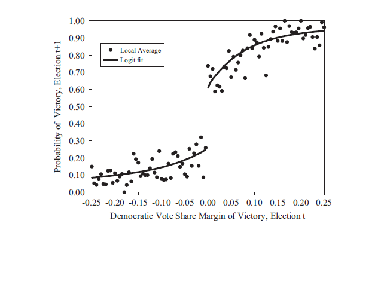
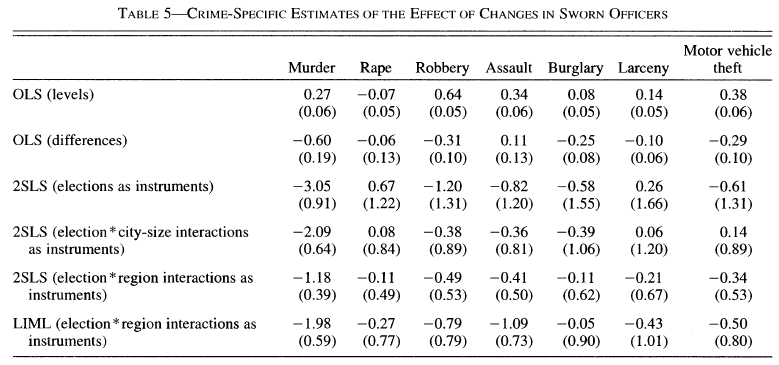

```{r include=FALSE}
options(digits=3)
library("ggplot2")
```

# Dagsorden

- Eksperimenter og naturlige eksperimenter 

- Naturlige eksperimenter
    - Styrker og svagheder
    - Eksempler
    - Tre typer: RDD, IV, DID

# Forrige gang

- Eksperimenter
    - Laboratorieeksperimenter
    - Spørgeskemaeksperimenter
    - Felteksperimenter
    
- Fælles for disse eksperimenter: forskeren står for interventionen

- Kontrol med randomiseringen og implementeringen af stimuli

# I dag: Naturlige eksperimenter

- Naturlige eksperimenter: når "naturen" står for randomiseringen
    - ($\neq$ forskeren)

- Forskellen på naturlige eksperimenter og "rigtige" eksperimenter
    - "However, unlike true experiments, the data used in natural experiments come from "naturally" occurring phenomena - actually, in the social sciences, from phenomena that are often the product of social and political forces. Because the manipulation of treatment variables is not generally under the control of the analyst, natural experiments are, in fact, observational studies." (Dunning [2012](http://www.cambridge.org/us/academic/subjects/politics-international-relations/research-methods-politics/natural-experiments-social-sciences-design-based-approach), 16)

# Naturlige eksperimenter

- Naturlige eksperimenter bygger på - som alle studier - bestemte antagelser omkring datagenerationsprocessen

- Nogle empiriske fænomener er mere eksogene end andre
    - Offentlige politikker er sjældent eksogene, men nøje planlagt
    - Naturkatastrofer, terrorangreb og lignende er ofte eksogene
        - "Katrina was an act of nature that was close to what a political scientist would have liked to have done if he or she could - intervening and changing the political makeup of several large U.S. cities such as New Orleans, Houston, and Atlanta." (Morton og Williams [2010](http://www.cambridge.org/us/academic/subjects/politics-international-relations/research-methods-politics/experimental-political-science-and-study-causality-nature-lab), 53)

# Naturlige eksperimenter

- Vi udnytter at naturen foretager randomiseringen

- Randomiseringen skaber eksogenitet
    - 'As-if' randomisering
    
- Ikke et spørgsmål om randomisering eller ej
    - Plausibilitet på et kontinuum (Dunning [2008](http://prq.sagepub.com/content/61/2/282.abstract))
        - Mindst plausibel as-if randomisering: observationsstudier
        - Mest plausibel as-if randomisering: eksperimenter
        
- Naturlige eksperimenter ligger et sted mellem observationsstudier og eksperimenter

- I de bedste tilfælde: Stærk kausal inferens i den "rigtige" verden (ligesom felteksperimenter)

# Hvad er forskellen på kvasieksperimenter og naturlige eksperimenter?

Kvasieksperimenter: "[har] det til fælles med naturlige eksperimenter, at den eksperimentelle intervention kommer udefra. Den er ikke manipuleret af forskeren, men tilvejebragt af naturen eller det politiske system. Men til forskel fra andre eksperimenter er inddelingen i eksperiment- og kontrolgrupper ikke randomiseret. Grupperne kan derfor være forskellige på mange andre parametre end deres udsættelse for den eksperimentelle intervention." (Blom-Hansen og Serritzlew [2014](http://politica.dk/fileadmin/politica/Dokumenter/politica_46_1/blom-hansen_og_serritzlew.pdf), 18)

# Eksempel: Effekten af nationale tests

- Spørgsmål: Påvirker  nationale tests elevers efterfølgende tests?

- Udfordring: Svært at finde tilfældig variation 

- Løsning: Lav et eksperiment hvor det bliver randomiseret, om man får en national test eller ej

- Alternativ løsning: Udnyt eksogen variation i, hvem der får nationale tests

# Eksempel: Effekten af nationale tests

- Rambøll ([2013](http://www.uvm.dk/Aktuelt/~/UVM-DK/Content/News/Udd/Folke/2013/Okt/131010-Nationale-test-medvirker-til-styrket-evalueringskultur)): Evaluering af de nationale tests i folkeskolen

- "Til førstnævnte analyser af elev- og skoleniveau udnyttes det, at it-systemet brød sammen i en periode på ni dage fra den 2. til 10. marts 2010. Det betød, at de elever, der skulle have gennemført en test på det tidspunkt, slet ikke fik nogen test. Ved at sammenligne disse elevers resultater ved efterfølgende nationale test, med resultaterne for alle de andre elever, der gennemførte testen i 2010, kan effekten af de nationale test undersøges."

- "Denne analyse bekræfter antagelsen, at det var tilfældigt, hvilke elever der blev ramt af nedbrud. Således har vi et grundlag for at lave en robust analyse af forskelle i faglige resultater mellem elevernes faglige resultater og kan tillægge eventuelle forskelle deres deltagelse i de nationale test."

# Eksempel: Effekten af nationale tests


# Regressionsdiskontinuitetsdesignet

- Identifikationsstrategi hvor vi udnytter viden omkring processen der inddeler observationer i stimuli og kontrolgrupper på baggrund af en (eller flere) kontinuerlige (tærskel)variable

- Tre elementer: Tærskelvariabel, tærskelværdi, udfaldsvariabel

- Enheder der har en værdi over (/under) tærskelværdien bliver tildelt stimuli (/kontrol)
    - Stimulitildeling er en deterministisk funktion af en tærskelvariabel (ikke randomisering)
    - Men 'as-if' tilfældigt i et vindue omkring tærskelværdien

- Stimulieffekten: Forskellen i udfaldsvariablen for enheder der ligger lige over tærskelværdien og enheder der ligger lige under tærskelværdien

- Introduktion: Olsen ([2014](http://politica.dk/fileadmin/politica/Dokumenter/politica_46_1/olsen.pdf)): Tærskelvariable og tærskelværdier: en introduktion til regressions-diskontinuitetsdesignet

# Tærskelvariabel

```{r echo = FALSE, warning = FALSE, fig.width=9, fig.height=6}
library("ggplot2")

df <- data.frame(x = 1:100)
df$y.0 <- ifelse(df$x < 50, 0, NA)
df$y.1 <- ifelse(df$x >= 50, 1, NA)
df$y <- ifelse(!is.na(df$y.1), df$y.1, df$y.0)

ggplot(df, aes(x, y)) + 
  geom_line(aes(x[y.0==0],y[y.0==0]), size=1, col="red") +
  annotate("text", x = 25, y = 0.1, label = "Kontrol") +
  geom_line(aes(x[y.1==1],y[y.1==1]), size=1, col="blue") +
  annotate("text", x = 75, y = 0.9, label = "Stimuli") +
  geom_vline(xintercept=50, linetype="dashed", col="gray70") +
  scale_y_continuous("Stimuli", breaks=c(0,1)) +
  xlab("Tærskelvariabel") +
  theme_minimal(base_size = 18) +
  theme(panel.grid.major = element_blank())
```

# Eksempel: Stemmeandel i et topartisystem

```{r echo = FALSE, warning = FALSE, fig.width=9, fig.height=6}
library("ggplot2")

df <- data.frame(x = 1:100)
df$y.0 <- ifelse(df$x < 50, 0, NA)
df$y.1 <- ifelse(df$x >= 50, 1, NA)
df$y <- ifelse(!is.na(df$y.1), df$y.1, df$y.0)

ggplot(df, aes(x, y)) + 
  geom_line(aes(x[y.0==0],y[y.0==0]), size=1, col="red") +
  annotate("text", x = 25, y = 0.1, label = "Kontrol") +
  geom_line(aes(x[y.1==1],y[y.1==1]), size=1, col="blue") +
  annotate("text", x = 75, y = 0.9, label = "Stimuli") +
  geom_vline(xintercept=50, linetype="dashed", col="gray70") +
  scale_y_continuous("Sandsynlighed for at få magten", breaks=c(0,1)) +
  xlab("Stemmeandel (%)") +
  theme_minimal(base_size = 18) +
  theme(panel.grid.major = element_blank())
```


# Eksempel: Stemmeandel i et topartisystem

```{r echo = FALSE, warning = FALSE, fig.width=9, fig.height=6}
library("ggplot2")

df <- data.frame(x = 1:100)
df$y.0 <- ifelse(df$x < 50, 0, NA)
df$y.1 <- ifelse(df$x >= 50, 1, NA)
df$y <- ifelse(!is.na(df$y.1), df$y.1, df$y.0)

ggplot(df, aes(x, y)) + 
  geom_line(aes(x[y.0==0],y[y.0==0]), size=1, col="red") +
  annotate("text", x = 25, y = 0.1, label = "Kontrol") +
  geom_line(aes(x[y.1==1],y[y.1==1]), size=1, col="blue") +
  annotate("text", x = 75, y = 0.9, label = "Stimuli") +
  geom_vline(xintercept=48, linetype="dashed", col="black") +
  geom_vline(xintercept=52, linetype="dashed", col="black") +
  geom_vline(xintercept=50, linetype="dashed", col="gray70") +
  scale_y_continuous("Sandsynlighed for at få magten", breaks=c(0,1)) +
  xlab("Stemmeandel (%)") +
  theme_minimal(base_size = 18) +
  theme(panel.grid.major = element_blank())
```

# Fra stimulitildeling til stimulieffekt

- Vi kender mekanismen bag stimulitildelingen
      - "In a regression-discontinuity design, treatment assignment is determined by the value of a covariate, sometimes called a forcing variable, and there is a sharp discontiniuity in the probability of receiving treatment at a particular threshold value of this covariate" (Dunning [2012](http://www.cambridge.org/us/academic/subjects/politics-international-relations/research-methods-politics/natural-experiments-social-sciences-design-based-approach), 64)
      - Distinktion mellem 'sharp' og 'fuzzy' RDD
      - Forkerte estimater hvis enheder kan manipulere stimulitildeling (Lee og Lemieux [2010](https://www.aeaweb.org/articles.php?doi=10.1257/jel.48.2.281), 283)

- På baggrund af denne stimulitildeling kan vi estimere effekten af at have modtaget stimuli, forudsat at:
    - Stimuli og kontrol ikke afviger på andre forhold end 'as-if' tilfældig stimulitildeling

- Tærskelvariablen og udfaldsvariablen vil ofte korrelere, hvorfor vi blot indskrænker os til at kigge på diskontiniuteten 

# RDD og Campbells kausalmodel

- Stærk intern validitet (Cook og Wong [2008](http://www.jstor.org/stable/27917242); Dunning [2012](http://www.cambridge.org/us/academic/subjects/politics-international-relations/research-methods-politics/natural-experiments-social-sciences-design-based-approach); Berk [2010](http://link.springer.com/referenceworkentry/10.1007%2F978-1-4614-5690-2_295), 574)

- Mindre ekstern validitet (Imbens og Lemieux [2008](http://www.sciencedirect.com/science/article/pii/S0304407607001091), 622)

- Mindre statistisk validitet
    - Lav power

# RDD og Rubins kausalmodel

- For hver observation _i_ har vi et potentielt udfald ($Y_{i}$) og en stimulitildeling ($W_{i}$)

- Potentielt udfald givet stimuli: $Y_{i}(W_{i})$
    - Eksempelvis to potentielle udfald $Y_{i}(1), Y_{i}(0)$

- Tærskelvariabel: $X_{i}$ 

- Tærskelværdi: $c$ (diskontinuitet)

- Stimulitildeling:

      - $W_{i} = \begin{cases} W_{i} = 1  & \mbox{if } X_{i} \geq c \\  W_{i} = 0 & \mbox{if } X_{i} < c \end{cases}$

- Eksempel med tærskelværdi $c$ = 50

# Stimulieffekt og det kontrafaktiske scenarie

```{r echo = FALSE, warning = FALSE, fig.width=9, fig.height=6}
df <- data.frame(x = (1:1000)/10)
df$y <- df$x / 3
df$z <- ifelse(df$x < 50, "red", "blue")

ggplot(df, aes(x, y)) + 
  geom_line(color=as.factor(df$z), size=1) +
  geom_vline(xintercept=50, linetype="dashed", col="gray70") +
  xlab("Tærskelvariabel (X)") +
  scale_y_continuous("Udfald (Y)", limits=c(0,45), breaks=c(0,10,20,30,40)) +
  theme_minimal(base_size = 18) +
  theme(panel.grid.major = element_blank())

```

# Stimulieffekt og det kontrafaktiske scenarie

```{r echo = FALSE, warning = FALSE, fig.width=9, fig.height=6}
df <- data.frame(x = (1:1000)/10)
df$y <- df$x / 3
df$y.1 <- ifelse(df$x >= 50, (df$x / 3), NA)
df$y.0 <- ifelse(df$x < 50, df$x / 3, NA)
df$z <- ifelse(df$x < 50, "red", "blue")

ggplot(df, aes(x, y)) + 
  geom_line(aes(x[y.0>=0],y[y.0>=0]), size=1, col="red") +
  geom_line(aes(x[y.1>=0],y[y.1>=0] + 10), size=1, col="blue") +
  geom_vline(xintercept=50, linetype="dashed", col="gray70") +
  xlab("Tærskelvariabel (X)") +
  scale_y_continuous("Udfald (Y)", limits=c(0,45), breaks=c(0,10,20,30,40)) +
  theme_minimal(base_size = 18) +
  theme(panel.grid.major = element_blank())

```

# Stimulieffekt og det kontrafaktiske scenarie

```{r echo = FALSE, warning = FALSE, fig.width=9, fig.height=6}
ggplot(df, aes(x, y)) + 
  geom_line(aes(x[y.0>=0],y[y.0>=0]), size=1, col="red") +
  geom_line(aes(x[y.1>=0],y[y.1>=0]), size=1, linetype="dashed", col="blue", alpha=.3) +
  geom_line(aes(x[y.1>=0],y[y.1>=0] + 10), size=1, col="blue") +
  geom_vline(xintercept=50, linetype="dashed", col="gray70") +
  xlab("Tærskelvariabel (X)") +
  scale_y_continuous("Udfald (Y)", limits=c(0,45), breaks=c(0,10,20,30,40)) +
  theme_minimal(base_size = 18) +
  theme(panel.grid.major = element_blank())

```

# Stimulieffekt og det kontrafaktiske scenarie

```{r echo = FALSE, warning = FALSE, fig.width=9, fig.height=6}
ggplot(df, aes(x, y)) + 
  geom_line(aes(x[y.0>=0],y[y.0>=0]), size=1, col="red") +
  geom_line(aes(x[y.0>=0],y[y.0>=0] + 10), size=1, linetype="dashed", col="red", alpha=.3) +  
  geom_line(aes(x[y.1>=0],y[y.1>=0]), size=1, linetype="dashed", col="blue", alpha=.3) +
  geom_line(aes(x[y.1>=0],y[y.1>=0] + 10), size=1, col="blue") +
  geom_vline(xintercept=50, linetype="dashed", col="gray70") +
  xlab("Tærskelvariabel (X)") +
  scale_y_continuous("Udfald (Y)", limits=c(0,45), breaks=c(0,10,20,30,40)) +
  theme_minimal(base_size = 18) +
  theme(panel.grid.major = element_blank())

```

# Eksempler på tærskelvariable

- En tærskelvariabel kan eksempelvis være: 
    - Stemmeandel
    - Fødselsdato/fødselsår
    - Indkomst
    - Gruppestørrelse
    - Testscore
    - Geografisk distance

- I tilfælde hvor velkendte regler inddeler observationer i grupper, har vi et potentielt RDD
    - Politik er fyldt med regler

# Robusthedstests

- Undersøg hvor robuste resultaterne er
    - Funktionel form, bandwidth, _software defaults_

- Kontrolvariable
    - Kan give mere præcise estimater
    - Test som udfaldsvariable

- Placebotests
    - Andre tærskelværdier

# Eksempel: Effekten af stipendier (Thistlethwaite og Campbell [1960](http://psycnet.apa.org/journals/edu/51/6/309))

- Effekten af stipendier ($W_{i}$) på fremtidig akademisk præstation ($Y_{i}$)

- Stipendier gives på baggrund af SAT præstation ($X_{i}$)

- Stimuli: Dem der med nød og næppe har modtaget stipendium 

- Kontrol: Dem der med nød og næppe _ikke_ har modtaget stipendium

# Eksempel: Spansksprogede stemmesedler

- Hopkins ([2011](http://onlinelibrary.wiley.com/doi/10.1111/j.1540-5907.2011.00534.x/abstract)): Translating into Votes: The Electoral Impacts of Spanish-Language Ballots

- Tærskelværdi ($c$): Steder emd en sprogminoritet på over +10,000 borgere skal give en spansk stemmeseddel (_Voting Rights Act_)

- Tærskelvariabel ($X$): Populationstørrelse

- Udfaldsvariabel ($Y$): Valgdeltagelse (%)

# Eksempel: Spansksprogede stemmesedler


# Eksempel: Incumbency bonus

- Lee ([2008](http://www.sciencedirect.com/science/article/pii/S0304407607001121)): Randomized experiments from non-random selection in U.S. House elections



# Eksempel: Validiteten af tætte valg og RDD

- Flere studier diskuterer validiteten af tætte valg og RDD

    - Grimmer et al. ([2011](http://web.stanford.edu/~jgrimmer/CEF.pdf)): Gubernatorial and State House control is correlated with winning close elections for the U.S. House

    - Caughey og Sekhon ([2011](http://pan.oxfordjournals.org/content/19/4/385.abstract)): Covariate imbalances between near winners and losers.

    - Eggers et al. ([2015](http://onlinelibrary.wiley.com/doi/10.1111/ajps.12127/abstract)): No systematic evidence of sorting or imbalance around electoral thresholds.

    - Hainmueller et al. ([2015](http://polmeth.wustl.edu/media/Paper/HHSrdd_1_2.pdf)) og de la Cuesta og Imai ([2016](http://imai.princeton.edu/research/files/RD.pdf)).

# Eksempel: Effekten af at blive kaldt overvægtig (Almond et al. [2016](http://www.pnas.org/content/early/2016/03/09/1518443113.abstract))

- "We compare those narrowly designated as overweight to those narrowly designated as having a healthy BMI. For students who were particularly close to the overweight threshold, overweight categorization has an arbitrary component because individual control over small movements in the recorded BMI is imperfect."


# Instrumentelle variable (IV)

- En instrumentel variabel forklarer stimulitildeling (som en tærskelvariabel i RDD)
    - "An instrument is a variable thought to randomly induce variation in the treatment variable of interest." (Gelman og Hill [2007](http://www.cambridge.org/us/academic/subjects/statistics-probability/statistical-theory-and-methods/data-analysis-using-regression-and-multilevelhierarchical-models), 216)

- IV kræver _stærke_ antagelser
    - I observationsstudier/naturlige eksperimenter er disse ofte urealistiske

- Lokal gennemsnitlig stimulieffekt (LATE)

- Intro: Hairi ([2014](http://politica.dk/fileadmin/politica/Dokumenter/politica_46_1/hariri.pdf)): Statskundskabens sammenfiltrede virkelighed og et bud på en løsning: IV-estimation

# IV: Løsningen på hvad?

- Kan bruges både i eksperimenter og observationsstudier
    - Estimation af stimulieffekter i eksperimenter for dem der overholder stimulitildelelse

- IV skaber _eksogen_ variation i stimulitildelingen

- "The solution offered by the instrumental-variables design is to find an additional variable - an instrument - that is correlated with the independent variable but could not be influenced by the dependent variable or correlated with its other causes." (Dunning [2012](http://www.cambridge.org/us/academic/subjects/politics-international-relations/research-methods-politics/natural-experiments-social-sciences-design-based-approach), 87)


# Eksempel: Tildelelse af førtidspension

- Bengtsson et al. ([2014](http://www.sfi.dk/rapportoplysninger-4681.aspx?Action=1&NewsId=4470&PID=9267)): "Vi finder et naturligt eksperiment, hvor alle andre faktorer er holdt konstante. Det gør vi ved at finde et forhold, som er afgørende for, om flere får en pension, men som ikke har noget med den enkelte borger at gøre. I vores undersøgelsesdesign udnytter vi det element af tilfældighed, om borgeren bor i en "pensions" eller "ikke-pensions" kommune. Det anser vi for at være tilfældigt set i forhold til borgeren, og det anvender vi som en slags instrument til at variere vores årsagsfaktor, altså om borgere får tilkendt førtidspension."

# Eksempel: Klassestørrelse og testresultater

- Randomiseringen i forhold til om man kommer i en lille eller stor klase

- Krueger ([1999](http://qje.oxfordjournals.org/content/114/2/497.abstract)): "initial random assignment is used as an instrumental variable for actual class size." (p. 507)

- "It is possible that some students were switched from their randomly assigned class to another class before school started or early in the fall." (p. 502)

# Eksempel: Klassestørrelse og testresultater


# Eksempel: Klassestørrelse og testresultater


# IV-regression

- To trin

    - Første trin: $D_{i} = \alpha_{0} + \alpha_{1}W_{i}+\upsilon_{i}$

    - Andet trin: $Y_{i} = \beta_{0} + \beta_{1}D_{i}+\epsilon_{i}$

- Den kausale effekt af $D$ på $Y$ er $\beta_{1}$

- Vigtigt: Vi skal tage højde for usikkerhed i begge trin!

# Eksempel: Militærtjeneste og indkomst

- Angrist ([1990](http://www.jstor.org/stable/2006669)): The Vietnam Draft Lottery

- Udfald (Y): Indkomst

- Stimuli (D): Krigsveteran

- Hvorfor ikke bare undersøge gennemsnitsforskelle mellem veteraner og ikke-veteraner? 
    - Ikke tilfældigt

- "The draft lottery facilitates estimation of (1) because functions of randomly assigned lottery numbers provide instrumental variables that are correlated with $s_{i}$, but orthogonal to the error term, $u_{ir}$." (p. 319)

# Eksempel: Militærtjeneste og indkomst


# Eksempel: Politi og kriminalitet

- Levitt ([1997](http://www.jstor.org/stable/2951346)): The effect of increased police force on crime

- "Cities with high crime rates, therefore, may tend to have large police forces, even if police reduce crime." (p. 270)

- Instrument: Valg

- "In order to identify the effect of police on crime, a variable is required that affects the size of the police force, but does not belong directly in the crime "production function." The instrument employed in this paper is the timing of mayoral and gubernatorial elections." (p. 271)

# Eksempel: Politi og kriminalitet


# Eksempel: Politi og kriminalitet



# Hvad er et godt instrument?

- Det bedste instrument er et randomiseret stimuli i et eksperiment

- I naturlige eksperimenter kræver det teori (viden om stimulitildelingsmekanismen)

- "The most important potential problem is a bad instrument, that is, an instrument that is correlated with the omitted variables (or the error term in the structural equation of interest in the case of simultaneous equations)." (Angrist og Krueger [2001](https://www.aeaweb.org/articles.php?doi=10.1257/jep.15.4.69), 79)

# Tjekliste (Sovey og Green [2011](http://onlinelibrary.wiley.com/doi/10.1111/j.1540-5907.2010.00477.x/abstract), 198)

- Model
    - Hvad vil vi gerne estimere?
- Uafhængighed
    - Hvorfor er IV uafhængigt af andre forklaringer til variation i den afhængige variabel?
- Udelukkelsesbegrænsning
    - Hvorfor har instrumentet ingen direkte effekt på den afhængige variabel?
- Instrumentstyrke
    - Hvor stærkt er instrumentet?
- Monotonicitet
    - Er det plausibelt, at der ikke er _defiers_?
- SUTVA


# Udvalgte praktiske råd i IV-analyser (Hairi [2014](http://politica.dk/fileadmin/politica/Dokumenter/politica_46_1/hariri.pdf))

- Rapporter altid F-teststørrelsen i analysens første trin

- Medtag de samme kontrolvariable i første og andet trin

- Brug ikke endogene kontrolvariable 

- Pas på med laggede instrumenter

- _An instrument does not a theory make_

- Brug gerne IV-estimation som et supplement til OLS

# Difference-in-difference

- DID kombinerer før og efter-måling med stimuli og kontrol
    - To grupper med to perioder

- Eksempel:
    - Design A har en før og efter måling
    - Design B har en stimuli- og kontrolgruppe
    - Design A + Design B = DID

- DID estimator

    - $[\bar{Y}_{1}|T-\bar{Y}_{0}|T] - [\bar{Y}_{1}|C-\bar{Y}_{0}|C]$

- Kaldes også for _multiple time series design_

# Difference-in-difference

- Ideelt til at estimere effekten af en politik

- DID udnytter tidsmæssig variation, men fordrer (også) fundamentale antagelser
    - Kontrolgruppen er et godt kontrafaktisk scenarie da det oplever samme tidsmæssige udvikling med undtagegelse af stimuli
    - Antagelsen om parallel tendens (i fravær afstimuli)
        - Antagelsen om det kontrafaktiske scenarie

# Robusthedstests

- Forskellige måder at teste robustheden af ens DID

    1. Placebotests i tid
        - Undersøg tidligere perioder

    2. Placebotests i rum
        - Undersøg andre kontrolgrupper
    
    3. Placebotests i udfald
        - Undersøg andre uafhængige variable
        - Gerne nogle som stimuli på ingen måde skulle kunne ændre

- Robusthedstests i DID kan give DIDID (difference-in-difference-in-difference)
    - Placebotesten giver endnu en forskelsestimator

# Eksempel: Kommunestørrelse og _political efficacy_

- Har kommunestørrelsen nogen betydning for vælgernes opfattelse af politik? 

- Lassen og Serritzlew ([2011](http://journals.cambridge.org/action/displayAbstract?fromPage=online&aid=8278952)) undersøger effekten af kommunesammenlægningen på vælgernes _internal political efficacy_ (IPE)

- DID fordi:
    - Pre- og post-målinger
    - Nogle, men ikke alle kommuner, blev påvirket af reformen

# Eksempel: Kommunestørrelse og _political efficacy_


# Eksempel: Offentlige politikker og vælgernes holdninger

- Flere studier undersøger effekten af offentlige politikker på vælgerens holdninger vha. DID

- Watson ([2015](http://cps.sagepub.com/content/48/5/645)): Effekten af velfærdspolitikker i England på demokratisk deltagelse

- Pacheco ([2013](http://poq.oxfordjournals.org/content/77/3/714)): Effekten af rygeforbud i USA på holdninger til:
    - rygere
    - passiv rygning
    - antirygningspolitikker

# RDD, IV og DID i praksis

- Både RDD, IV og DID kan analyseres i R såvel som Stata
    - DID kan i den simpleste form forstås som en tovejsinteraktion

- Har I data, der skal analyseres: kontakt mig

# Dagens øvelse

- Overvej hvilken eksogen/tilfældig variation, der vil være ideel til at undersøge dit/jeres forskningsspørgsmål

- Hvad er den største udfordring?
    - Manglende data?
    - Svært at forestille sig eksistensen af en sådan tilfældig variation?


# Næste gang

- Observationsdata, part I

- Mandag, kl. 10-12 i U31A
