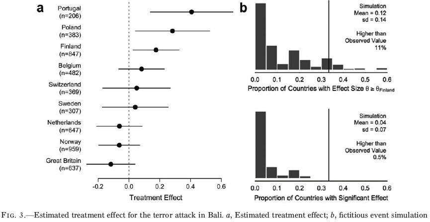

```{r include=FALSE}
options(digits=3)
library("ggplot2")
```

# Seminaropgaven

- Send mig gerne hvad I har
    - Deadline 31. marts
    
- Tænk ikke så meget over antal sider

- Vejledning

- Dato for aflevering: ukendt

# Gæsteforelæsning

- Evalueringen af offentlige politikker

- Mandag den 18. april

# Dagsorden

- Forskellige tilgange
    - Eksperimenter, naturlige eksperimenter, observationsstudier

- Observationsstudier

- Forskellige designs

- Få cases

- Afbrudt tidsseriedesign

# Forrige gang

- Naturlige eksperimenter
    - RDD
    - IV
    - DID

- I dag bevæger vi os endnu længere væk fra eksperimenter

# I dag: Observationsstudier

- Observationsstudier er studier hvor forskeren
    - ikke kontrollerer datagenerationsprocessen og 
    - der ikke er randomiseret variation

- Vores definition af kausalitet er dog den samme
    - "Like it or not, social scientists rely on the logic of experimentation even when analyzing nonexperimental data." (Green og Gerber [2003](http://ann.sagepub.com/content/589/1/94.abstract), 110)

- Logikken er den samme
    - "In some sense every empirical researcher is reporting the results of an experiment. Every researcher who behaves as if an exogenous variable varies independently of an error term effectively views their data as coming from an experiment." (Harrison og List [2004](http://www.jstor.org/stable/3594915), 1009)


# Randomiserede og ikke-randomiserede grupper

- Randomiserede grupper og stimuli

|---|---|---|
| R | $X$ | $O_{1}$ |
| R |  | $O_{2}$ |

- Ikke-randomiserede grupper og stimuli

|---|---|---|
| NR | $X$ | $O_{1}$ |
| NR |  | $O_{2}$ |

- Randomiserede grupper faciliterer en kausal test
    - Ikke-randomiserede grupper kan **aldrig** facilitere en direkte kausal test
    
- Manglende randomisering: som regel overestimering af effekter (Kunz og Oxman [1998](http://www.bmj.com/content/317/7167/1185.short))

# Kvalitativ vs. kvantitativ metode

- Ikke en unik kvantitativ eller kvalitatitiv metode

- Alle kvalitative data kan måles og kodes med brugen af kvantitative tilgange
    - Og der er et komponent af kvalitativ forskning til al forskning

- Casestudier beror på samme logik som andre designs
    - "[T]here is no reason to suppose that case study research follows a divergent logic of inquiry relative to experimental research." (Gerring og McDermott [2007](http://onlinelibrary.wiley.com/doi/10.1111/j.1540-5907.2007.00275.x/abstract), 689)

- Casestudier er en slags kvasieksperiment
    - Cases vælges med henblik på at teste et teoretisk argument

# Forskellige typer af studier (Blom-Hansen og Serritzlew [2014](http://politica.dk/fileadmin/politica/Dokumenter/politica_46_1/blom-hansen_og_serritzlew.pdf))


# Designs

- Forskellige elementer kan styrke et observationsstudie

- Stimulitildeling
    - Tilfældig
    - Tærskelværdibaseret
    - Matching

# Designs

- Mål
    - Posttest observationer
    - Pretest observationer
    - Moderatorvariable
    - Måle på validitetstrusler

# Designs

- Sammenlignelige grupper
    - To eller flere forskellige grupper
    - Kohorter
    - Intern vs. ekstern kontrol
    - Konstruerede kontraster

# Designs

- Stimuli
    - Skiftende stimuli
    - Modsatte stimuli
    - Fjernede stimuli
    - Gentagende stimuli


# Designfokus

- Fokus på designvalg (Rosenbaum [1999](http://www.jstor.org/stable/pdf/2676761.pdf))
    - Valg af forskningsspørgsmål
    - Valg af grupper
    - Valg af konkurrende teorier
    - Intern replikation
    - Fravær af stimuli i kontrolgruppen
    - Styrken af stimuli
    - _Natural blocks_ (relaterede observationer)

# Eksempel: Effekten af college football på partivalg (Healy et al. [2010](http://www.pnas.org/content/107/29/12804.short))


# Eksempel: Effekten af college football på partivalg 

- College football påvirker evalueringer af politikerne
    - Hvorfor?
    
- Observationsstudie
    - Vi kan ikke replikere det
    
- Hvordan kan vi styrke studiet? 

# Eksempel: Effekten af college football på partivalg (Fowler og Montagnes [2015](http://www.pnas.org/content/112/45/13800.abstract))

- Test teoretiske implikationer

- "In this study, we reassess the evidence on college football games and elections. Multiple independent sources of evidence suggest that this particular result is a false positive, despite the fact that Healy et al. (1) used a credible research design and followed the best practices of social science. There is no single smoking gun. Rather, we test several additional hypotheses that should hold if college football games truly influence elections, and in each case, the evidence fails to support the original finding."

# Eksempel: Effekten af college football på partivalg (Fowler og Montagnes [2015](http://www.pnas.org/content/112/45/13800.abstract))


# Designs uden kontrolgrupper

- En gruppe med posttest
    - Ingen pretests eller kontrolgruppe

    - Alle trusler i forhold til intern validitet
        - Med undtagelse af tidsdimensionen

|---|---|---|
| | $X$ | $O_{1}$ |

# Designs uden kontrolgrupper

- En gruppe med forskellige posttests
    - Ingen pretests eller kontrolgruppe
    - Samme trusler til intern validitet som med én posttest

|---|---|---|
| | $X$ | $\{O_{1A} O_{1B} ... O_{1N} \}$ |

# Designs uden kontrolgrupper

- En gruppe med pretest og posttest

|---|---|---|
| $O_{1}$ | $X$ | $O_{2}$ |

- En styrke at have en pretest
    - Men mangler stadig kontrolgruppe! 
    - Intet kontrafaktisk scenarie

# Designs uden kontrolgrupper

- En gruppe med flere pretests og en posttest

|-----|-----------|---|---|---
| $O_{1}$ |  | $O_{2}$ | $X$ | $O_{3}$ |

- Giver mulighed for at undersøge modningseffekter
    - Men tager ikke nødvendigvis højde for historieeffekter, instrumenteffekter (og interaktioner mellem dem - eller interaktioner med modningseffekter)

# Designs uden kontrolgrupper

- En gruppe med pretest og posttest ved brug af forskellige afhængige variable

|---|---|---|
| $\{O_{1A}, O_{1B}\}$ | $X$ | $\{O_{2A}, O_{2B}\}$ |

- A forventes at blive påvirket af stimuli, B gør ikke
- B forventes at reagere på truslerne til intern validitet på samme måde som A

# Designs uden kontrolgrupper

- En gruppe med og uden stimuli

|-----|-----------|---|---|---|---|---
| $O_{1}$ | $X$ | $O_{2}$ |  | $O_{3}$ | $X'$ | $O_{4}$

- $X'$ angiver at fjerne et stimuli
    - Tænk på en stikkontakt

- Kan bruges til at teste forskelle som funktion af stimuli i forhold til forskellige validitetstrusler
    - $X'$ skal ikke have samme effekt som $X$!

# Designs uden kontrolgrupper

- En gruppe med gentaget stimuli

|-----|-----------|---|---|---|---|---
| $O_{1}$ | $X$ | $O_{2}$ | $X'$ | $O_{3}$ | $X$ | $O_{4}$

- Når der er mulighed for at introducere stimuli igen
    - Tænk (igen) på en stikkontakt

# Designs med kontrolgrupper uden randomisering

- Posttest med forskellige grupper

|---|---|---|
| NR | $X$ | $O_{1}$ |
| NR |  | $O_{2}$ |

- Udfordring: Vi kan ikke sige om det er $X$ eller forskelle mellem grupperne, der forklarer en eventuel forskel mellem $O_{1}$ og $O_{2}$

- Løsning: Forsøge at gøre de to grupper sammenlignelige, så man kan estimere effekten af $X$
    - Næste gang ser vi på en af disse teknikker

# Designs med ikke-randomiserede kontrolgrupper og pre-tests

- To grupper med pre- og post-tests 

|---|---|---|---|
| NR | $O_{1}$ | $X$ | $O_{2}$ |
| NR | $O_{1}$ |  | $O_{2}$ |

- Difference-in-difference (jvf. sidste uge)

# Designs med ikke-randomiserede kontrolgrupper og pre-tests

- To grupper med flere pre-målinger

|---|---|---|---|---|---|
| NR | $O_{1}$ |  | $O_{2}$ |$X$ | $O_{3}$
| NR | $O_{1}$ |  | $O_{2}$ |  | $O_{3}$

- To grupper med flere målinger og stimuli på forskellige tidspunkter

|---|---|---|---|---|---|
| NR | $O_{1}$ | $X$ | $O_{2}$ | | $O_{3}$
| NR | $O_{1}$ | | $O_{2}$ | $X$ | $O_{3}$

# Designs med ikke-randomiserede kontrolgrupper og pre-tests

- Modsat stimuli

|---|---|---|---|
| NR | $O_{1}$ | $X_{+}$ | $O_{2}$ |
| NR | $O_{1}$ | $X_{-}$ | $O_{2}$ |

- Beror på at skabe to stimulieffekter med modsat fortegn

# Designs med ikke-randomiserede kontrolgrupper og pre-tests

- Kohortekontrolgruppe

|---|---|---|---|
| NR | $O_{1}$ |  |  |
| NR |  | $X$ | $O_{2}$ |

- Kohortekontrolgruppe med pre-måling for begge grupper

|---|---|---|---|---|---|---|
| NR | $O_{1}$ | | $O_{2}$ |  | | 
| NR | | | | $O_{3}$ | $X$ | $O_{4}$

# Trusler til validiteten 

- Talrige trusler til validiteten i alle stadier af den videnskabelige proces

1. I læsningen af litteraturen
    - _Rhetoric biases_, _all's well literature bias_, _one-sided reference bias_, _positive result bias_, _hot stuff bias_.

2. I valg af sample
    - _Popularity bias_, _centripetal bias_, _referral filter bias_, _diagnostic access bias_ _diagnostic suspicion bias_, _unmasking bias_, _mimicry bias_, _previous opinion bias_, _wrong sample size bias_, _admission rate bias_, _prevalence-incidence bias_, _diagnostic vogue bias_, _diagnostic purity bias_, _procedure selection bias_, _missing clinical data bias_, _non-contemporaneous control bias_, _migrator bias_, _membership bias_, _non-respondent bias_, _volunteer bias_.

# Trusler til validiteten 

3. I gennemførelsen af studiet
    - _Contamination bias_, _withdrawal bias_, _compliance bias_, _therapeutic personality bias_, _bogus control bias_.
    
4. I målingen af variable
    - _Insensitive measure bias_, _underlying cause bias_, _end-digit preference bias_, _apprehension bias_, _unacceptability bias_, _obsequiousness bias_, _expectation bias_, _substitution game_, _family information bias_, _exposure suspicion bias_, _recall bias_, _attention bias_, _instrument bias_.
    
# Trusler til validiteten 

5. I analysen af data
    - _Post-hoc significance bias_, _data dredging bias_, _scale degradation bias_, _tidying-up bias_, _repeated peeks bias_.
    
6. I fortolkningen af analysen
    - _Mistaken identity bias_, _cognitive dissonance bias_, _magnitude bias_, _significance bias_, _correlation bias_, _under-exhaustion bias_, 

# Få cases

- Hvad kan vi lære af få cases?

- Flere observationer er som regel bedre

- Ofte kan indsamling af flere data være vanskeligt
    - Der findes ikke flere observationer
    - Omkostningstungt

# Få cases: Casestudier

- Udfordringen er især intern validitet

- Fordrer ofte bestemte antagelser (Lieberson [1991](http://www.jstor.org/stable/pdf/2580241.pdf)):
    1. Deterministisk kausalitet
    2. Ingen målefejl
    3. Én årsag
    4. Ingen interaktionseffekter

# Få cases: Kan vi lære noget af N=1? 

- Selvfølgelig
    - Samfundsvidenskaberne er fyldt med gode casestudier af én case

- Eksempler fra Science/Nature: 

    - Kaminski et al. ([2004](http://science.sciencemag.org/content/304/5677/1682)): Word Learning in a Domestic Dog: Evidence for "Fast Mapping"
    
    - Ericcson et al. ([1980](http://science.sciencemag.org/content/208/4448/1181)): Acquisition of a memory skill
    
    - Anon ([1970](http://www.nature.com/nature/journal/v226/n5248/abs/226869a0.html)): Effects of Sexual Activity on Beard Growth in Man

# Få cases: Hvad med QCA?

- Qualitative comparative analysis (QCA)

- Kan fungere, men vær opmærksom på væsentlige metodiske udfordringer

    - Lucas og Szatrowski ([2014](http://smx.sagepub.com/content/44/1/1)): Qualitative Comparative Analysis in Critical Perspective
    
    - Krogslund et al. ([2015](http://pan.oxfordjournals.org/content/23/1/21)): Fuzzy Sets on Shaky Ground: Parameter Sensitivity and Confirmation Bias in fsQCA

    - Tanner ([2014](http://www.sciencedirect.com/science/article/pii/S144940351400037X)): QCA is of questionable value for policy research

# Få cases: Big data

- Observationsstudier er ikke kun relateret til mindre studier

- Big data/machine learning vinder frem i disse år

- Forudsigelser versus kausalitet

- Introduktionsartikler:
    - Breiman ([2001](http://projecteuclid.org/euclid.ss/1009213726)): Statistical Modeling: The Two Cultures
    - Lazer et al. ([2009](http://science.sciencemag.org/content/323/5915/721)): Computational Social Science
    - Varian ([2014](https://www.aeaweb.org/articles.php?doi=10.1257/jep.28.2.3)): Big Data: New Tricks for Econometrics

# Få cases: Matching

- Bliver vi altid klogere af at have flere data? 
    - Med andre ord: Er flere data altid løsningen?

- Ikke alle observationer har en kontrafaktisk ækvivalent

- Dermed ikke alle observationer, der kan bruges i en kausalanalyse
    - Emnet for næste uge

# Afbrudt tidsseriedesign

- Det mest simple

|---|---|---|---|---|---|---|---|---|---|---|
| $O_{1}$ | $O_{2}$ | $O_{3}$ | $O_{4}$ | $O_{5}$ | $X$ | $O_{6}$ | $O_{7}$ | $O_{8}$ | $O_{9}$ | $O_{10}$

- Udvidet med endnu en gruppe

|---|---|---|---|---|---|---|---|---|---|---|
| $O_{1}$ | $O_{2}$ | $O_{3}$ | $O_{4}$ | $O_{5}$ | $X$ | $O_{6}$ | $O_{7}$ | $O_{8}$ | $O_{9}$ | $O_{10}$
| $O_{1}$ | $O_{2}$ | $O_{3}$ | $O_{4}$ | $O_{5}$ |  | $O_{6}$ | $O_{7}$ | $O_{8}$ | $O_{9}$ | $O_{10}$

# Afbrudt tidsseriedesign

- To forskellige afhængige variable

|---|---|---|---|---|---|---|---|---|---|---|
| $O_{A1}$ | $O_{A2}$ | $O_{A3}$ | $O_{A4}$ | $O_{A5}$ | $X$ | $O_{A6}$ | $O_{A7}$ | $O_{A8}$ | $O_{A9}$ | $O_{A10}$
| $O_{B1}$ | $O_{B2}$ | $O_{B3}$ | $O_{B4}$ | $O_{B5}$ |  | $O_{B6}$ | $O_{B7}$ | $O_{B8}$ | $O_{B9}$ | $O_{B10}$

- Tilføje og fjerne stimuli
    - Evt. en midlertidig politik

|---|---|---|---|---|---|---|---|---|---|---|---|---|
| $O_{1}$ | $O_{2}$ | $O_{3}$ | $X$ | $O_{4}$ | $O_{5}$ | $O_{6}$ | $X'$ | $O_{7}$ | $O_{8}$ | $O_{9}$ 

# Afbrudt tidsseriedesign

- Udfordringer
    - Mange stimuli implementeres langsomt og diffust
    - Stimuli kan have tiltagende effekter og ikke være målbare med det samme
    - Mange tidsseriedata har ikke nok data til at lave statistiske analyser
        - Kræver mange observationer
    - Det kan være svært at få adgang til god data
    - Manglende data
    - Skiftende intervaller
    - Skiftende mål

# Afbrudt tidsseriedesign

- Eksempler med tværsnitsdata

- Udnytter information omkring, hvornår data er indsamlet

- Respondenter interviewet *før* en begivenhed fungerer som en approksimeret kontrafaktisk gruppe til dem, der er interviewet *efter* en begivenhed

- Overvej flere ting
    - Hvad er antagelserne?
    - Påvirker begivenheden sandsynligheden for at deltage i en undersøgelse?
    - Hvor stærkt er stimuli? (reagerer alle på begivenheden?)

# Eksempel: Effekten af terror på institutionel tillid (Dinesen og Jæger [2013](http://onlinelibrary.wiley.com/doi/10.1111/pops.12025/abstract))


# Eksempel: Effekten af terror på holdningen til immigranter (Legewie [2013](http://www.jstor.org/stable/10.1086/669605))


# Eksempel: Effekten af terror på holdningen til immigranter (Legewie [2013](http://www.jstor.org/stable/10.1086/669605))



# Eksempel: Effekten af terror på holdningen til immigranter (Jakobsson og Blom [2014](http://ijpor.oxfordjournals.org/content/26/4/475))


# Eksempel: Effekten af partiernes politik til holdningen til efterlønnen (Slothuus [2010](http://www.tandfonline.com/doi/abs/10.1080/10584601003709381))


# Eksempel: Effekten af økonomiske chock på opfattede levevilkår (Hariri et al. [2016](http://wber.oxfordjournals.org/content/30/1/55))


# Dagens øvelse

- Lav et diagram, der tester en kausal påstand

- Minimumskrav:
    - Der skal være et stimuli (uafhængig variabel)
    - Der skal være en postmåling (afhængig variabel)

- Diskuter de største validitetsudfordringer
    - Statistisk validitet
    - Intern validitet
    - Ekstern validitet
    - Konstruktionsvaliditet

- Diskuter hvordan designet bedst kan styrkes
    - Ideelt
    - Praktisk
    - Etisk?

# Næste gang

- Observationsdata, part II

- Torsdag 14. april, kl. 10-12 i U143
