```{r include=FALSE}
options(digits=3)
library("ggplot2")
```

# Eksamensdato

- Dato for aflevering: 2. juni, klokken 12.00

- Nye datoer
    - Tentativ udgave: 15. maj

- Vejledning
    - Ideelle tidspunkter?

# Gæsteforelæsning

- Evalueringen af offentlige politikker

- Mandag den 18. april

- Se den opdaterede læseplan!

# AGORA

- Tid: Onsdag d. 4. maj 
    - Hele dagen fra kl. 08.45 (al undervisning er aflyst)

- Sted: SDU O100 - ved hovedindgangen

- Følgende oplægsholdere er allerede præsenteret (flere på vej):

    - Martin Lidegaard, medlem af folketinget for Radikale Venstre og forhenværende udenrigsminister

    - Flemming Rose, fhv. kulturredaktør på Jyllands-Posten

    - Andreas Kamm, generalsekretær i Dansk Flygtningehjælp

- Yderligere oplysninger på [https://www.facebook.com/AGORASDU/](https://www.facebook.com/AGORASDU/)


# Dagsorden

- Observationsstudier, recap

- Mange observationer: Matching metoden

- Færre (aggregerede) observationer: Syntetisk kontrol metoden
    - Komparative casestudier

# Observationsstudier

- Husk: Observationsstudier er studier hvor forskeren...
    - ikke kontrollerer datagenerationsprocessen og 
    - der ikke er randomiseret variation

- Logikken i eksperimenter og observationsstudier er den samme
    - Problem: Sammenligningen af observationer, der ikke er sammenlignelige
    - Stimulitildelingen er ikke tilfældig

- Vi skal approksimere det eksperimentelle ideal i vores observationsstudier


# Observationsstudier og kausal inferens

- Vi har stadig et stimuli!
    - "A study without a treatment is neither an experiment nor an observational study." (Rosenbaum [2002](http://www.springer.com/us/book/9780387989679), 1)

- To grupper: Stimuli og kontrol

- I eksperimenter:
    - Grupperne er sammenlignelige (med undtagelse af stimuli)
    - Kontrolvariable påvirker ikke stimulitildeling
    - Sandsynligheden for at få stimuli er kendt
        - På grund af randomisering
        - $P(W_{i})$ = 0.5, for alle $i$ ved stimuli og kontrol
        - Uafhængig: $(Y(1),Y(0),X) \perp W$

# Observationsstudier og kausal inferens

- De bedste observationsstudier bygger på logikken fra eksperimenter

- I eksperimenter er vi interesseret i gennemsnitseffekter (ATE)

- I mange observationsstudier er vi interesseret i gennemsnitlige stimulieffekter for stimuligruppen (ATT)

    - $ATT = E[Y(1) - Y(0) | W = 1]$

- Giver os mulighed for at evaluere effekten for de enheder der _har_ fået stimuli

- Kontrafaktisk gennemsnit: $E[Y(0) | W = 1]$


# Observationsstudier og kausal inferens

- I observationsstudier kender vi ikke stimulitildelingsmekanismen
    - Vi ved blot, at den ikke altid er tilfældig
        - $P(W_{i}) \neq 0.5$

- Når kontrolvariable, $X$, påvirker stimulitildelingen: Matching 
    - "Matching refers to a variety of procedures that restrict and reorganize the original sample in preparation for a statistical analysis." (Gelman og Hill [2007](http://www.cambridge.org/us/academic/subjects/statistics-probability/statistical-theory-and-methods/data-analysis-using-regression-and-multilevelhierarchical-models), 206)

# Matching

- Med andre ord: Matching hjælper os med at skabe mere sammenlignelige grupper

- Hvordan? 
    - Maksimerer balancen på kontrolvariable

- Gør stimuli og kontrolgruppe identitiske før stimulitildeling

- Fundamental antagelse: balance på observerede variable $\rightarrow$ balance på uobserverede variable

# Matching 

- Resultat: Vi kan sammenligne sammenlignelige enheder
    - Hvad kan vi lære fra enheder, vi ikke kan sammenligne med noget?
        - Intet. Mangler kontrafaktisk scenarie.

- Løsningen er et distancemål ($D_{ij}$), der måler distancen mellem to enheder i forhold til deres værdier på kontrolvariablene

- Der findes forskelige distancemål

# Eksakt matching (stratificeret matching)

- To muligheder for afstand mellem to enheder
    - Ingen afstand mellem observationer
    - Uendelig afstand

      $D_{ij} = \begin{cases} 0  & \mbox{if } X_{i} = X_{j} \\ \infty & \mbox{if } X_{i} \not = X_{j} \end{cases}$


- Problem: Dimensionalitetsproblemet/_curse of dimensionality_ (Sekhon [2009](http://www.annualreviews.org/doi/abs/10.1146/annurev.polisci.11.060606.135444), 497)

- Fungerer bedst med få variable der er kategoriske

# Propensity score

- En løsning på dimensionalitetsproblemet

- Propensity score: "the propensity towards exposure to treatment 1 given the observed covariates x" (Rosenbaum og Rubin [1983](http://biomet.oxfordjournals.org/content/70/1/41), 43)

- Propensity score: $p_{i} \equiv Pr(W_{i} | X_{i})$

- Sandsynlighed for at få stimuli givet kontrolvariable

- Distance: $D_{ij} = | p_{i} - p_{j} |$

- I praksis: En propensity score for hver enhed (en ekstra kolonne i vores datasæt)
    - Evt. de forudsagte sandsynligheder fra en logistisk regression

# Designantagelser

- Antagelse 1: $Pr[W | X, Y(1), Y(0)] = Pr(W | X)$ (_Unconfoundedness_)

- Forskellige personer har forskellige _propensity scores_ (Rubin [2004](http://jeb.sagepub.com/content/29/3/343.abstract)). Eksempler: 
    - Ældre mænd har sandsynligheden 0,8 for at få stimuli
    - Yngre mænd har sandsynligheden 0,6 for at få stimuli
    - Ældre kvinder har sandsynligheden 0,5 for at få stimuli
    - Yngre kvinder har sandsynligheden 0,2 for at få stimuli

# Designantagelser

- Antagelse 2: $0 < p_{i} < 1$ (sandsynligheden er mellem 0 og 1, i.e. overlap)

- Overlap (_common support_)

- Hvad hvis $p_{i} = 1$ eller $p_{i} = 0$?

- Ekskluder observationer for hvem $p_{i}$ er tæt på 0 eller 1 (tommelfingerregel: ekskluder ved $p_{i} < 0.1$ og $p_{i} > 0.9$) 

# Eksempel, overlap før og efter matching

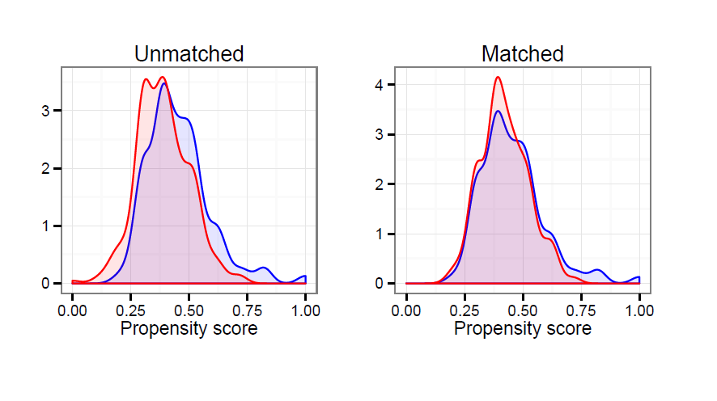

# Overlap før og efter matching

- Tjek om der er overlap før og efter

- Har vi fået identiske grupper?
    - I så fald: ingen observerbare forskelle

# Hvad er et godt match?

- Hvor tætte skal to observationer være, før vi har et godt match?

- Vi smider observationer ud fra vores datasæt

- Sæt en _caliper_ der er grænseværdien for, hvor stor en distance vi vil acceptere

- Pre-stimuli kontrolvariable
    - Vælg relevante kontrolvariable
    - Relevante
        - Pre-stimuli (*Ikke* noget, der kan blive påvirket af stimuli)

# Matching, forskellige metoder

- Nearest neighbor matching (med eller uden caliper)
      
- Radius matching
      
- Genetic matching

- Coarsened exact matching

# Nearest neighbor og specifikke valg

- Nærmeste nabo. Vælg den _nabo_ i kontrolgruppen, der ligger tættest på stimulienheden

- Trade-off: Bias og varians

- Antal matches
    - Match 1 NN: Mindre bias, mere varians
    - Match 1:n NN: Mindre varians, mere bias

- Med eller uden erstatning?
    - Med erstatning: Mindre bias, mere varians
    - Uden erstatning: Mindre varians, potentiel bias
    - Tommelfingerregel: match med erstatning

# Balance

- Forskellige måder at teste balancen
  - Forskelle i andele/gennemsnit (t-test, Fisher exact test)
  - Distributionen (QQ plot, Kolmogorov-Smirnov test)

- Igen: Vi ønsker identitiske grupper (med undtagelse af stimuli)

- Ingen observerbare forskelle

# Hvorfor brugere forskere matching? (Miller [2015](https://sites.google.com/site/mkmtwo/Miller-Matching.pdf?attredirects=0), 31)

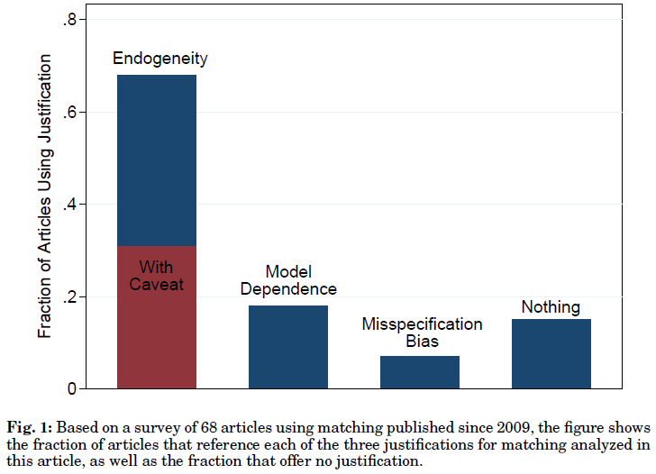

# Eksempel: Den kausale effekt af uddannelse på politisk deltagelse

- Kam og Palmer ([2008](http://journals.cambridge.org/action/displayAbstract?fromPage=online&aid=1927220)): Et klassisk stimulitildelingsproblem

- Logikken: "matches respondents who attended college with those who did not by using a propensity score, or predicted likelihood of attending college based upon an individual's preadult experiences and characteristics. The matching process mimics random assignment, thus producing two groups whose levels of participation can then be compared, having essentially controlled for preadult experiences and characteristics." (p. 613)

- "Each respondent who received the treatment (i.e., a respondent who went to college, in our research question) is matched with a set of untreated respondents (i.e., respondents who did not attend college) that have similar propensity scores. This technique is called nearest-neighbor matching." (Kam og Palmer [2008](http://journals.cambridge.org/action/displayAbstract?fromPage=online&aid=1927220), 620)


# Propensity scores, før matching

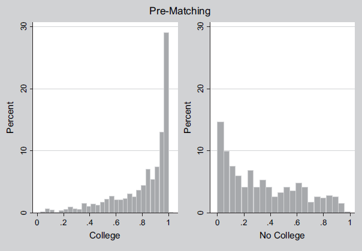


# Propensity scores, efter matching

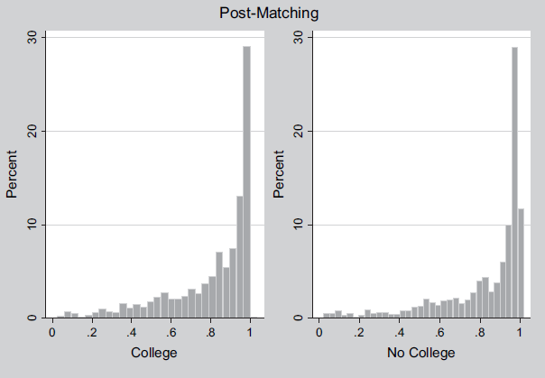

# Eksempel: Den kausale effekt af uddannelse på politisk deltagelse

- Problem: Propensity scores tæt på 1

- Henderson og Chatfield ([2011](http://journals.cambridge.org/action/displayAbstract?fromPage=online&aid=8347737&fileId=S0022381611000351), 652): "we observe that clustering around 1 is so pronounced that the p-scores for the top 5% of college-attenders range in value from .9998174 to .9999998. In fact, over half of all attenders have propensity scores greater than .9 and over a quarter have scores greater than .99. In contrast, only 14 nonattenders have propensities greater than .9 (3%) and only 5 (1%) have propensities greater than .95, with the highest propensity for any nonattender being .9889."

# Eksempel: Den kausale effekt af uddannelse på politisk deltagelse

- Kam og Palmer ([2008](http://journals.cambridge.org/action/displayAbstract?fromPage=online&aid=1927220)): Ingen effekt

- Mayer ([2011](http://journals.cambridge.org/action/displayFulltext?type=1&fid=8347736&jid=JOP&volumeId=73&issueId=03&aid=8347734)): Uddannelse øger den politiske deltagelse

- Henderson og Chatfield ([2011](http://journals.cambridge.org/action/displayAbstract?fromPage=online&aid=8347737&fileId=S0022381611000351)): Uddannelse øger den politiske deltagelse

- Kam og Palmer ([2011](http://journals.cambridge.org/action/displayAbstract?fromPage=online&aid=8347740&fileId=S0022381611000363)): Ingen kausal effekt


# Eksempel: Effekten af samfundstjeneste på kriminalitet

- Klement ([2015](http://link.springer.com/article/10.1007/s11292-015-9231-1)): Comparing the effects of community service and imprisonment on reconviction: results from a quasi-experimental Danish study

- Udfaldsvariabel: Domsrate

- Stimuli: Samfundstjeneste (kontrolgruppe: fængsel)

- Design: Kvasieksperiment

- Sample: Danske kriminelle

- Resultat: Samfundstjeneste $\rightarrow$ Mindre tilbagefald


# Unmatched 

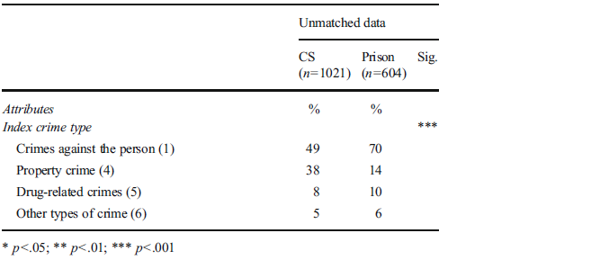

# Matched


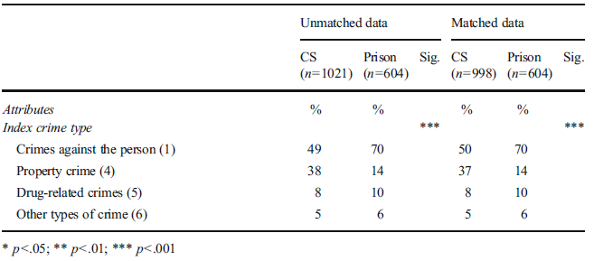


# Begrænsninger og udfordringer med matching

- Intet studie er bedre end dets design
    - "Without an experiment, a natural experiment, a discontinuity, or some other strong design, no amount of econometric or statistical modeling can make the move from correlation to causation persuasive." (Sekhon [2009](http://www.annualreviews.org/doi/abs/10.1146/annurev.polisci.11.060606.135444), 503)
    - "Matching has no advantage relative to regression for inferring causation or dealing with endogeneity" (Miller [2015](https://sites.google.com/site/mkmtwo/Miller-Matching.pdf?attredirects=0), 2)

- Flere trin, flere steder det kan gå galt
    - 'Researcher Degrees of Freedom'
    - Misvisende forskning
    - Først når vi har sammenlignelige grupper, bør man estimere den kausale effekt

# Begrænsninger og udfordringer med matching

- Matching løser ikke FPCI

- Gode designs er løsningen
    - Randomisering $\rightarrow$ balance
    - Balance $\not\rightarrow$ randomisering

- Hovedpointe: viden om observerbare forskelle mellem stimuli og kontrolgrupper kan hjælpe os med at reducere bias i vores effektestimater

# Syntetisk kontrol

- Ved færre observationer: syntetisk kontrol metoden for komparative case studier

- Målsætning: Estimere effekten af stimuli/intervention på få observationer

- Især applicerbart på komparative casestudier
    - Ét land gennemfører en reform, andre gør ikke
    - Én stat i USA forbyder noget, andre gør ikke
    
- Største svaghed: arbitrært valg af kontrolgruppe

- Vi er interesseret i et vægtet gennemsnit af alle potentielle sammenligningsenheder der bedst ligner den enhed, vi ønsker at studere
    - Ligesom med matching


# Komparative casesstudier

- Design: Afbrudt tidsseriedesign med en kontrolgruppe
    - En eller flere målinger før og efter intervention
    - En stimuligruppe/enhed får intervention
    - En kontrolgruppe/enhed får ikke intervention

- Hvordan laver vi de rette kontrafaktiske sammenligninger?

- Hvilke enheder skal vi sammenligne?
    - To eller flere?

# Syntetisk kontrol

- Reform finder sted i Danmark, men ikke i andre lande

    - Vi har værdier før og efter reformen i Danmark og andre lande

    - Det vi ønsker at lave er en kontrolgruppe

        - Et syntetisk Danmark

- Begivenhed finder sted i Odense Kommune, men ikke andre kommuner

    - Svært at sammenligne Odense Kommune med de andre kommuner
    
    - Samme opgave: Lave en syntetisk kontrol

- Syntetisk kontrol

    - Statistisk værktøj til kvalitative studier


# Model

- J+1 regioner, T perioder
    - J: mulige kontrolreigioner

    - T: antal perioder

    - $T_{0}$: antal prestimuli perioder ($1 \leq T_{0} < T$)

- Region 1 påvirkes af stimuli i perioden $T_{0} + 1, ..., T$.

- $Y_{jt}^{N}$: Udfald for region _j_ i periode _t_ uden stimuli/intervention

- $Y_{jt}^{I}$: Udfald for region _j_ i periode _t_ med stimuli/intervention

- Effekt af stimuli/intervention: $\alpha_{jt} = Y_{jt}^{I} - Y_{jt}^{N}$

# Model

- Intervention, $D_{jt}$: 1 hvis region _j_ er tildelt stimuli i periode _t_

- Observeret udfald for reigion _j_ i periode _t_:

    $Y_{jt} = Y_{jt}^{N} + \alpha_{jt} D_{jt}$

- Kun region 1 får stimuli - og kun efter $T_{0}$

      $D_{jt} = \begin{cases} 1  & \mbox{if } j = 1 \mbox{ and } t > T_{0} \\ 0 & \mbox{otherwise. } \end{cases}$

- Hovedinteresse: Estimere $\alpha_{1t}$, altså effekten af interventionen på region 1
    - $\alpha_{1t} = Y_{1t} - Y_{1t}^{N}$
    - Husk: $Y_{1t}$ er observeret
    - Vi er interesseret i estimationen af det kontrafaktiske scenarie

# Model
- Kontrafaktisk scenarie er givet ved en faktormodel:
    - $Y_{jt}^{N} = \delta_{t} + \theta_{t} \textbf{Z}_{j} + \lambda_{t}\mu_{j} + \varepsilon_{jt}$
    - Hvor:
        - $\delta_{t}$ (delta): ukendt faktor med konstant faktorladning på tværs af enheder
        - $\theta_{t}$ (theta): ukendte parametre 
        - $\textbf{Z}_{j}$: kontrolvariable der ikke er påvirket af stimuli
        - $\lambda_{t}$ (lambda): ukendte fælles faktorer
        - $\mu_{j}$ (my): ukendte faktorladninger
        - $\varepsilon$ (epsilon): uobserverede kortvarige chok
    - Hovedpointe: Forskellige reaktioner til flere uobserverede faktorer

# Model

- Uobserverede faktorer kan være problematiske
    - Vi kan matche på pre-stimuli perioderne for at kontrollere for heterogene reaktioner til uobserverede faktorer

- Potentiel syntetisk kontrol givet et sæt af vægte, $W$
    - $W = (w_{2},...,w_{J+1})'$
    - Hver vægt er større end nul ($w_{j} \geq 0$ for $j=2,...,J+1$)
    - Summen af disse værdier er 1 ($w_{2} + ... + w_{J+1}=1$)
    - For hver værdi er der en syntetisk kontrol
        - Et vægtet gennemsnit for kontrolregionerne

- Udfaldet for hver syntetisk kontrol er givet ved:
    - $\sum\limits_{j=2}^{J+1} w_{j}Y_{jt} = \delta_{t} + \theta_{t} \sum\limits_{j=2}^{J+1} w_{j} \textbf{Z}_{i} + \lambda_{t} \sum\limits_{j=2}^{J+1} w_{j} \mu_{j} + \sum\limits_{j=2}^{J+1} w_{j} \varepsilon_{jt}$

# Model

- Den syntetiske kontrol estimator er så: 
    - $\widehat{\alpha}_{1t} = Y_{1t} - \sum\limits_{j=2}^{J+1} w_{j}Y_{jt}$
    
- $Y_{jt}$: udfald for region $j$ i periode $t$.
- $\widehat{\alpha}_{1t}$: effekten af intervention/stimuli

- Kontrafaktisk scenarie: kombinationen af enheder, der ikke har fået stimuli, som bedst ligner vores interventionsenhed før interventionen

- Tænk en tidsseriegraf hvor vi vil have kontrol og stimuli til at være identiske før en intervention

# Eksempel: Californiens Proposition 99 (Abadie et al. [2010](http://www.tandfonline.com/doi/abs/10.1198/jasa.2009.ap08746))

- Politik: Øgede priser på cigaretter (øget skat)

- Data: Paneldata for amerikanske stater (1970-2000)

- Udfald: Tobaksforbrug

- Interventionsår: 1988

- Region: Californien

- Syntetisk Californien: vægtet gennemsnit af potentielle kontrolstater
    - Vægte valgt med henblik på at den syntetiske kontrol bedst forudsiger værdierne på predictors af cigaretforbrug før interventionen (_Proposition 99_)

- Andre stater der efterfølgende implementerede store kontrolprogrammer er ekskluderet

# Eksempel: Californiens Proposition 99 (Abadie et al. [2010](http://www.tandfonline.com/doi/abs/10.1198/jasa.2009.ap08746))

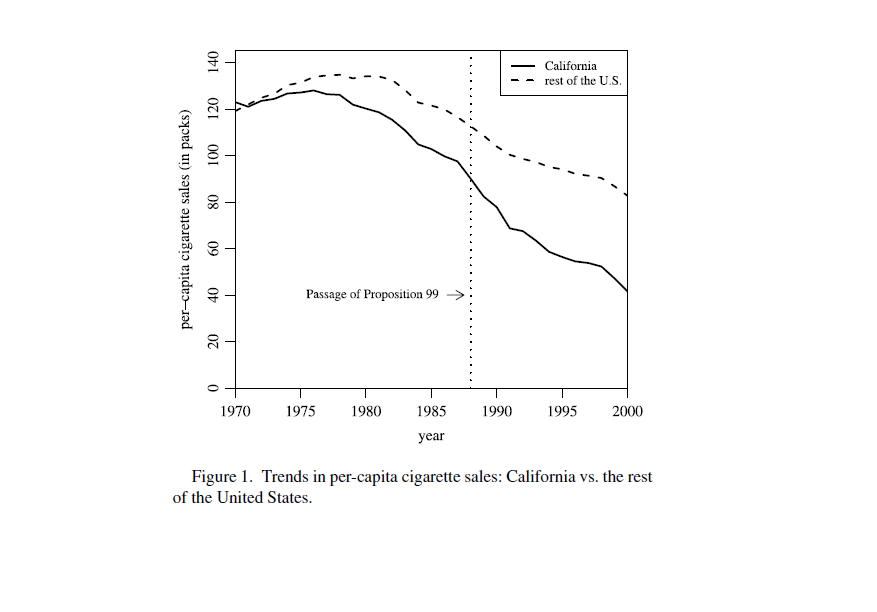

# Eksempel: Californiens Proposition 99 (Abadie et al. [2010](http://www.tandfonline.com/doi/abs/10.1198/jasa.2009.ap08746))

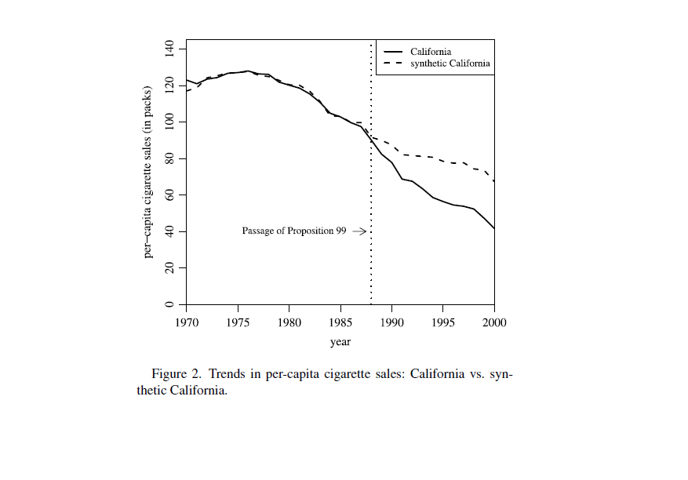

# Eksempel: Californiens Proposition 99 (Abadie et al. [2010](http://www.tandfonline.com/doi/abs/10.1198/jasa.2009.ap08746))

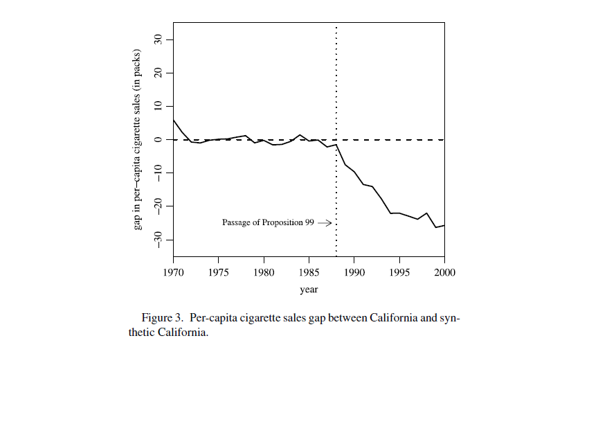

# Eksempel: Californiens Proposition 99 (Abadie et al. [2010](http://www.tandfonline.com/doi/abs/10.1198/jasa.2009.ap08746))

- Placebotests

- Hvordan?
    - Interventionen bliver givet til hver af de 38 kontrolstater
    - Estimerer stimulieffekten for hver stat, hvis den implementerede kontrolprogrammet i stedet for Californien

- RMSE

# Eksempel: Californiens Proposition 99 (Abadie et al. [2010](http://www.tandfonline.com/doi/abs/10.1198/jasa.2009.ap08746))

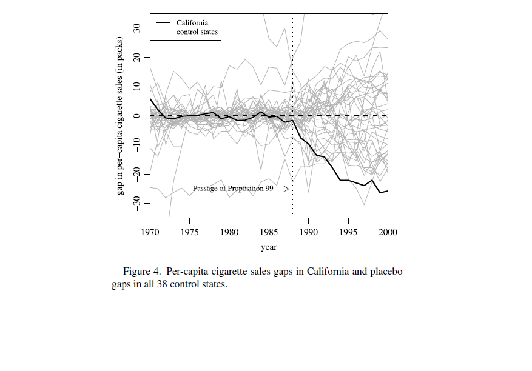

# Eksempel: Californiens Proposition 99 (Abadie et al. [2010](http://www.tandfonline.com/doi/abs/10.1198/jasa.2009.ap08746))

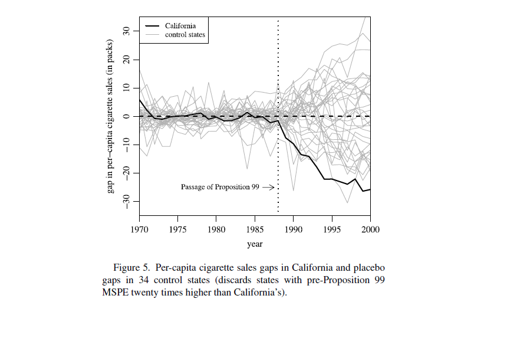

# Eksempel: Effekten af terror på økonomien (Abadie og Gardeazabal [2003](https://www.aeaweb.org/articles?id=10.1257/000282803321455188))

- Region: Baskerlandet

- Udfald: BNP pr. indbygger

- Intervention: Terror

- "We approach this problem by comparing the economic evolution of the Basque Country during the terrorist era with that of a weighted combination of other Spanish regions chosen to resemble the characteristics of the Basque Country before terrorism. We conceptualize such a weighted average of other Spanish regions as a "synthetic" Basque Country without terrorism, against which we can compare the actual Basque Country with terrorism." (p. 116)

# Eksempel: Effekten af terror på økonomien (Abadie og Gardeazabal [2003](https://www.aeaweb.org/articles?id=10.1257/000282803321455188))

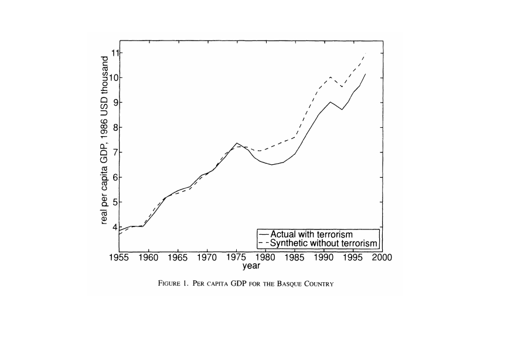

# Eksempel: Effekten af Tysklands genforening på Vesttysklands økonomi (Abadie et al. [2015](http://onlinelibrary.wiley.com/doi/10.1111/ajps.12116/abstract))

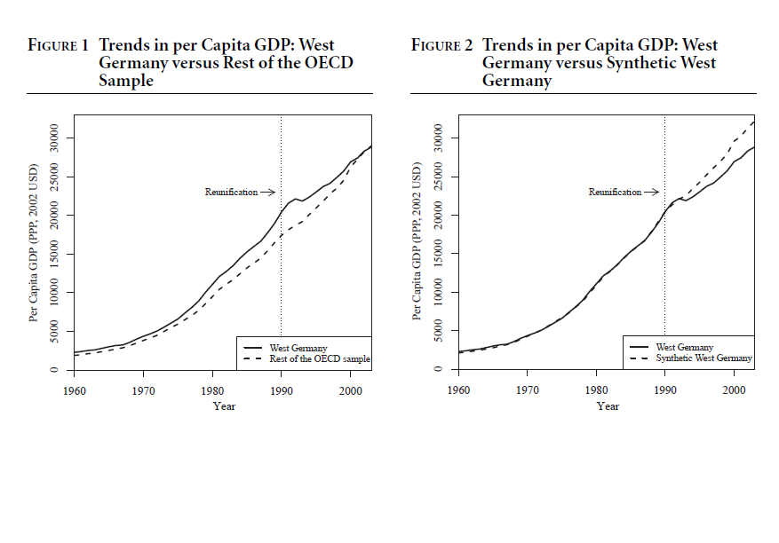

# Eksempel: Effekten af Tysklands genforening på Vesttysklands økonomi (Abadie et al. [2015](http://onlinelibrary.wiley.com/doi/10.1111/ajps.12116/abstract))

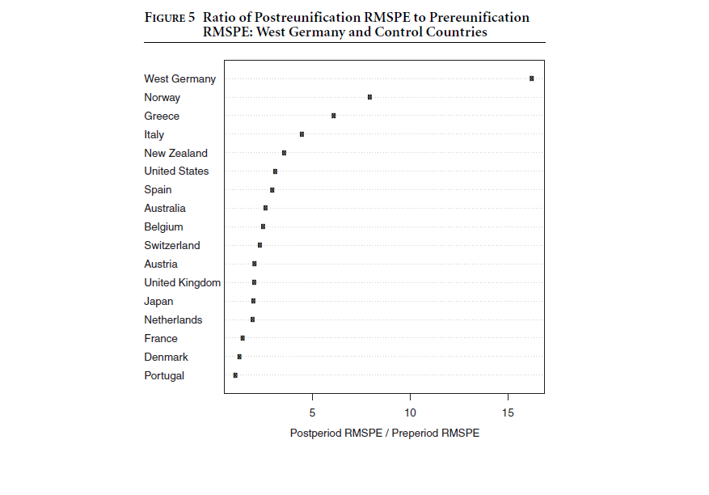

# Eksempel: Effekten af Tysklands genforening på Vesttysklands økonomi (Klö\ss ner et al. [2016](http://www.oekonometrie.uni-saarland.de/papers/Cross-Validation.pdf))

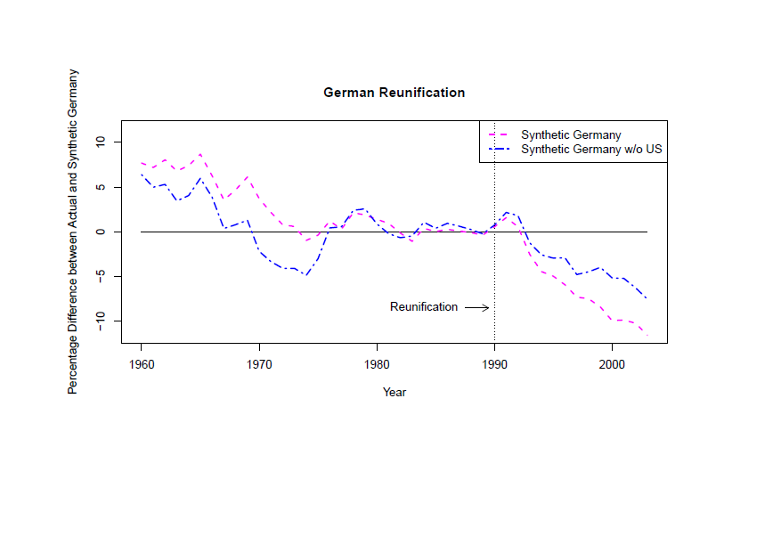

# Eksempel: Effekten af Tysklands genforening på Vesttysklands økonomi (Klö\ss ner et al. [2016](http://www.oekonometrie.uni-saarland.de/papers/Cross-Validation.pdf))

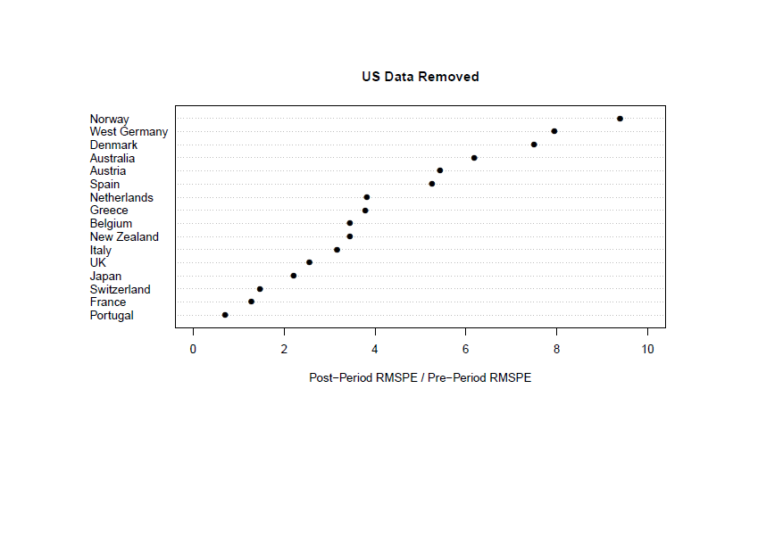


# Hvad med SUTVA?

- Vi antager stadig, at der ikke er interaktioner mellem enhederne

- Hvorfor? Ikke muligt at estimere effekten af en intervention hvis der er brud på SUTVA

# Matching og syntetisk kontrol i Stata og R

- Matching: forskellige pakker i både Stata og R
    - Kontakt mig hvis I har brug for hjælp
    
- Syntetisk kontrol: brug Synth pakken til både Stata og R
    - Kontakt mig hvis I har brug for hjælp

# Næste gang

- Gæsteforelæsning

- Mandag, kl. 10-12 i U31A
