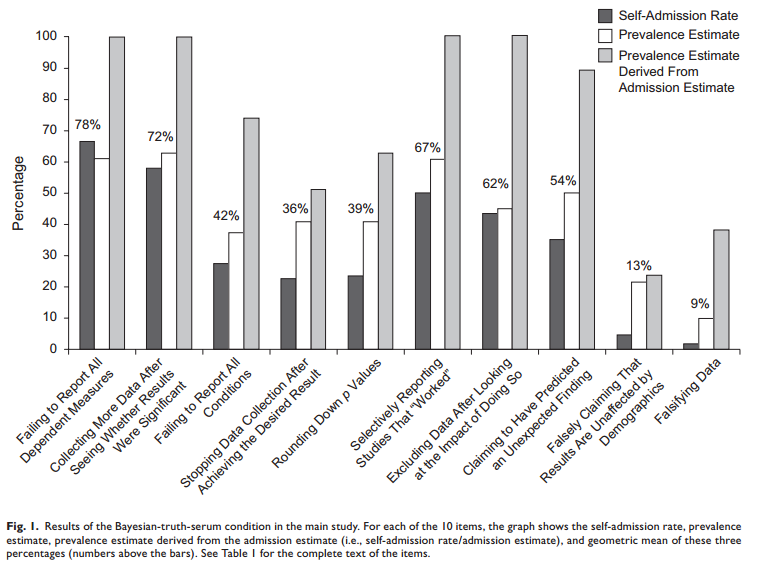

```{r include=FALSE}
options(digits=3)
library("ggplot2")
```

# Gæsteforelæsning

- Evaluering af 'Evalueringen af offentlige politikker'

- Feedback?

# Eksamen og vejledning

- Dato for aflevering: 2. juni, klokken 12.00

- Vejledning I: Mandag 9. maj efter klokken 13

- Vejledning II: Mandag 23. maj 

# Evaluering

- Semesterets undervisningsevaluering

- Evalueringsperioden starter mandag d. 25. april (i dag)

- Løber frem til og med søndag d. 8. maj

# Add on I: AGORA

- Tid: Onsdag d. 4. maj 
    - Hele dagen fra kl. 08.45 (al undervisning er aflyst)

- Sted: SDU O100 - ved hovedindgangen

- Yderligere oplysninger på [https://www.facebook.com/AGORASDU/](https://www.facebook.com/AGORASDU/)

# Add on II: Introduktion til R

- Tirsdag d. 21. juni
    
# Dagsorden

- Åben videnskab (_open science_)

- Reproducerbarhed

- Replikation

- Workflow

# LaCour og Green ([2014](http://science.sciencemag.org/content/346/6215/1366))


# Hvor stort er problemet? (John et al. [2012](http://pss.sagepub.com/content/23/5/524))



# Udfordring

- Meget forskning kan ikke replikeres
    - Nogle mener sågar, at det meste forskning ikke kan replikeres

- Meget forskning kan ikke reproduceres

- Hvad er forskellen?

# Reproduktion og replikation

- Reproducere: at skabe de *samme* resultater med det *samme* data

- Replikere: at gennemføre en undersøgelse med *andre* data (evt. nye data)

- Reproduktion og replikation bliver dog ofte anvendt som var de indbyrdes ombyttelige
    - Væsentlige forskelle på de to

- Herrnson ([1995](http://www.jstor.org/stable/420302), 452): "Replication repeats an empirical study in its entirety, including independent data collection. It enables a researcher to comment on whether data used in an original study were collected properly or whether generalizations supported under one set of conditions are also supported under others. Replications increase the amount of information for an empirical research question and increase the level of confidence for a set of empirical generalizations."

# Videnskab (lidt teori om viden, epistemologi)

- Videnskab er en kollektiv, åben praksis
    - Ikke individuel magi

- Uafhængigt af hvordan vi måler verden (observationer, interviews, etnografi etc.), skal andre kunne se, hvordan denne viden er indsamlet

- Videnskabelige resultater skal kunne reproduceres af andre

- To typer af transparens
    - Produktionstransparens
    - Analytisk transparens

# Reproducerbarhedskontinuum (Peng [2011](http://science.sciencemag.org/content/334/6060/1226))


# Publikationsbias

- Kun positive resultater bliver publiceret
    - 'file drawer problem' (Rosenthal [1979](http://psycnet.apa.org/journals/bul/86/3/638/))

- Forskere bruger ensidede hypotesetests for at få signifikante resultater (Gerber et al. [2010](http://apr.sagepub.com/content/38/4/591.abstract))

- Implikation: Forskere skriver ikke deres negative fund op
    - Forkert viden/forkerte opfattelser bliver sjældent korrigeret 

# Publikationsbias: Hvorfor? (Franco et al. [2014](http://science.sciencemag.org/content/345/6203/1502))


# Publikationsbias: Hvorfor? (Franco et al. [2015](http://pan.oxfordjournals.org/content/23/2/306), [2016](http://spp.sagepub.com/content/7/1/8))


# Hvorfor er det vigtigt?

- Meget forskning kan ikke replikeres
    - Igen: 'False positives' (Ioannidis [2005](http://journals.plos.org/plosmedicine/article?id=10.1371/journal.pmed.0020124))
    - Tidsskrifter publicerer primært artikler der bekræfter en teori

- Penge brugt på forskning, der ikke kan replikeres 
    - Alene US$28,000,000,000 inden for præklinisk forskning i USA (Freedman et al. [2015](http://journals.plos.org/plosbiology/article?id=10.1371/journal.pbio.1002165))

- Et af de definerende karakteristika ved videnskab er, at det kan reproduceres. 
    - Reproducerbar forskning: pleonasme
    - "the only way to understand and evaluate an empirical analysis is to know the exact process by which the data were generated and the analysis produced" (King [1995](http://journals.cambridge.org/action/displayAbstract?fromPage=online&aid=8810955&fileId=S1049096500057607))

# Hvorfor er det vigtigt? (Open Science Collaboration [2015](http://science.sciencemag.org/content/349/6251/aac4716))


# Hvorfor er det vigtigt i offentlig politik?

- Reproducerbarhed
    - Vi skal vide hvordan studier kommer frem til de konklusioner, de gør
    - Især for kritisk at kunne evaluere validiteten
        - Særinteresser

- Replikationer
    - Svært at gennemføre replikationer
    - Der er brug for gode replikationsstudier
    - Ingen grund til at tro, at succesraten for replikationer i studiet af offentlig politik vil være højere end i psykologisk forskning

# Løsninger på 'replikationskrisen' (Ioannidis [2014](http://journals.plos.org/plosmedicine/article?id=10.1371/journal.pmed.1001747))

- Større samarbejde på tværs af forskningsgrupper

- Replikationskultur

- Preregistrering

- Deling (data og andet materiale)

- Reproducerbarhed

- osv.

# Dimensioner af reproducerbar forskning

- Tilgængelighed
    - På kort og længere sigt, *INTET* "available upon request"

- Dokumentation

- Data
    - Jo mere, desto bedre 

- Åbenhed

- Kode

- Software

# Dimensioner af åben videnskab (Neuhold [2014](https://commons.wikimedia.org/wiki/File:Open_Science_-_Prinzipien.png))


# Åben videnskab (Braun og Ong [2014](http://www.ong-home.my/papers/braun13open-science-ml.pdf))


# Åben videnskab: fordele

- Adgang til forskning (ikke bag betalingsmure)
- Faciliterer transparent og reproducerbar forskning
- Samarbejde med andre, bedre forskning (Kolata [2010](http://www.nytimes.com/2010/08/13/health/research/13alzheimer.html?pagewanted=all&_r=0))
- Sikrer adgang til data og andet materiale på længere sigt
- Effektivt
- Bedre forskning (Wicherts et al. [2011](http://journals.plos.org/plosone/article?id=10.1371/journal.pone.0026828))
- Flere bruger ens viden (Piwowar et al. [2007](http://journals.plos.org/plosone/article?id=10.1371/journal.pone.0000308), Piwowar og Vision [2013](https://peerj.com/articles/175/))

# Mange måder at opnå signifikante resultater

- Lave hypoteser *efter* analyserne (HARKing, Kerr [1998](http://psr.sagepub.com/content/2/3/196.short))

- Kontrol over dataindsamlingen
    - Gennemfør analyserne løbende og stop når der er noget signifikant

- Analyser flere afhængige variable

- Vælg en anden kontrolgruppe

- Fjern ekstreme observationer

- Undersøg interaktionseffekter

- osv. osv. osv.

# Mange måder at opnå signifikante resultater: *Texas sharpshooter fallacy*


# Mange måder at opnå signifikante resultater (Simmons et al. [2011](http://pss.sagepub.com/content/22/11/1359.full))


# Transparens i formidling (Miguel et al. [2014](http://science.sciencemag.org/content/343/6166/30))


# Mange måder at opnå signifikante resultater


# Mange måder at opnå signifikante resultater


# Mange måder at opnå signifikante resultater (Motulsky [2014](http://onlinelibrary.wiley.com/doi/10.1111/bph.12884/full))


# Eksempel: Crowdsourcing dataaanlyse

- Der er mange forskellige måder at teste én hypotese på

- Selv med det *samme* datasæt kan forskellige forskere komme frem til forskellige konklusioner

- Giver fodbolddommere oftere rødt kort til mørke spillere? (Silberzahn et al. [2015](http://home.uchicago.edu/~npope/crowdsourcing_paper.pdf))
    - "Twentynine teams involving 61 analysts used the same data set to address the same research questions: whether soccer referees are more likely to give red cards to dark skin toned players than light skin toned players and whether this relation is moderated by measures of explicit and implicit bias in the referees' country of origin. [...] Twenty teams (69%) found a significant positive effect and nine teams (31%) observed a nonsignificant relationship."

# Hvor ofte er reproduktionsmaterialet tilgængeligt? (Key [2016](http://journals.cambridge.org/action/displayAbstract?fromPage=online&aid=10269177&fulltextType=RA&fileId=S1049096516000184))


# Hvor ofte er reproduktionsmaterialet tilgængeligt? (Dafoe [2014](http://journals.cambridge.org/action/displayAbstract?fromPage=online&aid=9135992&fileId=S104909651300173X))


# Reproduktionsmateriale

- Forskelligt materiale
    - Rå data
    - Metadata
    - Importerbar data
    - Stata do-fil/R-script
    - En readme

# Reproduktionsmateriale: rå data

- Det fulde, rå datasæt
    - Data der *ikke* er behandlet på nogen måde
    - Evt. som de er indsamlet
    - Evt. som de er blevet tilsendt/downloadet
    
- Sikrer at der altid er originalt materiale, man kan gå tilbage til
    - Må *aldrig* overskrives/ændres

# Reproduktionsmateriale: metadata

- Data omkring ens rå data

- Al information, der hjælper en med at forstå ens rå data
    - Kan være i én fil eller med flere supplerende filer

- I en spørgeskemaundersøgelse kan det være:
    - Spørgeskema
    - Kodebog
    - Samplinginformation
    - Og så videre

- Standarder for metadata: [http://www.dcc.ac.uk/resources/metadata-standards](http://www.dcc.ac.uk/resources/metadata-standards)

# Reproduktionsmateriale: importerbar data

- Det rå materiale er ikke altid optimalt i forhold til reproduktion
    - Datasæt der ikke er kompatible med forskellige statistikprogrammer (`.xls`, `.sav`, `.dta`)
    
- Få eksporteret datasættet til et åbent format
    - Gerne `.csv` (kommasepareret fil)
    - Lav så få ændringer som muligt
        - Dokumenter hvilke (og hvorfor)

- Brug gode standarder og gør det nemt for andre at bruge dine data (White et al. [2013](https://peerj.com/preprints/7/))

# Reproduktionsmateriale: Stata do-fil/R-script

- Alt der laves ved det importerbar data skal dokumenteres
    - Kommandoer, funktioner m.v.
    - Import af data, rekodninger, analyser, tabeller, figurer
        - Det kan være flere forskellige filer

- Automatisering
    - Alt der kan automatiseres, bør automatiseres 
    - Kan køres fra start til slut

- Tekstfiler til det software, man anvender
    - Syntax-fil til SPSS, do-fil til Stata, R-script til R
    
- Lav kommentarer, der beskriver hvad der foregår
    - Men undlad at bruge output fra analyserne som kommentarer!!!

# Reproduktionsmateriale: Stata do-fil/R-script, gode råd (Wilson et al. [2014](http://journals.plos.org/plosbiology/article?id=10.1371/journal.pbio.1001745))

- Skriv til mennesker (ikke computere)
    - Overskueligt, meningsfulde navne, konsistent opbygning

- Lad computeren gøre arbejdet (automatiser procedurer)

- Undgå gentagelser 

- Lav inkrementelle forandringer
    - Undgå store ændringer, tjek om tingene fungerer
    - Dokumenter ændringer (version control)

- Forvent fejl

- Se også: Ten Simple Rules for Reproducible Computational Research (Sandve et al. [2013](http://journals.plos.org/ploscompbiol/article?id=10.1371/journal.pcbi.1003285))

# Reproduktionsmateriale: readme

- Overordnet dokumentation

- Oversigt over filer
    - Indhold og format
    - Rækkefølge, organisering af filer i undermapper
    
- Detajleret beskrivelse af procedure, der reproducerer ens resultater

- Referencer og links til data og andet materiale, der anvendes

# Reproduktionsmateriale: data

- "Data management should be woven into every course in science." (Nature [2009](http://www.nature.com/nature/journal/v461/n7261/full/461145a.html))

- Sørg for at dine data ikke går tabt!
    - Bedste løsning: upload dem til permanente dataarkiver

- Backup

- Hvis en artikel bliver publiceret og data går tabt (og ikke kan genskabes), bør artiklen trækkes tilbage
    - Derfor: Sørg for at data ikke går tabt

- Der er simple guidelines til, hvordan man gør det nemt for sig selv og andre at vedligeholde og bruge data (Goodman et al. [2014](http://journals.plos.org/ploscompbiol/article?id=10.1371/journal.pcbi.1003542))

# Data og anonymitet

- I politologisk forskning bruger vi ofte følsomme data
    - Især når det vedrører holdningsspørgsmål
    
- Personer deltager i spørgeskemaer med forsikringen om, at de ikke kan identificeres

- Sørg *altid* for, at data er anonymiseret

- Gerne k-anonymitet (Sweeney [2002](http://dataprivacylab.org/dataprivacy/projects/kanonymity/kanonymity.pdf))

- Hvilke data skal du have adgang til, før du kan identificere personer, du kender?
    - Postnummer, fødselsdagsdato og køn?

# Workflow: et par råd

- Overvej hvordan du bygger projekter op

- Ikke noget der er ret meget fokus på
    - Én mappe
    - Talrige forskellige filer med samme indhold
    - Ingen kontrol med hvad der ændres

- Sørg for at systematisere et workflow, så det er nemt at dokumentere, hvad der er sket 
    - Med andre ord: reproducerbar forskning

# Anbefaling: versionskontrol

- Undlad intetsigende titler på dokumenter
    - `dok1.docx`, `final1.docx`, `final2.docx`, `finalfinal.docx`

- Dokumenter udviklingen i dit projekt
    - Overvej Git/GitHub: [Git/GitHub, Transparency, and Legitimacy in Quantitative Research](https://thepoliticalmethodologist.com/2013/11/18/gitgithub-transparency-and-legitimacy-in-quantitative-research/)
    - Gør det nemt for dig selv at finde tidligere versioner af dit arbejde

- Overvej plain text
    - Word er WYSIWYG
    - Arbejd med LaTeX eller Markdown

# Anbefaling: gode formater

| Type            | Anbefaling    | I stedet for        |
|-----------------|---------------|---------------------|
| Data/tabel      | `csv`         | `sav`, `dta`, `xls` |
| Tekst           | `tex`, `md`   | `docx`              |
| Billeder        | `png`, `tiff` | `jpg`, `gif`        |
| Endelig version | `pdf`         | `docx`              |

# Gennemførelsen af en replikation

- To studier er aldrig 100% identiske
    - Som minimum forskel i tid

- 36 spørgsmål, der bør besvares (Brandt et al. [2014](http://www.sciencedirect.com/science/article/pii/S0022103113001819))

- Beskrivelse af effekt (9 spørgsmål)
    - Hvad vil man gerne replikere? Hvordan blev det pågældende studie gennemført?

- Design af replikationsstudie (7 spørgsmål)

- Forskelle på originale studie og replikationsstudie (9 spørgsmål)
    - Forskelle i procedure, mål, stimuli etc.

- Analyse af replikation (3 spørgsmål)

- Registrering (1 spørgsmål)

- Rapportering (7 spørgsmål)

# Data Access and Research Transparency (DA-RT)

- Data skal være tilgængelige og proceduren skal være transparent

- Har ikke været *status quo* i den politologiske litteratur, men tiderne skifter...

    - Forudsætning for at kunne publicere hos blandt andre: American Journal of Political Science, American Political Science Review, American Politics Research, British Journal of Political Science, Comparative Political Studies, European Journal of Political Research, European Union Politics, International Security, Journal of Conflict Resolution, Journal of Experimental Political Science, Journal of European Public Policy, Journal of Peace Research, Journal of Theoretical Politics, Quarterly Journal of Political Science, Party Politics, Political Analysis, Political Behavior, Political Communication, Political Science Research and Methods, Research and Politics, Journal of Politics  

- Mere info: [dartstatement.org](http://www.dartstatement.org/)

# Måder at maksimere sandsynligheden for at ens studie kan replikeres

- Sørg for at det kan reproduceres

- Større stikprøve

- Gode mål (høj reliabilitet)

- Undgå at teste for mange hypoteser på det samme data

- Test samme hypotese flere gange
    - Søg flere empiriske implikationer af hypotesen

# Gennemfør replikationer!

- Hvis du/I stadig mangler en idé til en seminaropgave: gennemfør et replikationsstudie

- Det er vigtigt, at der gennemføres replikationsstudier

- Find et studie og se, om du/I kan replikere det

- Forslag:
    - Find amerikansk studie, repliker i Danmark
    - Find studie der tester generel hypotese på gamle data og se om det kan replikeres på nye data
        - Evt. studier der bruger første runde af European Social Survey

# Flere og flere replikationsstudier (Makel et al. [2012](http://pps.sagepub.com/content/7/6/537.abstract))


# Dagens øvelse: Reproducere/replikere

- Diskuter med sidemanden

- Overvej hvilke studier der vil være gode at replikere
    - Hvorfor?
    - Hvilke udfordringer vil der være forbundet hermed?

- Gerne relateret til det område din/jeres seminaropgave omhandler

- 5 minutter

# Næste gang

- Præsentation af seminaropgave, part 2

- Send gerne et par sider ud inden weekenden

- Mandag, kl. 10-12 i U31A
