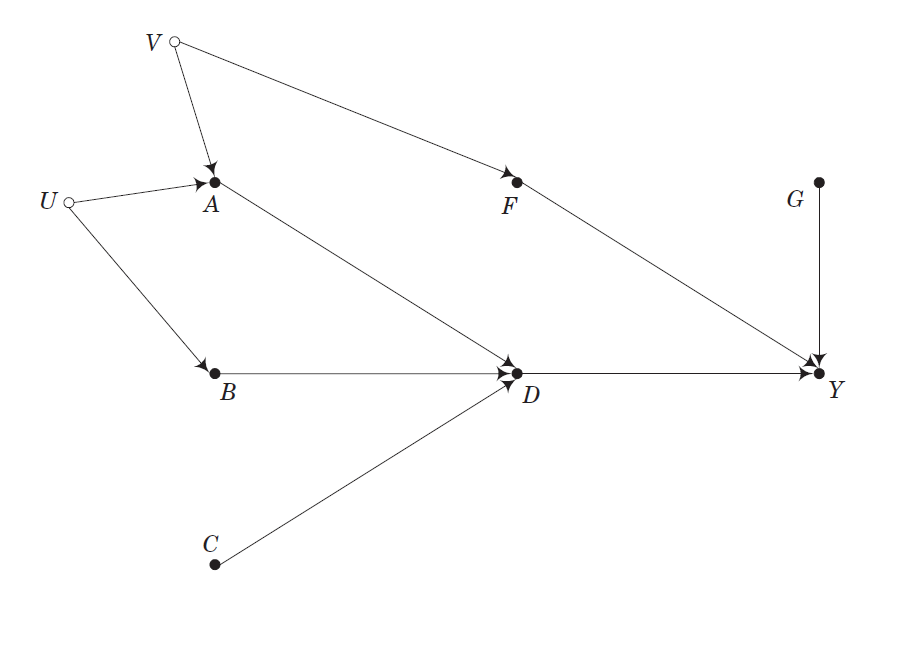
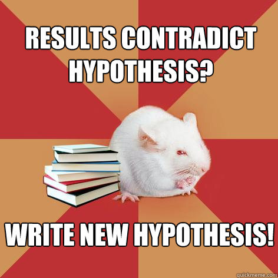
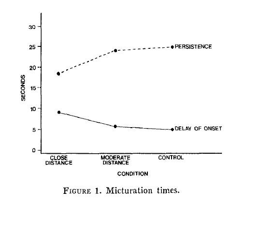
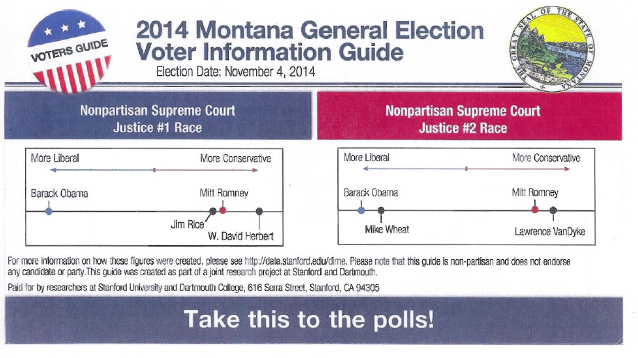

# Eksamen og vejledning

- Dato for aflevering: **2. juni, klokken 12.00**

- Vejledning I: I dag, efter klokken 13

- Send mig hvad I har: Onsdag 18. maj

- Vejledning II: Mandag 23. maj 

# Evaluering af faget

- Semesterets undervisningsevaluering

- Evalueringsperioden er begyndt

- Hvis du ikke allerede har evalueret faget: gør det

- Forlænget til og med søndag d. 15. maj

# Evaluering af faget, målbeskrivelsen

- Kan du:
    - identificere kausale påstande i studiet af offentlig politik
    - redegøre for nøglebegreber og kausale grundantagelser og modeller
    - diskutere styrker og svagheder ved forskellige teoretiske og metodiske tilgange
    - applicere teoretiske og metodiske tilgange på egne problemstillinger
    - forholde sig kritisk til kausale påstande i empiriske studier

# Evaluering af faget, mine observationer

- Engagerede studerende (_selection bias_, lavt fremmøde)

- Pensum

- Teoretisk bredde
    - Flere begrænsninger?

- Eksamensform

# Add on I: AGORA 16

- Succes?

# Add on II: Introduktion til R

- Plan
    - Databehandling
        - Datasæt
        - Rekodning
    - Deskriptiv statistik
    - Visualisering
    - Statistiske analyser
        - OLS
        - Logistisk regression
        - Matching
        - IV
        - RDD

- Tirsdag d. 21. juni

# Add on II: Introduktion til R

- Et par ting at gøre forud for add on II

- Installer R og RStudio
    - R: [r-project.org](https://www.r-project.org/)
    - RStudio: [rstudio.com](https://www.rstudio.com/)

- Undersøg om du kan installere pakker

```{r, eval=FALSE}
install.packages("ggplot2")
```

# Dagsorden

- Opsamling
    - Hvad har vi lært?

- Praktiske overvejelser

- Etiske overvejelser


# Opsamling

- Tre blokke
    - Kausalitet
    - Empiriske tilgange
    - Seminaropgave

# Kausalmodeller: Rubin

- Kausaleffekt for enhed _i_

    - $\tau_{i} = Y_{i}(1) - Y_{i}(0)$

- Gennemsnitlig stimulieffekt (_ATE_)
    
    - $\tau_{ATE} = E[Y(1) - Y(0)] = E[Y(1)] - E[Y(0)]$

# Kausalmodeller: Campbell

- Statistisk validitet

- Intern validitet

- Konstruktionsvaliditet

- Ekstern validitet

# Kausalmodeller: Pearl



# Empiriske tilgange

- Eksperimenter

- Naturlige eksperimenter

- Kvasieksperimenter

- Observationsstudier

# Seminaropgaven: Struktur

1) Introduktion
    - Hvorfor er emnet interessant?
        - Hvilken mangel har den eksisterende litteratur?
    - Hvad er problemstillingen?
    - Hvad kommer du frem til?

# Seminaropgaven: Struktur

2) Teori
    - Introducer den afhængige variabel
    - Definition
    - Model/kausalt argument
    - Hypotese

# Seminaropgaven: Struktur

3) Metode
    - Design
        - Identifikation
    - Data
        - Estimation

# Seminaropgaven: Struktur

4) Resultater
    - Deskriptiv statistik
    - Analyse
    - Robusthedstests
    - Substantiel tolkning

# Seminaropgaven: Struktur

5) Diskussion
    - Styrker og svagheder
    - Validitetsovervejelser
    - Perspektivering
    
# Seminaropgaven: Struktur

6) Konklusion
    - Opsamling
    - Generalisering
    - Ideer til fremtidig forskning (evt. speciale)

# Praktiske overvejelser

- Vi har fokuseret på teori og metode
    - Praktiske overvejelser

- Lad være med at bruge praktiske overvejelser som et argument i seminaropgaven!
    - Vi ved, at der er praktiske begrænsninger

- Tre typer af praktiske overvejelser
    - Penge 
    - Tid 
    - Interesser

# Praktiske overvejelser: hypoteser



# Praktiske overvejelser: hypoteser

- Det er intet krav, at man finder noget, der er signifikant!

- Vær transparent og ærlig i formidlingen af de metodiske valg såvel som analysen

# Etik

- Etiske spørgsmål og aspekter

- Samfundsvidenskaberne: forskning med og om mennesker

- Etiske principper
    - Respekt for personer, der indgår i studiet
    - Til fordel for deltagerne
    - Retfærdighed

- Husk: 
    - debriefing
    - anonymitet 
    - og så videre...

# Etik i eksperimenter

- Hvilke spørgsmål er i særdeleshed relevante, når det handler om eksperimenter?
    - Randomisering
        - nogen får ikke et stimuli
        - ikke dem med det største behov

- Manipulation

# Måder at imødekomme etiske udfordringer ved randomisering

1) Regressionsdiskontinuitetsdesignet 
    - Regelbaseret tildeling af stimuli baseret på behov

2) Stimulitildeling til de enheder, der har et stort behov

3) Stratificeret stimulitildeling baseret på behov

4) Større sandsynlighedsscore for personer med behov

5) Dose-response design

6) Dynamisk design hvor flere enheder over tid bliver tildelt succesfulde grupper

7) Informer enheder om at der er flere grupper de kan blive placeret i

8) Brug transparent randomisering for at øge opfattet retfærdighed

# Eksempel: Toiletobservationer (Middlemist et al. [1976](http://psycnet.apa.org/journals/psp/33/5/541/))

- Personal space invasions in the lavatory

- "In a field experiment conducted in a men's lavatory at a midwestern U.S. university, subjects were randomly assigned to one of three levels of interpersonal distance. Men who entered a threeurinal lavatory to urinate were forced to use the leftmost urinal. A confederate was placed immediately adjacent to the subject, one urinal removed, or was absent from the lavatory. An observer stationed in a toilet stall timed the delay and persistence of micturation."

# Eksempel: Toiletobservationer (Middlemist et al. [1976](http://psycnet.apa.org/journals/psp/33/5/541/))



# Eksempel: Get out the vote

- Må forskere påvirke vælgerne? 

- Er det OK at gennemføre GOTV-eksperimenter? 

- Hvilke etiske udfordringer er der forbundet med dette?

# Eksempel: Get out the vote



# Dagens øvelse

- Overvej hvilke etiske spørgsmål, der er relevant i forhold til din/jeres seminaropgave

- 10 minutter

# Næste gang

- I dag er *sidste* gang :'(
